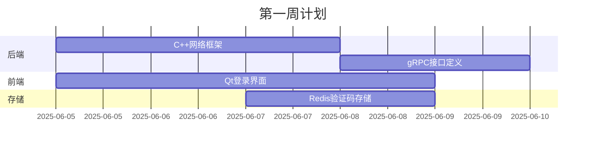

# MyChat

## 技术栈:

- cpp完成核心后端服务,附以nodejs
- grpc分布式服务进行不同板块功能实现,docker完成部署
- 前端界面第一版使用Qt搭建,后续再考虑electron搭建桌面端,vue网页端,移动端再说
- git版本管理

## 功能：

### core：

- 登录注册功能:注册实现手机号或者邮箱验证(node邮箱服务,redis存验证码 )，qss实现错误(输入验证)时样式

### extra：

- log
- config
- file upload/download and store
- web interface
- QQ空间/朋友圈

## 预期发展：

基础消息聊天功能 -> 发送图片视频音频等功能 -> 图片视频基础编辑功能 -> qq空间/大论坛 -> 音乐播放室功能(qq一起听功能) -> 文件传输/存储功能

## 实际发展：


---

你的开发计划整体思路清晰，技术栈选择合理，体现了循序渐进的学习态度。以下是我针对你的计划提出的优化建议，帮助你更高效地实现项目并规避潜在风险：

---

### **一、架构设计建议**

1. **明确服务边界**

   - 核心服务（C++）：消息路由、连接管理、协议编解码、分布式协调（如一致性哈希）
   - 辅助服务（Node.js）：仅处理非性能敏感任务（邮件发送、文件元数据管理、验证码逻辑）
   - **关键点**：用 gRPC 定义清晰的 `auth.proto`、`message.proto` 等接口，避免 C++/Node 逻辑耦合
2. **存储设计**

   ```mermaid
   graph LR
   A[客户端] --> B[消息服务]
   B --> C[Redis 缓存未读消息]
   B --> D[MySQL 持久化历史消息]
   D --> E[MinIO/S3 存储文件]
   ```

   - 消息表设计：`msg_id, sender_id, receiver_id, msg_type(text/image/voice), content, timestamp`
   - 使用 **Redis SortedSet** 维护在线状态和消息推送队列
3. **分布式要点**

   - **服务发现**：集成 Consul/Etcd 管理 gRPC 服务地址
   - **消息顺序性**：为每个会话分配单调递增的序列号（Snowflake ID）
   - **跨服务事务**：用 Saga 模式处理跨服务调用（如发消息时扣减积分）

---

### **二、开发阶段优化建议**

#### **Phase 1：核心通信 (必选基础)**

1. **认证服务**
   - 简化注册：初期仅支持邮箱验证（Mailgun API + Redis 存储验证码，TTL=300s）
   - JWT 令牌设计：包含 `user_id, exp, client_type` 用于多端互踢
2. **消息管道**
   - 协议层：用 Protobuf 定义 `Message{Header, Body}` 结构
   - 在线消息：直接 gRPC 推送到目标用户连接的服务节点
   - 离线消息：Redis List 存储未送达消息
3. **基础日志**
   - 使用 **spdlog** 异步日志库，按服务拆分日志文件
   - 关键字段：`[timestamp][service][user_id] log_content`

#### **Phase 2：富媒体扩展**

1. **文件服务独立部署**
   - 用 Node.js 实现预签名上传 URL（前端直传 MinIO）
   - 文件元数据库：`file_id, owner_id, size, mime_type, storage_path`
2. **图片/视频压缩**
   - 集成 **libvips** (C++) 实现图片缩略图生成
   - 音频转码：FFmpeg 处理语音消息（48kbps OPUS 格式）

#### **Phase 3：社交功能**

1. **朋友圈设计要点**
   - 数据模型：`feed_id, user_id, content_type, content, visibility`
   - 推拉结合：活跃用户用推送（写扩散），长尾用户用拉取（读扩散）
2. **一起听实现思路**
   - 房间管理：gRPC 服务维护房间状态
   - 同步协议：通过 NTP 校准时间戳，发送 `PLAY/PAUSE/SEEK` 控制指令

---

### **三、关键技术风险规避**

1. **C++ 网络层陷阱**
   - 使用 **asio** 或 **muduo** 网络库避免裸写 epoll
   - 连接保活：TCP Keepalive + 应用层心跳包（60s 间隔）
2. **gRPC 性能优化**
   - 开启 HTTP/2 多路复用
   - 使用 Streaming RPC 传输大文件（分块传输）
3. **Qt 前端注意事项**
   - 采用 MVVM 模式：用 QML 实现 UI，C++ 处理业务逻辑
   - 消息列表优化：QListView + 自定义委托实现懒加载

---

### **四、学习路线推荐**

1. **先实现单机版 MVP**
   - 第1周：完成 C++ 登录服务 + Qt 基础聊天界面
   - 第2周：实现文本消息收发（SQLite 存储）
2. **逐步引入分布式**
   - 第3周：容器化服务（Dockerfile 编写）
   - 第4周：用 gRPC 拆分 Auth/Message 服务
3. **扩展进阶功能**
   - 第5周：集成 MinIO 文件服务
   - 第6周：实现朋友圈发布/拉取

---

### **五、易忽略的细节**

1. **安全性**
   - 密码存储：bcrypt 盐值哈希（C++ 可用 `libbcrypt`）
   - 消息加密：使用 AES-GCM 端到端加密（非聊天室场景）
2. **部署方案**
   - 开发环境：Docker Compose 一键启动所有服务
   - 生产环境：Kubernetes 部署 + Prometheus 监控
3. **调试工具**
   - gRPC 命令行调试工具 `grpcurl`
   - 日志追踪：为每个请求注入 `request_id` 串联全链路

> **关键提醒**：每完成一个模块，立即编写**集成测试脚本**（如用 Python 模拟多用户并发消息），避免后期调试地狱。

---

你的规划已具备优秀项目的雏形，关键在于保持迭代节奏。建议将 **「预期功能」拆解为 GitHub Issues**，用 Milestone 管理进度。遇到具体技术卡点时（如 gRPC 流控机制），欢迎随时交流细节设计！

---

基于边学边做的开发节奏和暑假两个月（约8周）的时间，我为你设计了一个**渐进式开发路线**，聚焦核心功能、控制技术风险，确保每周都有可见成果：

---

### **整体策略**

- **核心原则**：优先打通消息收发闭环 → 扩展富媒体 → 社交功能
- **技术栈学习顺序**：C++网络基础 → gRPC通信 → Qt基础 → Docker部署
- **每周产出**：可运行的里程碑版本（从v0.1到v0.8）
- **时间分配**：70%编码+20%学习+10%调试

---

### **详细周计划表**

#### **第一周：认证系统 + 基础框架搭建**



- **目标**：实现邮箱注册/登录全流程
- **关键任务**：
  - 后端：用C++实现TCP连接池（asio库），定义 `auth.proto`（Login/Register接口）
  - 前端：Qt制作登录窗口（QLabel/QLineEdit/QPushButton），支持错误提示
  - 存储：Redis存储验证码（键：`email:code`，5分钟过期）
- **成果**：v0.1版可完成邮箱注册和登录

---

#### **第二周：文本消息收发核心**

- **目标**：实现1对1文本消息发送/接收
- **关键任务**：
  - 协议层：定义 `message.proto`（含sender/receiver/content）
  - 后端：
    - 消息路由服务（C++维护 `user_id → gRPC连接`映射表）
    - 离线消息存Redis SortedSet（按时间排序）
  - 前端：Qt消息框（QTextEdit + QListView显示历史消息）
- **风险控制**：
  - 使用**SQLite**暂存本地消息（避免直接上MySQL）
  - 消息去重：客户端生成唯一 `client_msg_id`
- **成果**：v0.2版支持好友间文字聊天

---

#### **第三周：多端同步与基础部署**

- **目标**：支持多设备在线 & Docker化部署
- **关键任务**：
  - **状态同步**：
    - 用Redis Pub/Sub广播用户在线状态
    - JWT令牌增加 `device_id`字段
  - **容器化**：
    - 编写Dockerfile打包C++服务（Alpine基础镜像）
    - docker-compose编排Redis + 后端服务
  - 前端：Qt实现消息已读/未读状态显示
- **成果**：v0.3版可在多设备同步消息状态

---

#### **第四周：文件传输基础**

- **目标**：支持图片/小文件传输
- **关键任务**：
  - 后端（Node.js）：
    - 文件分块上传接口（<5MB文件整传）
    - 生成预签名URL直传MinIO
  - 前端：
    - Qt实现文件选择对话框（QFileDialog）
    - 消息气泡显示缩略图（QPixmap缩放）
  - 存储：MinIO桶策略设为私有读写
- **避坑提示**：
  - 首次部署MinIO时开启 `console`端口（9001）便于调试
  - 文件元数据存SQLite（`file_id, path, size`）
- **成果**：v0.4版支持图片消息发送

---

#### **第五周：消息可靠性与日志**

- **目标**：提升消息可靠性 + 系统可观测性
- **关键任务**：
  - **消息QoS**：
    - 实现ACK确认机制（消息状态：发送中/已送达/已读）
    - 离线消息重推（Redis BRPOP轮询）
  - **日志系统**：
    - C++集成spdlog异步日志
    - 按服务拆分日志文件（auth.log/message.log）
  - 前端：消息状态图标（发送中⏳/已送达✓/已读👀）
- **成果**：v0.5版具备生产级消息可靠性

---

#### **第六周：朋友圈基础功能**

- **目标**：实现朋友圈发布/查看
- **关键任务**：
  - 数据模型：
    ```protobuf
    message Feed {
      string feed_id = 1;
      string user_id = 2;
      string content = 3;  // 文字或图片URL
      int64 timestamp = 4;
    }
    ```
  - 后端：
    - 发布接口（存MySQL的 `feeds`表）
    - 拉取接口（查询好友的feed，按时间倒序）
  - 前端：Qt实现九宫格图片布局（QGridLayout）
- **成果**：v0.6版支持发布图文朋友圈

---

#### **第七周：语音消息与优化**

- **目标**：支持语音消息录制/播放
- **关键任务**：
  - 前端：
    - Qt音频录制（QAudioRecorder）
    - 波形可视化（QCustomPlot库）
  - 后端：
    - FFmpeg转码为OPUS格式（48kbps）
    - 音频文件分片存储（避免大文件阻塞）
  - **性能优化**：
    - gRPC开启流式传输（语音分片发送）
    - 客户端缓存最近5条语音
- **成果**：v0.7版支持语音消息

---

#### **第八周：部署与压测**

- **目标**：全系统联调 + 压力测试
- **关键任务**：
  - **生产部署**：
    - 用nginx做gRPC反向代理
    - 配置Prometheus监控（服务存活/QPS）
  - **压力测试**：
    - 用Python编写压测脚本（模拟1000并发）
    - 重点监控：消息延迟、内存泄漏
  - 前端：修复遗留bug，优化消息滑动流畅度
- **交付成果**：v0.8可部署版本 + 压测报告

---

### **关键调整建议**

1. **砍掉非核心功能**：

   - 首期跳过“音乐播放室”（涉及复杂流媒体同步）
   - 图片编辑改用现成库（如OpenCV的dll），不自主开发
2. **学习资源推荐**：  

   | 技术         | 推荐资源                                           |
   | ------------ | -------------------------------------------------- |
   | C++网络编程  | 《Linux多线程服务端编程》第6章 + asio官方Tutorial  |
   | gRPC-C++     | grpc/examples/cpp/route_guide 官方示例             |
   | Qt信号槽机制 | 官方文档”Signals & Slots“章节 + 实现聊天消息刷新 |
3. **遇到卡点时的备选方案**：

   - 若C++消息路由开发慢 → 临时用Node.js实现消息中转（用ws库）
   - Qt界面卡顿 → 改用QML重写消息列表（利用GPU加速）

> **最后提醒**：每周末留出半天时间**代码重构**（例如将硬编码参数抽成config.json），避免技术债累积。保持Git提交原子性（每个功能一个分支），这将让后期调试轻松数倍！

这个计划既保证核心功能闭环，又为技术探索留出空间。实际执行时可根据进度动态调整，**核心是保持开发节奏**。完成v0.8后，你将拥有一个具备商用潜力的IM雏形！
