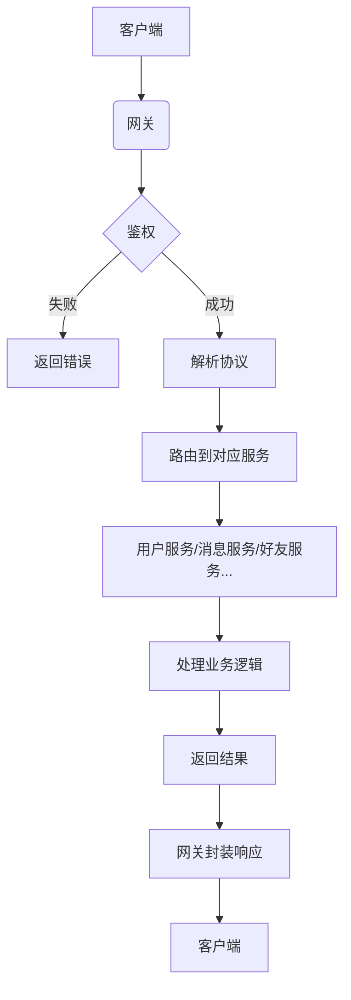
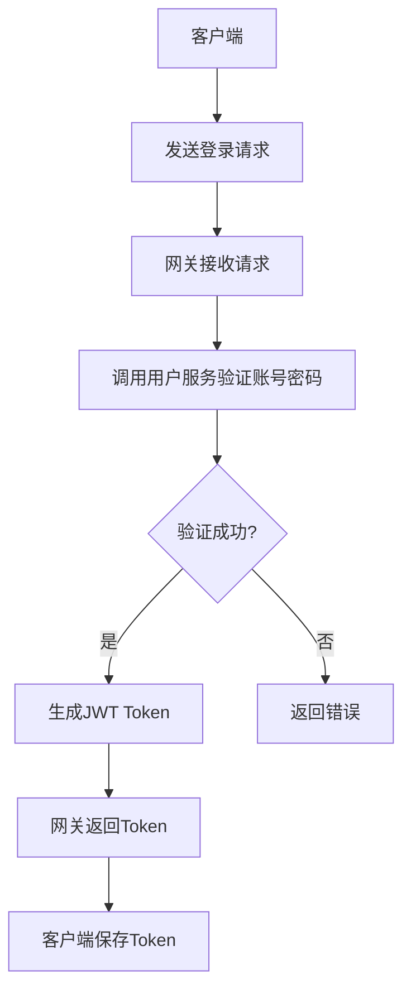
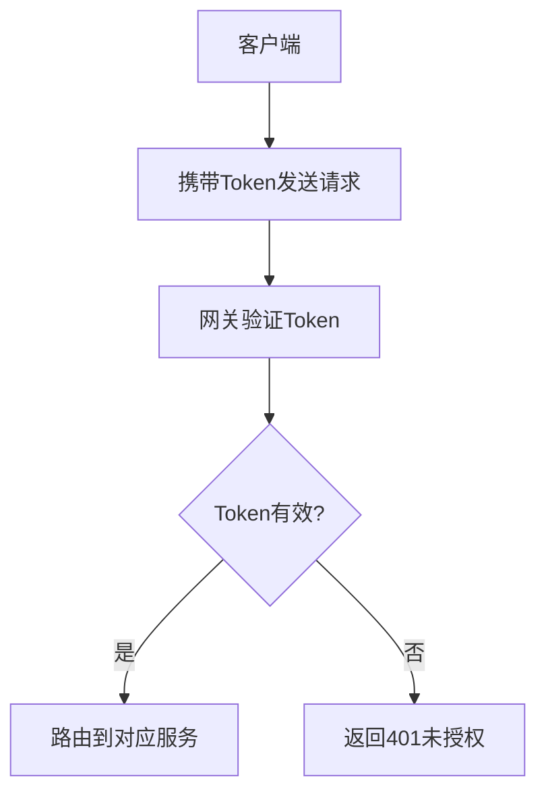

你的理解部分正确，但 **网关（gateway）的功能远不止注册、登录、验证、鉴权**。网关在即时通讯系统中扮演着**客户端连接入口**和**服务统一入口**的角色，它的职责更广泛。下面我会详细解释网关的核心功能、设计原则以及实现思路。

---

### 一、网关的核心功能（不只是鉴权）

#### 1. **网络接入层**

- **协议支持**：作为客户端连接的第一道门，网关需要支持多种通信协议（如WebSocket、HTTP、TCP等），处理握手、连接保持、心跳检测等。
- **连接管理**：维护所有客户端的长连接，记录用户ID与连接的映射关系，支持断线重连机制。
- **负载均衡**：如果部署多个网关实例，需要支持客户端连接的负载均衡（如通过Nacos或Consul做服务发现）。

#### 2. **协议解析与路由**

- **协议转换**：将客户端发送的二进制数据（如Protobuf格式）解析为结构化消息，并根据命令字（cmd_id）路由到对应的微服务。
- **消息转发**：将解析后的消息转发给对应的服务（如用户服务、消息服务），并接收服务的响应返回给客户端。
- **协议兼容性**：支持协议版本升级，处理新旧版本的兼容问题。

#### 3. **全局逻辑处理**

- **鉴权中心**：所有客户端请求必须经过网关进行身份验证（如验证JWT Token、Session ID等）。
- **流量控制**：限制客户端的请求频率（如防止刷屏攻击），支持限流算法（如令牌桶、漏桶）。
- **日志记录**：记录所有客户端请求的详细信息（如IP、用户ID、请求类型、耗时等），便于后续分析。

#### 4. **服务治理**

- **服务发现**：网关需要知道后端微服务的地址（如用户服务、消息服务），通常通过Nacos、Consul等注册中心获取。
- **健康检查**：定期检测后端服务的健康状态，自动剔除异常节点。
- **故障转移**：当某个服务实例不可用时，自动切换到其他可用实例。

---

### 二、网关与微服务的关系

网关是**客户端与后端服务之间的桥梁**，它的核心职责是**代理请求**，而不是处理业务逻辑。以下是典型的请求流程：



---

### 三、网关的详细功能设计（以WebSocket为例）

#### 1. **连接建立与握手**

```cpp
// WebSocket握手流程
void onHandshake(const WebSocketConnectionPtr& conn, const HttpRequest& req) {
    // 1. 解析URL参数（如token）
    std::string token = req.getQueryParam("token");

    // 2. 验证token有效性（调用用户服务接口）
    if (!verifyToken(token)) {
        conn->sendError("Invalid token");
        conn->close();
        return;
    }

    // 3. 记录用户ID与连接的映射关系
    std::string userId = extractUserIdFromToken(token);
    connectionManager.add(userId, conn);
}
```

#### 2. **消息处理流程**

```cpp
void onMessage(const WebSocketConnectionPtr& conn, const MessagePtr& msg) {
    // 1. 解析消息头（IMHeader）
    IMHeader header = parseHeader(msg);

    // 2. 验证用户权限（是否允许执行该操作）
    if (!checkPermission(header.user_id, header.cmd_id)) {
        sendError(conn, "Permission denied");
        return;
    }

    // 3. 路由到对应服务（如用户服务、消息服务）
    Service* targetService = routeService(header.cmd_id);
    if (!targetService) {
        sendError(conn, "Service not found");
        return;
    }

    // 4. 异步调用服务处理
    targetService->handleRequest(header, msg->payload(), [conn](const Response& resp) {
        conn->send(resp.serialize());
    });
}
```

#### 3. **断线处理**

```cpp
void onDisconnect(const WebSocketConnectionPtr& conn) {
    // 1. 获取用户ID
    std::string userId = connectionManager.getUserId(conn);

    // 2. 更新用户在线状态（调用用户服务）
    userService.updateUserStatus(userId, OFFLINE);

    // 3. 清理连接映射
    connectionManager.remove(userId, conn);

    // 4. 通知好友下线事件（推送消息给所有好友）
    pushOfflineNotification(userId);
}
```

---

### 四、网关的鉴权流程详解

#### 1. **登录流程**



#### 2. **后续请求的鉴权**



#### 3. **Token验证实现**

```cpp
bool verifyToken(const std::string& token) {
    // 1. 解析JWT Token
    auto decoded = jwt::decode(token);

    // 2. 验证签名
    if (!decoded.verify(jwt::params::secret("your-secret"))) {
        return false;
    }

    // 3. 验证有效期
    auto now = std::chrono::system_clock::now();
    if (decoded.get_expires_at() < now) {
        return false;
    }

    // 4. 验证用户是否存在（调用用户服务）
    std::string userId = decoded.get_payload_claim("user_id").as_string();
    if (!userService.checkUserExists(userId)) {
        return false;
    }

    return true;
}
```

---

### 五、网关的部署与扩展

#### 1. **单节点部署**

- 适用于小规模测试环境，所有客户端连接到同一个网关。
- 存在单点故障风险，适合初期开发阶段。

#### 2. **多节点部署**

- 使用Nacos或Consul进行服务注册与发现。
- 客户端通过负载均衡算法（如轮询、IP哈希）连接不同的网关实例。
- 需要实现**分布式连接管理**（如使用Redis记录用户连接信息）。

#### 3. **水平扩展**

- 网关本身是无状态的，可以轻松横向扩展。
- 通过Kubernetes或Docker Swarm实现自动扩缩容。

---

### 六、新手避坑指南

#### 1. **不要在网关处理复杂业务逻辑**

- 网关应专注于**协议解析、路由、鉴权**，所有业务逻辑交给后端微服务处理。
- 示例错误做法：在网关中处理消息存储、好友添加等操作。

#### 2. **避免连接泄露**

- 确保每次断开连接时清理映射关系。
- 使用智能指针（如 `std::shared_ptr<WebSocketConnection>`）管理连接生命周期。

#### 3. **协议兼容性问题**

- 初期定义好协议版本字段（如 `version`字段）。
- 后续升级时支持新旧协议共存，逐步淘汰旧版本。

#### 4. **性能瓶颈**

- 网关通常是高并发瓶颈，建议：
  - 使用异步非阻塞IO（如Boost.Asio）。
  - 避免在主线程中执行耗时操作。
  - 使用线程池处理业务逻辑。

---

### 七、下一步行动建议

1. **立即执行**：先实现一个简单的WebSocket服务器，能接收客户端连接并回显消息。
2. **扩展功能**：逐步添加鉴权逻辑（如登录接口、Token验证）。
3. **测试联调**：使用Qt客户端连接网关，验证基本通信流程。
4. **文档记录**：为每个功能模块编写技术文档（如鉴权流程、消息格式说明）。

如果你需要我提供具体的代码示例（如WebSocket服务器实现、JWT鉴权代码），欢迎随时提问！建议你从最基础的网关通信开始，我会持续为你提供指导。
