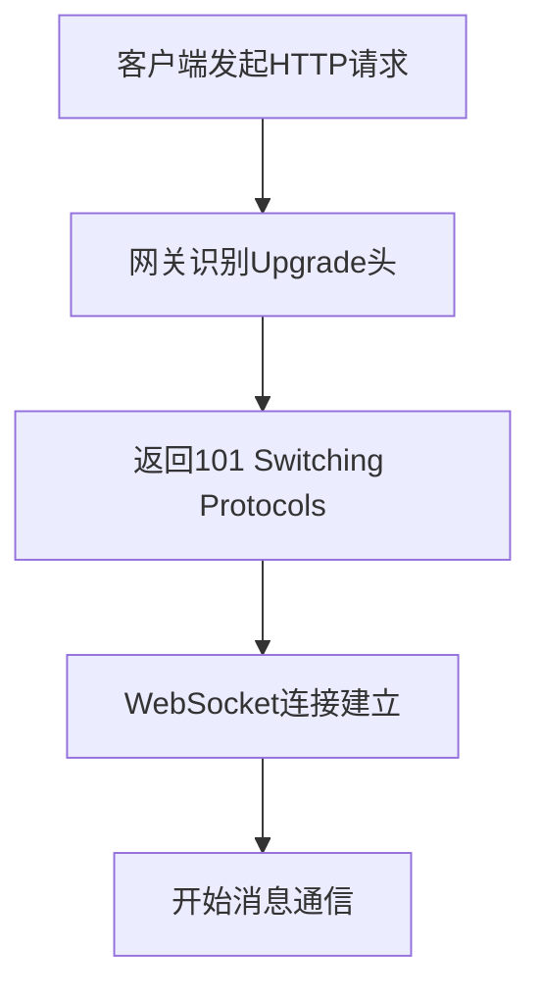
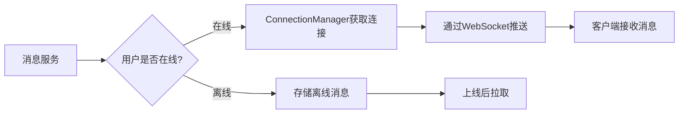
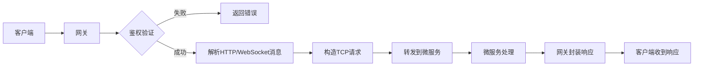

好的！接下来我会为你详细拆解**即时通讯项目中必须实现的网络基础类**，包括它们的**设计原则、代码结构、使用方式**，以及**如何与你的Protobuf协议集成**。这些内容将帮助你构建一个**高性能、可扩展、易维护**的网络通信层。

---

### 一、网络通信层的核心目标

好的！WebSocket连接管理类和连接管理器是即时通讯系统的核心组件，它们负责**维护客户端与网关的长连接**和**实现消息精准投递**。下面我会用**新手友好**的方式，带你一步步设计和实现这两个关键组件。

---

### 一、WebSocket连接管理类设计

#### 1. **为什么需要WebSocket？**

- ✅ 全双工通信：服务端可主动推送消息
- ✅ 低延迟：避免HTTP轮询开销
- ✅ 节省资源：单连接复用，减少握手开销
- ✅ 实时性：适合消息、通知等场景

#### 2. **WebSocket vs TCP 连接管理**

| 对比项   | TCP连接管理      | WebSocket连接管理      |
| -------- | ---------------- | ---------------------- |
| 协议     | 原生TCP          | WebSocket协议          |
| 握手     | 无               | HTTP升级握手           |
| 消息格式 | 二进制流         | 帧格式（有opcode）     |
| 适用场景 | 服务间通信       | 客户端与网关通信       |
| 调试难度 | 高（需工具解析） | 中（可直接查看文本帧） |

#### 3. **WebSocket连接管理类设计（WebSocketConnection）**

##### (1) 头文件设计

```cpp
// network/websocket_connection.h
#pragma once

#include <boost/beast/websocket.hpp>
#include <memory>
#include "tcp_connection.h"  // 复用TCPConnection基础能力

namespace im {

class WebSocketConnection : public std::enable_shared_from_this<WebSocketConnection> {
public:
    using Pointer = std::shared_ptr<WebSocketConnection>;

    // 创建WebSocket连接（基于已有的TCP socket）
    static Pointer create(boost::asio::io_context& io) {
        return Pointer(new WebSocketConnection(io));
    }

    // 获取底层WebSocket流
    boost::beast::websocket::stream<boost::beast::tcp_stream>& ws() { return ws_; }

    // 开始WebSocket握手
    void start_handshake(const std::string& target = "/");

    // 启动消息接收
    void start();

    // 发送二进制消息
    void send_binary(const std::string& message);

    // 发送文本消息（调试用）
    void send_text(const std::string& message);

    // 关闭连接
    void close();

    // 设置消息处理回调
    void set_message_handler(std::function<void(Pointer, const char*, size_t)> handler) {
        message_handler_ = handler;
    }

    // 设置连接关闭回调
    void set_close_handler(std::function<void(Pointer)> handler) {
        close_handler_ = handler;
    }

    // 获取用户ID（如果已认证）
    std::string get_user_id() const { return user_id_; }
  
    // 设置用户ID（认证后调用）
    void set_user_id(const std::string& user_id) { user_id_ = user_id; }

private:
    WebSocketConnection(boost::asio::io_context& io);
  
    // 处理接收的消息
    void do_read();
  
    // 处理WebSocket握手完成
    void on_handshake(boost::system::error_code ec);
  
    // 处理消息接收完成
    void on_read(boost::system::error_code ec, size_t bytes_transferred);

    boost::beast::websocket::stream<boost::beast::tcp_stream> ws_;
    boost::beast::flat_buffer buffer_;
  
    std::string user_id_;  // 认证后设置
    std::function<void(Pointer, const char*, size_t)> message_handler_;
    std::function<void(Pointer)> close_handler_;
};

}  // namespace im
```

##### (2) 实现文件设计

```cpp
// network/websocket_connection.cpp
#include "websocket_connection.h"
#include "utils/logger.h"

namespace im {

WebSocketConnection::WebSocketConnection(boost::asio::io_context& io)
    : ws_(io) {}

void WebSocketConnection::start_handshake(const std::string& target) {
    auto self = shared_from_this();
    ws_.async_handshake(
        "localhost",  // 服务器域名（实际使用时从请求获取）
        target,       // 路径（如"/"）
        [self](boost::system::error_code ec) {
            if (!ec) {
                self->start();
            } else {
                SPDLOG_ERROR("WebSocket handshake failed: {}", ec.message());
                if (self->close_handler_) {
                    self->close_handler_(self);
                }
            }
        }
    );
}

void WebSocketConnection::start() {
    do_read();
}

void WebSocketConnection::do_read() {
    auto self = shared_from_this();
    ws_.async_read(buffer_,
        [self](boost::system::error_code ec, size_t bytes_transferred) {
            if (!ec) {
                self->on_read(ec, bytes_transferred);
            } else {
                if (self->close_handler_) {
                    self->close_handler_(self);
                }
            }
        }
    );
}

void WebSocketConnection::on_read(boost::system::error_code ec, size_t bytes_transferred) {
    if (ec) {
        if (close_handler_) {
            close_handler_(shared_from_this());
        }
        return;
    }

    // 调用消息处理回调
    if (message_handler_) {
        message_handler_(
            shared_from_this(),
            static_cast<const char*>(buffer_.data().data()),
            bytes_transferred
        );
    }

    // 继续读取下一条消息
    buffer_.consume(bytes_transferred);
    do_read();
}

void WebSocketConnection::send_binary(const std::string& message) {
    auto self = shared_from_this();
    ws_.binary(true);  // 设置为二进制消息
    ws_.async_write(boost::asio::buffer(message),
        [self](boost::system::error_code ec, size_t) {
            if (ec) {
                SPDLOG_ERROR("WebSocket write failed: {}", ec.message());
            }
        }
    );
}

void WebSocketConnection::send_text(const std::string& message) {
    auto self = shared_from_this();
    ws_.text(true);  // 设置为文本消息
    ws_.async_write(boost::asio::buffer(message),
        [self](boost::system::error_code ec, size_t) {
            if (ec) {
                SPDLOG_ERROR("WebSocket write failed: {}", ec.message());
            }
        }
    );
}

void WebSocketConnection::close() {
    ws_.async_close(boost::beast::websocket::close_code::normal,
        [self = shared_from_this()](boost::system::error_code ec) {
            if (ec) {
                SPDLOG_ERROR("WebSocket close failed: {}", ec.message());
            }
            if (self->close_handler_) {
                self->close_handler_(self);
            }
        }
    );
}

}  // namespace im
```

#### 4. **关键设计要点**

##### (1) WebSocket握手流程



##### (2) 与Protobuf编解码器集成

```cpp
// 在网关中设置WebSocket消息处理
auto ws_conn = WebSocketConnection::create(io_context);
ws_conn->set_message_handler([](
    WebSocketConnection::Pointer conn, 
    const char* data, 
    size_t len
) {
    // 直接使用ProtobufCodec处理消息
    ProtobufCodec::on_message(conn, data, len);
});
```

##### (3) 心跳检测实现

```cpp
// 添加到WebSocketConnection类
void start_heartbeat(int interval_seconds = 30) {
    heartbeat_timer_.expires_after(std::chrono::seconds(interval_seconds));
    heartbeat_timer_.async_wait([self = shared_from_this()](auto ec) {
        if (!ec) {
            self->send_ping();
            self->start_heartbeat();
        }
    });
}

void send_ping() {
    ws_.async_ping("", [](auto ec) {
        if (ec) SPDLOG_ERROR("Ping failed: {}", ec.message());
    });
}
```

##### (4) 错误处理策略

- **握手失败**：记录日志，关闭连接
- **消息解析失败**：记录警告，不关闭连接
- **心跳超时**：主动关闭连接
- **连接断开**：触发close_handler_回调

---

### 二、连接管理器类设计（ConnectionManager）

#### 1. **为什么需要连接管理器？**

- ✅ 维护用户ID与连接的映射关系
- ✅ 支持消息精准投递（知道用户连接在哪）
- ✅ 处理多设备登录场景
- ✅ 实现用户状态同步

#### 2. **连接管理器类设计**

##### (1) 头文件设计

```cpp
// network/connection_manager.h
#pragma once

#include <unordered_map>
#include <mutex>
#include "websocket_connection.h"

namespace im {

class ConnectionManager {
public:
    static ConnectionManager& instance() {
        static ConnectionManager manager;
        return manager;
    }

    // 添加连接（认证后调用）
    void add_connection(const std::string& user_id, WebSocketConnection::Pointer conn);

    // 移除连接
    void remove_connection(const std::string& user_id);

    // 获取用户连接
    WebSocketConnection::Pointer get_connection(const std::string& user_id);

    // 向用户发送消息
    bool send_to_user(const std::string& user_id, const std::string& message);

    // 获取在线用户数
    size_t online_count() const;

    // 检查用户是否在线
    bool is_online(const std::string& user_id) const;

private:
    ConnectionManager() = default;
    ConnectionManager(const ConnectionManager&) = delete;
    ConnectionManager& operator=(const ConnectionManager&) = delete;

    std::unordered_map<std::string, WebSocketConnection::Pointer> connections_;
    mutable std::mutex mutex_;
};

}  // namespace im
```

##### (2) 实现文件设计

```cpp
// network/connection_manager.cpp
#include "connection_manager.h"
#include "utils/logger.h"

namespace im {

void ConnectionManager::add_connection(const std::string& user_id, WebSocketConnection::Pointer conn) {
    std::lock_guard<std::mutex> lock(mutex_);
  
    // 如果用户已在线，先移除旧连接
    auto it = connections_.find(user_id);
    if (it != connections_.end()) {
        SPDLOG_INFO("User {} reconnected, replacing old connection", user_id);
        it->second->close();
        connections_.erase(it);
    }
  
    // 添加新连接
    connections_[user_id] = conn;
    SPDLOG_INFO("User {} connected, total online: {}", user_id, connections_.size());
}

void ConnectionManager::remove_connection(const std::string& user_id) {
    std::lock_guard<std::mutex> lock(mutex_);
    connections_.erase(user_id);
    SPDLOG_INFO("User {} disconnected, total online: {}", user_id, connections_.size());
}

WebSocketConnection::Pointer ConnectionManager::get_connection(const std::string& user_id) {
    std::lock_guard<std::mutex> lock(mutex_);
    auto it = connections_.find(user_id);
    return (it != connections_.end()) ? it->second : nullptr;
}

bool ConnectionManager::send_to_user(const std::string& user_id, const std::string& message) {
    auto conn = get_connection(user_id);
    if (conn) {
        conn->send_binary(message);
        return true;
    }
    return false;
}

size_t ConnectionManager::online_count() const {
    std::lock_guard<std::mutex> lock(mutex_);
    return connections_.size();
}

bool ConnectionManager::is_online(const std::string& user_id) const {
    std::lock_guard<std::mutex> lock(mutex_);
    return connections_.find(user_id) != connections_.end();
}

}  // namespace im
```

#### 3. **关键设计要点**

##### (1) 多设备登录支持

```cpp
// 扩展连接管理器支持多设备
class ConnectionManager {
    // 使用二级映射：user_id -> device_id -> connection
    std::unordered_map<std::string, std::unordered_map<std::string, WebSocketConnection::Pointer>> connections_;
  
    void add_connection(
        const std::string& user_id, 
        const std::string& device_id,
        WebSocketConnection::Pointer conn
    ) {
        std::lock_guard<std::mutex> lock(mutex_);
        connections_[user_id][device_id] = conn;
    }
  
    // 获取用户所有设备连接
    std::vector<WebSocketConnection::Pointer> get_all_connections(const std::string& user_id) {
        std::lock_guard<std::mutex> lock(mutex_);
        std::vector<WebSocketConnection::Pointer> result;
        if (auto it = connections_.find(user_id); it != connections_.end()) {
            for (const auto& [_, conn] : it->second) {
                result.push_back(conn);
            }
        }
        return result;
    }
};
```

##### (2) 连接清理机制

```cpp
// 在WebSocketConnection中设置关闭回调
conn->set_close_handler([user_id](auto conn) {
    ConnectionManager::instance().remove_connection(user_id);
    // 通知好友下线
    PresenceService::user_offline(user_id);
});
```

##### (3) 消息推送流程



##### (4) 用户状态同步

```cpp
// 用户上线时
void on_user_online(const std::string& user_id) {
    // 1. 更新连接管理器
    ConnectionManager::instance().add_connection(user_id, conn);
  
    // 2. 通知好友
    for (const auto& friend_id : FriendService::get_friends(user_id)) {
        if (ConnectionManager::instance().is_online(friend_id)) {
            PresenceService::notify_online(friend_id, user_id);
        }
    }
}

// 用户下线时
void on_user_offline(const std::string& user_id) {
    // 1. 清理连接
    ConnectionManager::instance().remove_connection(user_id);
  
    // 2. 通知好友
    for (const auto& friend_id : FriendService::get_friends(user_id)) {
        if (ConnectionManager::instance().is_online(friend_id)) {
            PresenceService::notify_offline(friend_id, user_id);
        }
    }
}
```

---

### 三、在网关中整合WebSocket与连接管理器

#### 1. **WebSocket服务器实现**

```cpp
// gateway/websocket_server.h
#pragma once

#include <boost/asio.hpp>
#include "websocket_connection.h"

namespace im {

class WebSocketServer {
public:
    WebSocketServer(boost::asio::io_context& io, short port)
        : acceptor_(io, tcp::endpoint(tcp::v4(), port)) {
        start_accept();
    }

    void start_accept() {
        auto socket = std::make_shared<tcp::socket>(acceptor_.get_executor().context());
        acceptor_.async_accept(*socket, [this, socket](boost::system::error_code ec) {
            if (!ec) {
                handle_accept(socket);
            }
            start_accept();
        });
    }

    void handle_accept(std::shared_ptr<tcp::socket> socket) {
        // 创建WebSocket连接
        auto ws_conn = WebSocketConnection::create(acceptor_.get_executor().context());
      
        // 转移socket所有权
        ws_conn->ws().next_layer() = std::move(*socket);
      
        // 设置消息处理
        ws_conn->set_message_handler([this](auto conn, const char* data, size_t len) {
            // 使用Protobuf编解码器处理消息
            ProtobufCodec::on_message(conn, data, len);
        });
      
        // 设置关闭回调
        ws_conn->set_close_handler([this](auto conn) {
            if (!conn->get_user_id().empty()) {
                ConnectionManager::instance().remove_connection(conn->get_user_id());
            }
        });
      
        // 开始握手
        ws_conn->start_handshake();
    }

private:
    tcp::acceptor acceptor_;
};

}  // namespace im
```

#### 2. **网关主程序整合**

```cpp
// gateway/main.cpp
#include "websocket_server.h"
#include "protobuf_codec.h"
#include "connection_manager.h"
#include "services/user_service.h"

int main() {
    boost::asio::io_context io;
  
    // 1. 初始化连接管理器
    ConnectionManager& conn_manager = ConnectionManager::instance();
  
    // 2. 设置Protobuf消息处理器
    ProtobufCodec::set_message_handler([](
        const IMHeader& header, 
        const std::string& payload, 
        TCPConnection::Pointer conn
    ) {
        // 1. 验证Token
        if (!verify_token(header.token())) {
            send_error(conn, "Invalid token");
            return;
        }
      
        // 2. 认证成功，绑定用户ID
        auto ws_conn = std::static_pointer_cast<WebSocketConnection>(conn);
        ws_conn->set_user_id(header.from_uid());
        conn_manager.add_connection(header.from_uid(), ws_conn);
      
        // 3. 路由处理
        switch (header.cmd_id()) {
            case CMD_LOGIN:
                UserService::login(header, payload, conn);
                break;
            case CMD_SEND_MESSAGE:
                MessageService::send(header, payload);
                break;
            // 其他命令字处理...
        }
    });
  
    // 3. 启动WebSocket服务器
    WebSocketServer ws_server(io, 8080);
  
    // 4. 启动事件循环
    io.run();
    return 0;
}
```

#### 3. **消息推送示例**

```cpp
// services/message_service.cpp
#include "connection_manager.h"

void MessageService::send(const IMHeader& header, const std::string& payload) {
    // 1. 解析消息
    TextMessage msg;
    msg.ParseFromString(payload);
  
    // 2. 存储消息
    MessageDB::save(msg);
  
    // 3. 推送消息
    if (ConnectionManager::instance().is_online(msg.to_id())) {
        // 构造响应消息
        IMHeader response_header = header;
        response_header.set_cmd_id(CMD_PUSH_MESSAGE);
      
        // 发送消息
        ConnectionManager::instance().send_to_user(
            msg.to_id(), 
            serialize_message(response_header, payload)
        );
    } else {
        // 存储离线消息
        OfflineMessageService::save(msg);
    }
}
```

---

### 四、新手避坑指南

#### 1. **WebSocket握手问题**

- **错误**：忽略HTTP握手直接处理WebSocket帧
- **正确**：必须先完成WebSocket握手
  ```cpp
  // 必须先调用async_handshake
  ws_conn->start_handshake();
  ```

#### 2. **二进制消息 vs 文本消息**

- **错误**：对Protobuf消息使用send_text
  ```cpp
  // 错误：Protobuf是二进制数据
  ws_conn->send_text(protobuf_data);
  ```
- **正确**：对Protobuf消息使用send_binary
  ```cpp
  ws_conn->send_binary(protobuf_data);
  ```

#### 3. **连接生命周期管理**

- **错误**：不处理连接断开
  ```cpp
  // 错误：没有设置close_handler
  ws_conn->set_close_handler([](auto conn) {
      // 未清理连接管理器
  });
  ```
- **正确**：清理连接管理器
  ```cpp
  ws_conn->set_close_handler([user_id](auto conn) {
      ConnectionManager::instance().remove_connection(user_id);
  });
  ```

#### 4. **多设备登录处理**

- **错误**：只保存一个连接
  ```cpp
  // 错误：覆盖旧连接
  connections_[user_id] = conn;
  ```
- **正确**：支持多设备
  ```cpp
  // 支持多设备登录
  connections_[user_id][device_id] = conn;
  ```

#### 5. **线程安全问题**

- **错误**：不加锁操作共享数据
  ```cpp
  // 错误：没有互斥锁
  void add_connection(...) {
      connections_[user_id] = conn;
  }
  ```
- **正确**：使用互斥锁
  ```cpp
  void add_connection(...) {
      std::lock_guard<std::mutex> lock(mutex_);
      connections_[user_id] = conn;
  }
  ```

---

### 五、测试验证方法

#### 1. **WebSocket连接测试（使用Chrome开发者工具）**

```javascript
// 在浏览器控制台测试
const ws = new WebSocket('ws://localhost:8080');

ws.onopen = () => {
  console.log('Connected');
  // 发送登录请求
  const header = { cmd_id: 1001, from_uid: "U001" };
  const payload = { username: "user1", password: "pass123" };
  const message = serialize(header, payload);
  ws.send(message);
};

ws.onmessage = (event) => {
  console.log('Received:', event.data);
  // 解析Protobuf消息
  const response = parse(event.data);
  console.log('Response:', response);
};

ws.onerror = (error) => {
  console.error('WebSocket error:', error);
};
```

#### 2. **连接管理器单元测试**

```cpp
// test/connection_manager_test.cpp
#include "connection_manager.h"
#include "mock_websocket_connection.h"

TEST(ConnectionManagerTest, BasicOperations) {
    // 1. 创建模拟连接
    auto conn1 = MockWebSocketConnection::create();
    auto conn2 = MockWebSocketConnection::create();
  
    // 2. 添加连接
    ConnectionManager::instance().add_connection("U001", conn1);
    ConnectionManager::instance().add_connection("U002", conn2);
  
    // 3. 验证在线状态
    EXPECT_TRUE(ConnectionManager::instance().is_online("U001"));
    EXPECT_TRUE(ConnectionManager::instance().is_online("U002"));
    EXPECT_EQ(ConnectionManager::instance().online_count(), 2);
  
    // 4. 发送消息
    EXPECT_TRUE(ConnectionManager::instance().send_to_user("U001", "Hello"));
  
    // 5. 移除连接
    ConnectionManager::instance().remove_connection("U001");
    EXPECT_FALSE(ConnectionManager::instance().is_online("U001"));
    EXPECT_EQ(ConnectionManager::instance().online_count(), 1);
}
```

#### 3. **多设备登录测试**

```cpp
TEST(ConnectionManagerTest, MultiDevice) {
    // 1. 模拟同一用户多设备登录
    auto conn1 = MockWebSocketConnection::create();
    auto conn2 = MockWebSocketConnection::create();
  
    // 2. 添加连接
    ConnectionManager::instance().add_connection("U001", "D001", conn1);
    ConnectionManager::instance().add_connection("U001", "D002", conn2);
  
    // 3. 验证连接
    auto connections = ConnectionManager::instance().get_all_connections("U001");
    EXPECT_EQ(connections.size(), 2);
  
    // 4. 移除一个设备
    ConnectionManager::instance().remove_device("U001", "D001");
    connections = ConnectionManager::instance().get_all_connections("U001");
    EXPECT_EQ(connections.size(), 1);
}
```

---

### 六、常见问题解答

#### Q：WebSocketConnection 和 TCPConnection 有什么关系？

A：**WebSocketConnection 基于 TCPConnection**：

- WebSocketConnection 使用 `boost::beast::websocket::stream` 包装 TCP socket
- 它处理 WebSocket 握手、帧解析等协议细节
- 但底层仍是 TCP 连接

#### Q：为什么需要 set_user_id 方法？

A：WebSocket 连接建立时**用户尚未认证**：

1. 客户端建立 WebSocket 连接
2. 发送登录请求（包含 Token）
3. 网关验证 Token 后调用 `set_user_id`
4. 连接管理器才能将连接与用户绑定

#### Q：如何处理 WebSocket 连接断开？

A：关键步骤：

```cpp
// 1. 设置关闭回调
ws_conn->set_close_handler([user_id](auto conn) {
    // 2. 从连接管理器移除
    ConnectionManager::instance().remove_connection(user_id);
  
    // 3. 通知相关服务
    PresenceService::user_offline(user_id);
  
    // 4. 清理资源
    conn->close();
});
```

#### Q：如何支持 WebSocket 和 TCP 双协议？

A：设计可扩展的连接管理器：

```cpp
// 支持多种连接类型
class ConnectionManager {
    std::unordered_map<std::string, std::shared_ptr<ConnectionBase>> connections_;
  
    template <typename T>
    void add_connection(const std::string& user_id, std::shared_ptr<T> conn) {
        connections_[user_id] = conn;
    }
};
```

#### Q：如何处理消息推送失败？

A：实现重试机制：

```cpp
bool send_with_retry(const std::string& user_id, const std::string& message, int retry = 3) {
    for (int i = 0; i < retry; ++i) {
        if (ConnectionManager::instance().send_to_user(user_id, message)) {
            return true;
        }
        std::this_thread::sleep_for(std::chrono::milliseconds(100 * (i + 1)));
    }
    return false;
}
```

---

### 七、下一步行动建议

1. **立即执行**：先实现 `WebSocketConnection` 类，确保能完成握手和消息收发。
2. **测试验证**：使用浏览器或简单客户端连接网关，验证WebSocket功能。
3. **整合连接管理器**：实现用户ID与连接的绑定，支持消息推送。
4. **文档记录**：为每个类写简要说明（如 WebSocketConnection 的作用）。

如果你需要我为你提供某个类的完整代码示例（如WebSocket服务器完整实现、连接管理器优化），欢迎随时提问！建议你现在先实现最基础的 `WebSocketConnection` 类，我会持续为你提供指导。

当你完成这些后，你的即时通讯系统将具备：

- ✅ 客户端与网关的长连接
- ✅ 实时消息推送能力
- ✅ 用户状态管理
- ✅ 消息精准投递

这是即时通讯系统的核心骨架，后续可以在此基础上添加业务逻辑（登录、消息、好友等）。

在你的即时通讯系统中，网络通信层需要满足以下核心需求：

| 目标                   | 说明                                               |
| ---------------------- | -------------------------------------------------- |
| **高并发支持**   | 支持成千上万的并发连接（使用Boost.Asio异步IO模型） |
| **协议兼容性**   | 支持多种协议（WebSocket、HTTP、TCP）               |
| **消息格式统一** | 使用Protobuf统一消息格式（IMHeader + payload）     |
| **消息路由清晰** | 根据cmd_id路由到不同服务                           |
| **连接管理**     | 维护用户ID与连接的映射关系                         |
| **断线重连机制** | 自动处理连接断开和重连                             |
| **安全控制**     | 支持鉴权、限流、防刷机制                           |

---

### 二、核心网络类设计与实现

#### 1. **TCP连接管理类（TCPConnection）**

**作用**：封装TCP连接的建立、读写、断开逻辑，提供异步操作接口。

```cpp
// network/tcp_connection.h
#include <boost/asio.hpp>
#include <memory>
#include <functional>

class TCPConnection : public std::enable_shared_from_this<TCPConnection> {
public:
    using Pointer = std::shared_ptr<TCPConnection>;
  
    static Pointer create(boost::asio::io_context& io_context) {
        return Pointer(new TCPConnection(io_context));
    }

    boost::asio::ip::tcp::socket& socket() { return socket_; }

    void start() {
        do_read();
    }

private:
    TCPConnection(boost::asio::io_context& io_context)
        : socket_(io_context) {}

    void do_read() {
        auto self(shared_from_this());
        socket_.async_read_some(boost::asio::buffer(data_, max_length),
            [this, self](boost::system::error_code ec, std::size_t length) {
                if (!ec) {
                    // 调用消息处理回调
                    if (message_callback_) {
                        message_callback_(shared_from_this(), data_, length);
                    }
                    do_read();
                } else {
                    // 连接关闭或错误处理
                    if (close_callback_) close_callback_(shared_from_this());
                }
            });
    }

    void do_write(const std::string& message) {
        auto self(shared_from_this());
        boost::asio::async_write(socket_, boost::asio::buffer(message),
            [this, self](boost::system::error_code ec, std::size_t /*length*/) {
                if (ec) {
                    // 错误处理
                }
            });
    }

    boost::asio::ip::tcp::socket socket_;
    enum { max_length = 8192 }; // 支持大消息
    char data_[max_length];

    std::function<void(TCPConnection::Pointer, const char*, size_t)> message_callback_;
    std::function<void(TCPConnection::Pointer)> close_callback_;
};
```

#### 2. **TCP服务器基类（TCPServer）**

**作用**：监听端口、管理连接池、处理连接事件。

```cpp
// network/tcp_server.h
#include <boost/asio.hpp>
#include <memory>

class TCPServer {
public:
    TCPServer(boost::asio::io_context& io_context, short port)
        : acceptor_(io_context, tcp::endpoint(tcp::v4(), port)) {
        start_accept();
    }

private:
    void start_accept() {
        auto new_connection = TCPConnection::create(acceptor_.get_executor().context());
        acceptor_.async_accept(new_connection->socket(),
            [this, new_connection](boost::system::error_code ec) {
                if (!ec) {
                    // 触发新连接回调
                    if (new_connection_callback_) {
                        new_connection_callback_(new_connection);
                    }
                    new_connection->start();
                }
                start_accept();
            });
    }

    tcp::acceptor acceptor_;

    std::function<void(TCPConnection::Pointer)> new_connection_callback_;
};
```

#### 3. **WebSocket连接管理类（WebSocketConnection）**

**作用**：处理WebSocket握手、消息读写、连接生命周期管理。

```cpp
// network/websocket_connection.h
#include <boost/beast/websocket.hpp>
#include <memory>

class WebSocketConnection : public std::enable_shared_from_this<WebSocketConnection> {
public:
    using Pointer = std::shared_ptr<WebSocketConnection>;

    static Pointer create(boost::asio::io_context& io_context) {
        return Pointer(new WebSocketConnection(io_context));
    }

    boost::beast::websocket::stream<boost::beast::tcp_stream>& ws() { return ws_; }

    void start() {
        auto self = shared_from_this();
        ws_.async_accept([self](boost::system::error_code ec) {
            if (!ec) {
                self->do_read();
            } else {
                SPDLOG_ERROR("WebSocket accept error: {}", ec.message());
            }
        });
    }

private:
    WebSocketConnection(boost::asio::io_context& io_context)
        : ws_(io_context) {}

    void do_read() {
        auto self = shared_from_this();
        ws_.async_read(buffer_,
            [this, self](boost::system::error_code ec, std::size_t bytes_transferred) {
                if (!ec) {
                    // 处理消息
                    if (message_callback_) {
                        message_callback_(self, buffer_.data(), bytes_transferred);
                    }
                    buffer_.consume(bytes_transferred);
                    do_read();
                } else {
                    if (close_callback_) close_callback_(self);
                }
            });
    }

    void do_write(const std::string& message) {
        auto self = shared_from_this();
        ws_.text(true); // 发送文本消息
        ws_.async_write(boost::asio::buffer(message),
            [self](boost::system::error_code ec, std::size_t) {
                if (ec) {
                    SPDLOG_ERROR("WebSocket write error: {}", ec.message());
                }
            });
    }

    boost::beast::websocket::stream<boost::beast::tcp_stream> ws_;
    boost::beast::flat_buffer buffer_;

    std::function<void(Pointer, const char*, size_t)> message_callback_;
    std::function<void(Pointer)> close_callback_;
};
```

#### 4. **Protobuf编解码器（ProtobufCodec）**

**作用**：将二进制数据解析为Protobuf消息，支持粘包处理。

```cpp
// network/protobuf_codec.h
#include <google/protobuf/message.h>
#include "im/base.pb.h" // 包含IMHeader定义

class ProtobufCodec {
public:
    // 发送消息
    template <typename T>
    static void send(const T& message, TCPConnection::Pointer conn) {
        std::string data;
        message.SerializeToString(&data);
        conn->do_write(data);
    }

    // 接收消息（带粘包处理）
    static void on_message(TCPConnection::Pointer conn, const char* data, size_t len) {
        // 解析消息头
        IMHeader header;
        if (!header.ParseFromArray(data, len)) {
            SPDLOG_ERROR("Parse header failed");
            return;
        }

        // 提取消息体
        std::string payload(data + header.ByteSize(), len - header.ByteSize());

        // 调用业务处理函数
        if (message_handler_) {
            message_handler_(header, payload, conn);
        }
    }

    // 静态回调函数
    static std::function<void(const IMHeader&, const std::string&, TCPConnection::Pointer)> message_handler_;
};
```

#### 5. **事件循环管理类（IoServicePool）**

**作用**：管理多个IO线程，实现高效的异步网络操作。

```cpp
// network/io_service_pool.h
#include <boost/asio/io_context.hpp>
#include <vector>
#include <memory>

class IoServicePool {
public:
    explicit IoServicePool(std::size_t size)
        : next_io_service_(0) {
        for (std::size_t i = 0; i < size; ++i) {
            io_contexts_.emplace_back(new boost::asio::io_context);
            work_.emplace_back(new boost::asio::executor_work_guard<boost::asio::io_context::executor_type>(
                io_contexts_[i]->get_executor()));
        }
    }

    boost::asio::io_context& get_io_context() {
        boost::asio::io_context& io_context = *io_contexts_[next_io_service_];
        next_io_service_ = (next_io_service_ + 1) % io_contexts_.size();
        return io_context;
    }

    void run() {
        for (auto& io_context : io_contexts_) {
            io_context->run();
        }
    }

    void stop() {
        for (auto& io_context : io_contexts_) {
            io_context->stop();
        }
    }

private:
    std::vector<std::unique_ptr<boost::asio::io_context>> io_contexts_;
    std::vector<boost::asio::executor_work_guard<boost::asio::io_context::executor_type>> work_;
    std::size_t next_io_service_;
};
```

#### 6. **连接管理器（ConnectionManager）**

**作用**：维护用户ID与连接的映射关系，支持连接复用和状态管理。

```cpp
// network/connection_manager.h
#include <unordered_map>
#include <mutex>

class ConnectionManager {
public:
    static ConnectionManager& instance() {
        static ConnectionManager manager;
        return manager;
    }

    void add(const std::string& user_id, TCPConnection::Pointer conn) {
        std::lock_guard<std::mutex> lock(mutex_);
        connections_[user_id] = conn;
    }

    void remove(const std::string& user_id) {
        std::lock_guard<std::mutex> lock(mutex_);
        connections_.erase(user_id);
    }

    TCPConnection::Pointer get(const std::string& user_id) {
        std::lock_guard<std::mutex> lock(mutex_);
        auto it = connections_.find(user_id);
        return it != connections_.end() ? it->second : nullptr;
    }

    void send(const std::string& user_id, const std::string& message) {
        auto conn = get(user_id);
        if (conn) {
            conn->do_write(message);
        }
    }

private:
    std::unordered_map<std::string, TCPConnection::Pointer> connections_;
    std::mutex mutex_;
};
```

---

### 三、网络类的使用场景与整合

#### 1. **网关服务中的整合**

```cpp
// gateway/main.cpp
#include "network/tcp_server.h"
#include "network/protobuf_codec.h"
#include "network/connection_manager.h"

int main() {
    // 1. 初始化事件循环池
    IoServicePool io_pool(4); // 4个IO线程

    // 2. 启动TCP服务器
    TCPServer server(io_pool.get_io_context(), 8080);

    // 3. 设置新连接回调
    server.new_connection_callback_ = [](TCPConnection::Pointer conn) {
        SPDLOG_INFO("New connection from {}", conn->socket().remote_endpoint().address().to_string());

        // 4. 设置消息处理回调
        conn->message_callback_ = [](TCPConnection::Pointer conn, const char* data, size_t len) {
            // 5. 使用Protobuf编解码器处理消息
            ProtobufCodec::on_message(conn, data, len);
        };

        // 6. 设置连接关闭回调
        conn->close_callback_ = [](TCPConnection::Pointer conn) {
            SPDLOG_INFO("Connection closed");
        };
    };

    // 7. 启动事件循环
    io_pool.run();
    return 0;
}
```

#### 2. **消息处理回调的实现**

```cpp
// gateway/protobuf_codec.cpp
#include "network/protobuf_codec.h"
#include "im/command.pb.h"
#include "services/user_service.h" // 示例：调用用户服务

// 静态回调函数实现
std::function<void(const IMHeader&, const std::string&, TCPConnection::Pointer)> ProtobufCodec::message_handler_ = 
    [](const IMHeader& header, const std::string& payload, TCPConnection::Pointer conn) {
        // 1. 根据cmd_id路由到不同服务
        switch (header.cmd_id()) {
            case CMD_LOGIN: {
                // 2. 解析登录请求
                im::user::LoginRequest req;
                req.ParseFromString(payload);

                // 3. 调用用户服务
                im::user::LoginResponse resp;
                UserService::login(req, &resp);

                // 4. 序列化响应
                ProtobufCodec::send(resp, conn);
                break;
            }
            case CMD_SEND_MESSAGE: {
                // 处理发送消息逻辑
                im::message::SendMessageRequest req;
                req.ParseFromString(payload);
                MessageService::send(req);
                break;
            }
            // 其他命令字处理...
        }
    };
```

---

### 四、关键问题解决方案

#### 1. **粘包处理**

```cpp
// 在ProtobufCodec中实现消息长度前缀
static void on_message(TCPConnection::Pointer conn, const char* data, size_t len) {
    // 使用固定长度前缀（4字节表示消息长度）
    if (len < 4) {
        // 数据不足，等待下一次读取
        return;
    }

    // 1. 读取消息长度
    uint32_t message_len = *reinterpret_cast<const uint32_t*>(data);
    if (len < 4 + message_len) {
        // 消息不完整，等待下一次读取
        return;
    }

    // 2. 提取消息体
    const char* message_data = data + 4;
    // 3. 解析消息头
    IMHeader header;
    if (!header.ParseFromArray(message_data, message_len)) {
        SPDLOG_ERROR("Parse header failed");
        return;
    }

    // 4. 提取消息体
    std::string payload(message_data + header.ByteSize(), message_len - header.ByteSize());

    // 5. 调用业务处理函数
    if (message_handler_) {
        message_handler_(header, payload, conn);
    }

    // 6. 剩余数据处理（粘包剩余部分）
    if (len > 4 + message_len) {
        on_message(conn, data + 4 + message_len, len - 4 - message_len);
    }
}
```

#### 2. **连接复用与状态同步**

```cpp
// 在用户登录成功后绑定连接
void handle_login(TCPConnection::Pointer conn, const LoginRequest& req) {
    // 1. 验证登录信息
    if (UserService::validate(req)) {
        // 2. 将用户ID与连接绑定
        ConnectionManager::instance().add(req.user_id(), conn);
    }
}

// 在发送消息时查找连接
void send_message(const std::string& user_id, const std::string& message) {
    auto conn = ConnectionManager::instance().get(user_id);
    if (conn) {
        conn->do_write(message);
    } else {
        // 用户离线，存储离线消息
        OfflineMessageService::save(user_id, message);
    }
}
```

#### 3. **断线重连与连接迁移**

```cpp
// 在连接关闭时记录设备ID
void on_disconnect(TCPConnection::Pointer conn) {
    std::string user_id = get_user_id_from_conn(conn);
    std::string device_id = get_device_id_from_conn(conn);
  
    // 1. 更新用户在线状态（设备级别）
    UserService::update_device_status(user_id, device_id, OFFLINE);

    // 2. 保持其他设备连接
    if (ConnectionManager::instance().get_other_connections(user_id)) {
        // 用户还有其他设备在线
        return;
    }

    // 3. 用户完全下线
    UserService::update_user_status(user_id, OFFLINE);
    // 通知好友下线
    PushService::push_user_offline(user_id);
}
```

---

### 五、新手避坑指南

#### 1. **不要在主线程中执行耗时操作**

- 使用线程池处理业务逻辑：
  ```cpp
  // 使用线程池处理消息
  thread_pool_.enqueue([conn, header, payload]() {
      // 执行业务逻辑
      process_message(header, payload, conn);
  });
  ```

#### 2. **避免内存泄漏**

- 使用智能指针管理连接：
  ```cpp
  // 使用shared_ptr管理连接
  using TCPConnectionPtr = std::shared_ptr<TCPConnection>;
  ```

#### 3. **不要手动管理连接生命周期**

- 使用RAII风格的连接管理：
  ```cpp
  // 在连接关闭时自动清理
  conn->close_callback_ = [](TCPConnection::Pointer conn) {
      std::string user_id = get_user_id(conn);
      ConnectionManager::instance().remove(user_id);
  };
  ```

#### 4. **不要忽略错误处理**

- 所有异步操作必须处理错误码：
  ```cpp
  void do_write(const std::string& message) {
      auto self = shared_from_this();
      ws_.async_write(boost::asio::buffer(message),
          [self](boost::system::error_code ec, std::size_t) {
              if (ec) {
                  SPDLOG_ERROR("WebSocket write error: {}", ec.message());
              }
          });
  }
  ```

#### 5. **不要在主线程中执行耗时操作**

- 使用线程池处理业务逻辑：
  ```cpp
  // 使用线程池处理消息
  thread_pool_.enqueue([conn, header, payload]() {
      // 执行业务逻辑
      process_message(header, payload, conn);
  });
  ```

---

### 六、网络类与业务模块的整合

#### 1. **网关服务**

```cpp
// gateway/main.cpp
#include "network/tcp_server.h"
#include "network/websocket_connection.h"
#include "network/protobuf_codec.h"

int main() {
    IoServicePool io_pool(4);

    // 启动WebSocket服务器
    TCPServer server(io_pool.get_io_context(), 8080);

    // 设置新连接回调
    server.new_connection_callback_ = [](TCPConnection::Pointer conn) {
        auto ws_conn = WebSocketConnection::create(conn->socket().get_executor().context());
        conn->socket().async_accept(ws_conn->ws(), [ws_conn](boost::system::error_code ec) {
            if (!ec) {
                ws_conn->start();
            } else {
                SPDLOG_ERROR("WebSocket accept error: {}", ec.message());
            }
        });
    };

    io_pool.run();
    return 0;
}
```

#### 2. **用户服务**

```cpp
// services/user/user_service.cpp
void UserService::login(const LoginRequest& req, LoginResponse* resp) {
    // 1. 验证账号密码
    if (!verify_credentials(req.username(), req.password())) {
        resp->set_error_code(AUTH_FAILED);
        return;
    }

    // 2. 生成Token
    std::string token = generate_token(req.user_id());
    resp->set_token(token);
    resp->set_error_code(SUCCESS);
}
```

#### 3. **消息服务**

```cpp
// services/message/message_service.cpp
void MessageService::send(const SendMessageRequest& req) {
    // 1. 存储消息
    MessageDB::save(req.message());

    // 2. 推送消息
    if (is_online(req.message().to_uid())) {
        ProtobufCodec::send(req.message(), req.message().to_uid());
    } else {
        OfflineMessageService::save(req.message());
    }
}
```

#### 4. **推送服务**

```cpp
// services/push/push_service.cpp
void PushService::push_user_offline(const std::string& user_id) {
    // 1. 构造推送消息
    PushMessage msg;
    msg.set_type(USER_OFFLINE);
    msg.set_user_id(user_id);

    // 2. 获取用户所有连接
    auto connections = ConnectionManager::instance().get_all_connections(user_id);
    for (auto conn : connections) {
        ProtobufCodec::send(msg, conn);
    }
}
```

---

### 七、网络类与Protobuf协议的整合

#### 1. **消息结构设计**

```protobuf
// im/base.proto
message IMHeader {
    string version = 1;
    uint32 seq = 2;
    uint32 cmd_id = 3;
    string from_id = 4;
    string to_id = 5;
    uint64 timestamp = 6;
    string token = 7;
    string device_id = 8;
}
```

#### 2. **消息发送示例**

```cpp
// 使用ProtobufCodec发送消息
void send_login_response(TCPConnection::Pointer conn) {
    IMHeader header;
    header.set_version("v1.0");
    header.set_seq(12345);
    header.set_cmd_id(CMD_LOGIN);
    header.set_from_id("U001");
    header.set_to_id("U002");
    header.set_timestamp(TimeUtils::now_ms());
    header.set_token("abc123");

    std::string header_data = header.SerializeAsString();
    std::string payload = "Hello World";

    // 发送消息（带消息长度前缀）
    uint32_t total_len = header.ByteSize() + payload.size();
    char len_buf[4];
    *reinterpret_cast<uint32_t*>(len_buf) = htonl(total_len);

    std::string message;
    message.append(len_buf, 4);
    message.append(header_data);
    message.append(payload);

    conn->do_write(message);
}
```

#### 3. **消息接收处理**

```cpp
// ProtobufCodec::on_message 回调
void on_message(const IMHeader& header, const std::string& payload, TCPConnection::Pointer conn) {
    // 1. 验证Token
    if (!validate_token(header.token())) {
        send_error(conn, "Invalid token");
        return;
    }

    // 2. 路由到对应服务
    switch (header.cmd_id()) {
        case CMD_LOGIN:
            handle_login(header, payload, conn);
            break;
        case CMD_SEND_MESSAGE:
            handle_send_message(header, payload);
            break;
        // 其他命令字处理...
    }
}
```

---

### 八、网络类在项目中的分布

| 模块     | 使用的网络类        | 说明           |
| -------- | ------------------- | -------------- |
| 网关服务 | WebSocketConnection | 处理客户端连接 |
| 用户服务 | TCPConnection       | 与网关通信     |
| 消息服务 | TCPConnection       | 与网关通信     |
| 推送服务 | TCPConnection       | 推送离线消息   |
| 客户端   | WebSocketConnection | 与网关通信     |

---

### 九、下一步行动建议

1. **立即执行**：从 `TCPConnection` 和 `ProtobufCodec` 开始，实现最基础的连接管理和消息编解码。
2. **测试验证**：编写单元测试验证消息的序列化/反序列化和粘包处理。
3. **整合到网关**：将网络类整合到网关服务中，实现WebSocket连接管理。
4. **文档记录**：为每个网络类编写详细文档，说明其职责和使用方式。

如果你需要我为你提供某个类的完整实现示例（如WebSocket服务器实现、服务发现集成），欢迎随时提问！建议你现在先实现最基础的 `TCPConnection` 和 `ProtobufCodec`，我会持续为你提供指导。

---

你的思路非常正确！这是**典型的分层架构设计**，也是大多数即时通讯系统的标准做法。我会从 **新手视角** 详细为你讲解这种设计的优势、实现方式和开发建议。

---

### 一、推荐架构（分层设计）

```
│ 客户端（Qt）       WebSocket/HTTP + Protobuf     │
│ 网关（Gateway）     HTTP/WebSocket + TCP + Protobuf  │
│ 微服务（User/Message） TCP + Protobuf             │
```

#### 1. **为什么客户端用 HTTP/WebSocket？**

- **通用性强**：Qt客户端可以用 `QNetworkAccessManager` 发送HTTP请求，Web客户端可用 `fetch`，Electron可用 `axios`。
- **调试方便**：可以用 Postman 或 curl 测试接口。
- **开发门槛低**：新手更容易上手，避免处理TCP连接、粘包、心跳等底层问题。

#### 2. **为什么网关和微服务用 TCP/Protobuf？**

- **高性能**：长连接复用，避免HTTP连接建立开销。
- **低延迟**：Protobuf序列化效率远高于JSON。
- **服务间通信**：网关和微服务之间是内部通信，对协议兼容性要求低。

#### 3. **网关的作用（桥梁角色）**

- **协议转换**：将客户端的HTTP/WebSocket请求转换为TCP/Protobuf请求。
- **路由分发**：根据请求类型（cmd_id）转发到对应微服务。
- **鉴权中心**：所有请求必须经过网关进行Token验证。

---

### 二、客户端与网关的通信方式（推荐组合）

#### 1. **登录/注册/获取联系人等操作**

- **协议**：HTTP + JSON
- **示例**：
  ```cpp
  // Qt客户端使用QNetworkAccessManager发送HTTP请求
  QNetworkAccessManager manager;
  QNetworkRequest request(QUrl("http://gateway:8080/login"));
  request.setHeader(QNetworkRequest::ContentTypeHeader, "application/json");

  QJsonObject json;
  json["username"] = "user1";
  json["password"] = "pass123";
  json["device_id"] = "D001";

  QNetworkReply* reply = manager.post(request, QJsonDocument(json).toJson());
  ```

#### 2. **实时消息收发**

- **协议**：WebSocket + Protobuf
- **优势**：

  - 长连接保持，避免HTTP轮询开销
  - Protobuf序列化效率高，适合高频消息
  - 支持双向通信（服务端主动推送）
- **Qt客户端示例**：

  ```cpp
  QWebSocket socket;
  socket.open(QUrl("ws://gateway:8080?token=abc123"));

  // 发送消息
  IMHeader header;
  header.set_cmd_id(CMD_SEND_MESSAGE);
  header.set_from_id("U001");
  header.set_to_id("U002");
  header.set_timestamp(TimeUtils::now_ms());

  TextMessage text_msg;
  text_msg.set_content("Hello World");
  text_msg.set_at_list("U003");

  // 序列化为Protobuf
  std::string header_data = header.SerializeAsString();
  std::string payload_data = text_msg.SerializeAsString();

  // 构造完整消息（带消息长度前缀）
  uint32_t total_len = header.ByteSize() + payload_data.size();
  char len_buf[4];
  *reinterpret_cast<uint32_t*>(len_buf) = htonl(total_len);

  QByteArray message;
  message.append(len_buf, 4);
  message.append(header_data.data(), header.ByteSize());
  message.append(payload_data.data(), payload_data.size());

  socket.sendBinaryMessage(message);
  ```

---

### 三、网关与微服务的通信方式（TCP/Protobuf）

#### 1. **网关调用微服务的流程**



#### 2. **示例：网关调用用户服务验证登录**

```cpp
// 网关收到登录请求
void handle_login(HttpRequest req) {
    // 1. 解析JSON请求体
    LoginRequest login_req;
    parse_json(req.body(), &login_req);

    // 2. 构造TCP请求
    IMHeader header;
    header.set_cmd_id(CMD_LOGIN);
    header.set_from_id("gateway");
    header.set_to_id("user-service");
    header.set_timestamp(TimeUtils::now_ms());

    // 3. 发送TCP请求到用户服务
    auto conn = ConnectionPool::get("user-service");
    ProtobufCodec::send(header, login_req, conn);

    // 4. 等待响应
    auto response = wait_for_response();
    LoginResponse login_resp;
    login_resp.ParseFromString(response.payload());

    // 5. 返回HTTP响应
    return JsonResponse{
        "success", login_resp.success(),
        "token", login_resp.token()
    };
}
```

---

### 四、新手开发建议（分阶段实现）

#### 第一阶段：基础通信（1-2周）

1. **客户端 → 网关**：使用 HTTP + JSON
   - 示例：登录、注册、获取联系人
   - 工具：Qt的QNetworkAccessManager
2. **网关 → 微服务**：使用 TCP + Protobuf
   - 示例：登录请求转发到用户服务
   - 工具：Boost.Asio + ProtobufCodec

#### 第二阶段：实时消息（1周）

1. **客户端 → 网关**：使用 WebSocket + Protobuf
   - 实现消息收发
   - 支持群消息推送
2. **网关 → 微服务**：保持 TCP + Protobuf
   - 实现消息存储和推送

#### 第三阶段：优化服务间通信（后续扩展）

1. **微服务间通信**：使用 TCP + Protobuf
2. **服务发现**：使用 Nacos/Consul
3. **负载均衡**：实现简单的轮询算法

---

### 五、网关的核心职责（重点！）

| 职责               | 说明                           |
| ------------------ | ------------------------------ |
| **协议转换** | HTTP/WebSocket ↔ TCP/Protobuf |
| **鉴权中心** | 验证Token、限制非法访问        |
| **消息路由** | 根据cmd_id路由到对应服务       |
| **连接管理** | 维护用户与WebSocket连接的映射  |
| **限流熔断** | 防止刷屏攻击、服务降级         |
| **日志监控** | 记录所有请求的详细信息         |

---

### 六、新手避坑指南

#### 1. **不要一开始就追求完美架构**

- 初期只实现 HTTP + Protobuf 的网关
- 示例错误做法：一开始就设计服务注册与发现机制

#### 2. **避免手动处理TCP粘包**

- 初期在Protobuf消息前加4字节长度前缀
- 示例代码：
  ```cpp
  // 发送时加长度前缀
  void send_with_length_prefix(const std::string& data, TCPConnection::Pointer conn) {
      uint32_t len = data.size();
      char prefix[4];
      *reinterpret_cast<uint32_t*>(prefix) = htonl(len);
      conn->do_write(prefix, 4);
      conn->do_write(data);
  }

  // 接收时解析长度前缀
  void parse_with_length_prefix(const char* data, size_t len, TCPConnection::Pointer conn) {
      if (len < 4) return; // 数据不足
      uint32_t expected_len = ntohl(*reinterpret_cast<const uint32_t*>(data));
      if (len < 4 + expected_len) return; // 消息不完整

      const char* message_data = data + 4;
      // 处理消息...
  }
  ```

#### 3. **不要在客户端处理TCP和Protobuf**

- 客户端只处理 HTTP/WebSocket + JSON/Protobuf
- 网关负责协议转换和路由
- 示例错误做法：客户端直接使用Boost.Asio连接微服务

#### 4. **合理使用现成框架**

- 客户端使用 Qt 的 QNetworkAccessManager/QWebSocket
- 网关使用 Boost.Beast（HTTP/WebSocket）
- 微服务使用 Boost.Asio + Protobuf

#### 5. **版本控制建议**

- 客户端与网关：使用 HTTP headers 控制版本
  ```http
  Accept: application/json; version=1.0
  ```
- 网关与微服务：使用 Protobuf 的 version 字段
  ```protobuf
  message IMHeader {
      string version = 1; // "v1.0"
  }
  ```

---

### 七、新手开发路线图（详细）

#### 第一阶段：基础网络通信（1-2周）

```bash
1. 实现 TCP 服务器（Boost.Asio）
2. 实现 Protobuf 编解码器
3. 实现 HTTP 网关（Boost.Beast）
4. 实现 WebSocket 消息推送
5. 实现用户服务（HTTP API）
6. 实现登录流程（HTTP + Protobuf）
```

#### 第二阶段：服务间通信（1周）

```bash
1. 实现网关调用用户服务（TCP + Protobuf）
2. 实现消息服务（TCP + Protobuf）
3. 实现消息发送流程
4. 实现消息推送（WebSocket）
```

#### 第三阶段：优化与扩展（后续）

```bash
1. 实现服务注册与发现（Nacos）
2. 实现负载均衡（客户端负载均衡）
3. 实现限流熔断（令牌桶算法）
4. 实现服务治理（健康检查）
```

---

### 八、新手常见问题解答

#### Q：客户端直接使用Protobuf是不是更高效？

A：不是！**客户端应尽可能简化**，理由如下：

- 调试困难：Protobuf需要额外工具解析
- 跨平台兼容性差：不同语言的Protobuf实现可能不一致
- 开发成本高：需要手动处理TCP连接、粘包、心跳等

#### Q：网关和微服务必须用Protobuf吗？

A：初期**可以使用JSON**，后期再优化为Protobuf：

```cpp
// 初期网关转发JSON请求
void forward_http_to_tcp(HttpRequest req) {
    // 1. 解析JSON
    auto json = parse_json(req.body());
  
    // 2. 转换为Protobuf
    IMHeader header;
    header.set_cmd_id(json["cmd_id"].asInt());
    header.set_from_id(json["from_id"].asString());
  
    // 3. 转发到微服务
    ProtobufCodec::send(header, json["payload"], conn);
}
```

#### Q：WebSocket消息需要Protobuf吗？

A：**需要**，因为：

- 二进制传输效率高
- 支持多种消息类型（文本/图片/文件）
- 便于协议升级（支持新旧版本共存）

#### Q：网关是否必须使用Boost.Asio？

A：**不是**，新手可以先用现成框架：

- **C++**：RESTinC++（轻量级HTTP框架）
- **Python**：FastAPI（快速开发网关原型）
- **Go**：Gin（适合快速验证服务间通信）

---

### 九、典型开发流程（以发送消息为例）

#### 1. 客户端发送HTTP请求

```http
POST /send_message HTTP/1.1
Content-Type: application/json
Authorization: Bearer abc123

{
  "to_id": "U002",
  "content": "Hello World",
  "at_list": ["U003"]
}
```

#### 2. 网关解析并转发

```cpp
// 网关处理HTTP请求
void handle_send_message(HttpRequest req) {
    // 1. 验证Token
    if (!verify_token(req.token())) {
        return send_error("Auth failed");
    }

    // 2. 构造Protobuf消息
    IMHeader header;
    header.set_cmd_id(CMD_SEND_MESSAGE);
    header.set_from_id(req.user_id());
    header.set_to_id(req.to_id());
    header.set_token(req.token());

    TextMessage text_msg;
    text_msg.set_content(req.content());
    for (const auto& at : req.at_list()) {
        text_msg.add_at_list(at);
    }

    // 3. 转发到消息服务
    auto conn = ConnectionPool::get("message-service");
    ProtobufCodec::send(header, text_msg, conn);
}
```

#### 3. 消息服务处理并返回

```cpp
// 消息服务处理CMD_SEND_MESSAGE
void handle_send_message(const IMHeader& header, const std::string& payload) {
    TextMessage msg;
    msg.ParseFromString(payload);

    // 1. 存储消息
    MessageDB::save(msg);

    // 2. 推送消息
    if (is_online(msg.to_id())) {
        auto conn = ConnectionManager::instance().get(msg.to_id());
        ProtobufCodec::send(header, msg, conn);
    } else {
        OfflineMessageService::save(msg);
    }
}
```

#### 4. 网关返回HTTP响应

```cpp
// 网关收到微服务响应后返回
void handle_send_message_response(const std::string& resp_data) {
    BaseResponse base_resp;
    base_resp.ParseFromString(resp_data);

    // 构造JSON响应
    QJsonObject json;
    json["success"] = base_resp.error_code() == SUCCESS;
    json["error_msg"] = base_resp.error_msg();
    send_http_response(json);
}
```

---

### 十、新手推荐工具链

| 工具                    | 说明                                           |
| ----------------------- | ---------------------------------------------- |
| **Qt**            | 客户端开发（QNetworkAccessManager/QWebSocket） |
| **Boost.Asio**    | 网关和微服务的TCP通信                          |
| **Boost.Beast**   | 网关的WebSocket/HTTP服务                       |
| **Protobuf**      | 协议定义和编解码                               |
| **RESTinC++**     | 轻量级HTTP框架（适合网关）                     |
| **QJsonDocument** | Qt客户端解析JSON                               |
| **spdlog**        | 日志记录                                       |
| **Wireshark**     | 抓包调试                                       |
| **Postman**       | 测试HTTP接口                                   |

---

### 十一、下一步行动建议

1. **立即执行**：先实现网关的HTTP登录接口，用Postman测试。
2. **扩展功能**：逐步添加WebSocket消息推送功能。
3. **测试验证**：用Qt客户端连接网关，验证消息收发。
4. **文档记录**：为每个接口写文档（接口名、请求参数、响应格式）。

如果你需要我为你提供某个模块的完整代码示例（如HTTP登录接口实现、WebSocket消息推送），欢迎随时提问！建议你现在先实现最基础的 HTTP 登录接口，我会持续为你提供指导。

---

---

---

## 大致具体开发步骤

你的思路非常清晰！这是**非常合理且高效的开发路径**。下面我会为你详细拆解每个阶段的**具体任务、实现要点、注意事项**，帮助你有条不紊地推进项目。

---

### 一、第一阶段：网络基础类开发（2周）

#### 1. **TCP Server**

**作用**：处理TCP连接，管理客户端连接池。

**实现要点**：

```cpp
// network/tcp_server.h
#include <boost/asio.hpp>
#include <memory>

class TCPServer {
public:
    TCPServer(boost::asio::io_context& io_context, short port)
        : acceptor_(io_context, tcp::endpoint(tcp::v4(), port)) {
        start_accept();
    }

private:
    void start_accept() {
        auto new_connection = TCPConnection::create(acceptor_.get_executor().context());
        acceptor_.async_accept(new_connection->socket(),
            [this, new_connection](boost::system::error_code ec) {
                if (!ec) {
                    // 调用新连接回调
                    if (new_connection_callback_) {
                        new_connection_callback_(new_connection);
                    }
                    new_connection->start();
                }
                start_accept();
            });
    }

    tcp::acceptor acceptor_;

    std::function<void(TCPConnection::Pointer)> new_connection_callback_;
};
```

**注意事项**：

- 初期只实现基础连接管理，不要添加复杂逻辑
- 使用 `std::shared_ptr` 管理连接生命周期
- 为连接回调预留扩展点（如新连接处理、消息处理）

#### 2. **Protobuf 编解码器**

**作用**：实现Protobuf消息与二进制数据的转换。

**实现要点**：

```cpp
// network/protobuf_codec.h
#include <google/protobuf/message.h>
#include "im/base.pb.h"

class ProtobufCodec {
public:
    // 发送消息（带消息长度前缀）
    template <typename T>
    static void send(const T& message, TCPConnection::Pointer conn) {
        std::string data;
        message.SerializeToString(&data);
      
        // 添加4字节长度前缀
        uint32_t len = data.size();
        char len_buf[4];
        *reinterpret_cast<uint32_t*>(len_buf) = htonl(len);
      
        conn->do_write(len_buf, 4);
        conn->do_write(data);
    }

    // 接收消息（带粘包处理）
    static void on_message(TCPConnection::Pointer conn, const char* data, size_t len) {
        while (len >= 4) {
            uint32_t message_len = ntohl(*reinterpret_cast<const uint32_t*>(data));
            if (len < 4 + message_len) break; // 数据不完整
          
            // 提取消息体
            const char* message_data = data + 4;
            IMHeader header;
            if (!header.ParseFromArray(message_data, message_len)) {
                SPDLOG_ERROR("Parse header failed");
                return;
            }
          
            // 提取payload
            std::string payload(message_data + header.ByteSize(), message_len - header.ByteSize());
          
            // 调用业务处理函数
            if (message_handler_) {
                message_handler_(header, payload, conn);
            }
          
            // 剩余数据处理
            data += 4 + message_len;
            len -= 4 + message_len;
        }
    }
};
```

**注意事项**：

- 必须实现**消息长度前缀**（4字节）来处理粘包
- 初期只实现基本编解码，后续再扩展
- 使用 `std::function` 回调处理消息

#### 3. **WebSocket Server**

**作用**：处理WebSocket握手和实时消息收发。

**实现要点**：

```cpp
// network/websocket_server.h
#include <boost/beast/websocket.hpp>
#include <memory>

class WebSocketConnection : public std::enable_shared_from_this<WebSocketConnection> {
public:
    using Pointer = std::shared_ptr<WebSocketConnection>;
  
    static Pointer create(boost::asio::io_context& io) {
        return Pointer(new WebSocketConnection(io));
    }

    boost::beast::websocket::stream<boost::beast::tcp_stream>& ws() { return ws_; }

    void start() {
        auto self = shared_from_this();
        ws_.async_accept([self](boost::system::error_code ec) {
            if (!ec) {
                self->do_read();
            }
        });
    }

private:
    WebSocketConnection(boost::asio::io_context& io)
        : ws_(io) {}

    void do_read() {
        auto self = shared_from_this();
        ws_.async_read(buffer_,
            [this, self](boost::system::error_code ec, std::size_t bytes_transferred) {
                if (!ec) {
                    // 调用消息处理回调
                    if (message_callback_) {
                        message_callback_(self, buffer_.data(), bytes_transferred);
                    }
                    buffer_.consume(bytes_transferred);
                    do_read();
                } else {
                    // 连接关闭
                    if (close_callback_) {
                        close_callback_(self);
                    }
                }
            });
    }

    boost::beast::websocket::stream<boost::beast::tcp_stream> ws_;
    boost::beast::flat_buffer buffer_;

    std::function<void(Pointer, const char*, size_t)> message_callback_;
    std::function<void(Pointer)> close_callback_;
};
```

**注意事项**：

- 使用 `boost.beast` 实现WebSocket握手
- 消息处理回调应支持Protobuf编解码
- 管理连接生命周期（断线清理）

#### 4. **Connection Manager**

**作用**：维护用户ID与连接的映射关系。

**实现要点**：

```cpp
// network/connection_manager.h
#include <unordered_map>
#include <mutex>

class ConnectionManager {
public:
    static ConnectionManager& instance() {
        static ConnectionManager manager;
        return manager;
    }

    void add(const std::string& user_id, TCPConnection::Pointer conn) {
        std::lock_guard<std::mutex> lock(mutex_);
        connections_[user_id] = conn;
    }

    void remove(const std::string& user_id) {
        std::lock_guard<std::mutex> lock(mutex_);
        connections_.erase(user_id);
    }

    TCPConnection::Pointer get(const std::string& user_id) {
        std::lock_guard<std::mutex> lock(mutex_);
        auto it = connections_.find(user_id);
        return it != connections_.end() ? it->second : nullptr;
    }

private:
    std::unordered_map<std::string, TCPConnection::Pointer> connections_;
    std::mutex mutex_;
};
```

**注意事项**：

- 使用互斥锁保护共享数据
- 连接关闭时自动清理
- 支持WebSocket和TCP连接的统一管理

---

### 二、第二阶段：网关服务开发（1周）

#### 1. **使用 RESTinC++ 实现 HTTP 网关**

**作用**：处理客户端的HTTP请求，作为网关的HTTP接口层。

**实现要点**：

```cpp
// gateway/http_server.cpp
#include <restincpp/rest.h>

int main() {
    auto app = rc::create_app();
  
    // 登录接口
    app->route("/login", [](auto req) {
        // 1. 解析JSON请求体
        LoginRequest login_req;
        login_req.ParseFromString(req.body());
      
        // 2. 构造Protobuf请求
        IMHeader header;
        header.set_cmd_id(CMD_LOGIN);
        header.set_from_id("gateway");
        header.set_to_id("user-service");
      
        // 3. 调用用户服务（TCP通信）
        auto conn = ConnectionPool::get("user-service");
        ProtobufCodec::send(header, login_req, conn);
      
        // 4. 等待响应并返回
        return rc::response("LoginResponse");
    });
  
    app->listen("0.0.0.0:8080");
    return 0;
}
```

**注意事项**：

- 初期只实现基础路由
- 使用 `std::shared_ptr` 管理连接
- 逐步添加鉴权、消息路由等功能

#### 2. **WebSocket网关实现**

**作用**：处理实时消息推送。

```cpp
// gateway/websocket_server.cpp
#include "network/websocket_server.h"

int main() {
    boost::asio::io_context io;
    WebSocketServer ws_server(io, 8081);

    // 设置新连接回调
    ws_server.new_connection_callback_ = [](WebSocketConnection::Pointer conn) {
        // 设置消息处理回调
        conn->message_callback_ = [](WebSocketConnection::Pointer conn, const char* data, size_t len) {
            // 使用Protobuf编解码器处理消息
            ProtobufCodec::on_message(conn, data, len);
        };
    };

    io.run();
    return 0;
}
```

**注意事项**：

- WebSocket和TCP服务可以共用Protobuf编解码器
- 使用线程池处理业务逻辑
- 支持连接复用和状态同步

#### 3. **Connection Pool（连接池）**

**作用**：管理与微服务的TCP连接。

```cpp
// network/connection_pool.h
#include <unordered_map>
#include <mutex>

class ConnectionPool {
public:
    static ConnectionPool& instance() {
        static ConnectionPool pool;
        return pool;
    }

    TCPConnection::Pointer get(const std::string& service_name) {
        std::lock_guard<std::mutex> lock(mutex_);
        auto it = connections_.find(service_name);
        if (it != connections_.end()) {
            return it->second;
        }
      
        // 创建新连接
        auto conn = create_connection(service_name);
        connections_[service_name] = conn;
        return conn;
    }

private:
    TCPConnection::Pointer create_connection(const std::string& service_name) {
        // 根据服务名解析地址（初期硬编码）
        tcp::resolver resolver(io_context_);
        auto endpoints = resolver.resolve("127.0.0.1", "8082");
        auto conn = TCPConnection::create(io_context_);
        boost::asio::connect(conn->socket(), endpoints);
        return conn;
    }

    boost::asio::io_context io_context_;
    std::unordered_map<std::string, TCPConnection::Pointer> connections_;
    std::mutex mutex_;
};
```

**注意事项**：

- 初期手动配置服务地址
- 后期可集成服务发现（如Nacos）
- 支持连接复用，避免频繁创建销毁

---

### 三、第三阶段：网关服务开发（2周）

#### 1. **消息路由实现**

```cpp
// gateway/message_router.cpp
#include "network/protobuf_codec.h"
#include "services/user_service.h"
#include "services/message_service.h"

// 静态消息处理回调
std::function<void(const IMHeader&, const std::string&, TCPConnection::Pointer)> ProtobufCodec::message_handler_ = 
    [](const IMHeader& header, const std::string& payload, TCPConnection::Pointer conn) {
        // 1. 验证Token
        if (!verify_token(header.token())) {
            send_error(conn, "Invalid token");
            return;
        }

        // 2. 根据cmd_id路由到不同服务
        switch (header.cmd_id()) {
            case CMD_LOGIN: {
                // 调用用户服务
                UserService::handle_login(header, payload, conn);
                break;
            }
            case CMD_SEND_MESSAGE: {
                // 调用消息服务
                MessageService::send_message(header, payload);
                break;
            }
            // 其他命令字处理...
        }
    };
```

**注意事项**：

- 使用枚举路由命令字
- 保持路由逻辑清晰
- 支持未来扩展

#### 2. **鉴权中心**

```cpp
// gateway/auth_service.cpp
bool verify_token(const std::string& token) {
    // 1. 解析JWT Token
    auto decoded = jwt::decode(token);
  
    // 2. 验证签名
    auto verifier = jwt::verify()
        .allow_algorithm(jwt::algorithm::hs256{"your-secret"})
        .with_issuer("im-server");

    try {
        verifier.verify(decoded);
    } catch (...) {
        return false;
    }

    // 3. 验证用户是否在线
    if (!UserService::check_user_exists(decoded.get_payload_claim("user_id").as_string())) {
        return false;
    }

    return true;
}
```

**注意事项**：

- 初期使用JWT Token
- 后期可支持OAuth2.0
- 需要与用户服务交互验证Token有效性

#### 3. **服务间通信**

```cpp
// gateway/service_proxy.cpp
void forward_to_service(const std::string& service_name, const IMHeader& header, const std::string& payload) {
    // 1. 获取服务连接
    auto conn = ConnectionPool::instance().get(service_name);
  
    // 2. 构造TCP请求
    std::string header_data = header.SerializeAsString();
    std::string request_data = header_data + payload;
  
    // 3. 发送请求
    ProtobufCodec::send(request_data, conn);
}
```

**注意事项**：

- 使用连接池管理服务连接
- 支持异步调用（使用线程池）
- 后期支持服务发现和负载均衡

---

### 四、第四阶段：微服务开发（3周）

#### 1. **用户服务**

```cpp
// services/user_service.cpp
#include "im/user.pb.h"

void UserService::handle_login(const IMHeader& header, const std::string& payload, TCPConnection::Pointer conn) {
    // 1. 解析登录请求
    LoginRequest req;
    req.ParseFromString(payload);
  
    // 2. 验证账号密码
    LoginResponse resp;
    if (UserDB::verify(req.username(), req.password())) {
        resp.set_success(true);
        resp.set_token(generate_jwt_token(req.username()));
    } else {
        resp.set_success(false);
        resp.set_error_msg("Invalid credentials");
    }
  
    // 3. 返回响应
    ProtobufCodec::send(resp, conn);
}
```

**注意事项**：

- 初期使用内存数据库
- 后期集成MySQL
- 支持多种请求处理

#### 2. **消息服务**

```cpp
// services/message_service.cpp
#include "im/message.pb.h"

void MessageService::send_message(const IMHeader& header, const std::string& payload) {
    // 1. 解析消息
    TextMessage msg;
    msg.ParseFromString(payload);
  
    // 2. 存储消息
    MessageDB::save(msg);
  
    // 3. 推送消息
    if (ConnectionManager::instance().get(msg.to_id())) {
        auto conn = ConnectionManager::instance().get(msg.to_id());
        ProtobufCodec::send(header, payload, conn);
    } else {
        OfflineMessageService::save(msg);
    }
}
```

**注意事项**：

- 支持消息持久化
- 实现消息推送
- 支持离线消息存储

#### 3. **服务注册**

```cpp
// services/service_register.cpp
#include <nacos/nacos_client.h>

void register_service(const std::string& service_name, short port) {
    NacosClient client("127.0.0.1:8848");
    client.register_service(service_name, "127.0.0.1", port);
}
```

**注意事项**：

- 初期手动配置服务地址
- 后期集成服务发现
- 支持健康检查

---

### 五、新手避坑指南

#### 1. **不要手动管理连接生命周期**

- 使用智能指针：
  ```cpp
  using TCPConnectionPtr = std::shared_ptr<TCPConnection>;
  ```

#### 2. **避免在主线程中执行耗时操作**

- 使用线程池处理业务逻辑：
  ```cpp
  // 使用线程池处理消息
  thread_pool_.enqueue([conn, header, payload]() {
      process_message(header, payload, conn);
  });
  ```

#### 3. **不要重复造轮子**

- 使用现成库处理JWT、Protobuf、HTTP
- 示例错误：手动解析JSON代替Protobuf

#### 4. **不要忽略错误处理**

- 所有异步操作必须处理错误码：
  ```cpp
  void do_write(const std::string& message) {
      auto self = shared_from_this();
      ws_.async_write(boost::asio::buffer(message),
          [self](boost::system::error_code ec, std::size_t) {
              if (ec) {
                  SPDLOG_ERROR("WebSocket write error: {}", ec.message());
              }
          });
  }
  ```

#### 5. **不要在主线程中执行耗时操作**

- 使用线程池处理业务逻辑：
  ```cpp
  // 使用线程池处理消息
  thread_pool_.enqueue([conn, header, payload]() {
      process_message(header, payload, conn);
  });
  ```

---

### 六、新手开发路线图（详细）

#### 第一阶段：基础网络类（2周）

```bash
1. 实现TCP服务器
2. 实现Protobuf编解码器
3. 实现WebSocket服务器
4. 实现连接管理器
5. 实现连接池
```

#### 第二阶段：网关开发（1周）

```bash
1. 使用RESTinC++搭建HTTP服务
2. 实现WebSocket消息推送
3. 实现消息路由逻辑
4. 实现鉴权中心
5. 实现服务间通信
```

#### 第三阶段：微服务开发（3周）

```bash
1. 实现用户服务
2. 实现消息服务
3. 实现好友服务
4. 实现群组服务
5. 实现服务注册
```

#### 第四阶段：优化与扩展（后续）

```bash
1. 实现服务发现（Nacos）
2. 实现负载均衡
3. 实现限流熔断
4. 实现日志监控
5. 实现配置中心
```

---

### 七、新手开发建议

1. **立即执行**：从TCP服务器和Protobuf编解码器开始，逐步构建基础网络模块。
2. **测试验证**：使用Postman测试HTTP接口，使用telnet测试TCP连接。
3. **文档记录**：为每个模块编写技术文档（接口说明、调用示例）。
4. **分阶段开发**：每个模块完成后都要验证功能，避免集成困难。

如果你需要我为你提供某个模块的完整代码示例（如WebSocket服务器实现、服务发现集成），欢迎随时提问！建议你现在先实现最基础的TCP服务器和Protobuf编解码器，我会持续为你提供指导。
