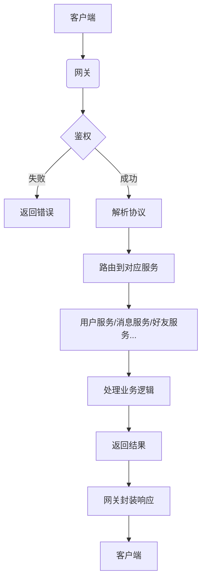
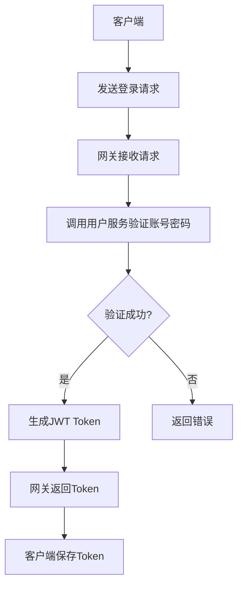
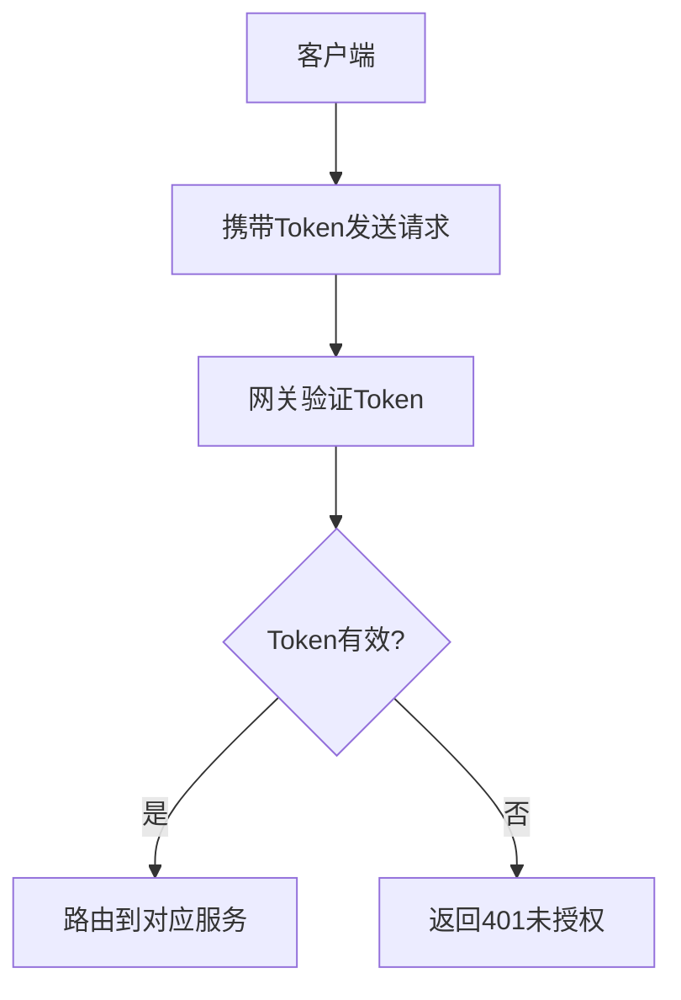

你的理解部分正确，但 **网关（gateway）的功能远不止注册、登录、验证、鉴权**。网关在即时通讯系统中扮演着**客户端连接入口**和**服务统一入口**的角色，它的职责更广泛。下面我会详细解释网关的核心功能、设计原则以及实现思路。

---

### 一、网关的核心功能（不只是鉴权）

#### 1. **网络接入层**

- **协议支持**：作为客户端连接的第一道门，网关需要支持多种通信协议（如WebSocket、HTTP、TCP等），处理握手、连接保持、心跳检测等。
- **连接管理**：维护所有客户端的长连接，记录用户ID与连接的映射关系，支持断线重连机制。
- **负载均衡**：如果部署多个网关实例，需要支持客户端连接的负载均衡（如通过Nacos或Consul做服务发现）。

#### 2. **协议解析与路由**

- **协议转换**：将客户端发送的二进制数据（如Protobuf格式）解析为结构化消息，并根据命令字（cmd_id）路由到对应的微服务。
- **消息转发**：将解析后的消息转发给对应的服务（如用户服务、消息服务），并接收服务的响应返回给客户端。
- **协议兼容性**：支持协议版本升级，处理新旧版本的兼容问题。

#### 3. **全局逻辑处理**

- **鉴权中心**：所有客户端请求必须经过网关进行身份验证（如验证JWT Token、Session ID等）。
- **流量控制**：限制客户端的请求频率（如防止刷屏攻击），支持限流算法（如令牌桶、漏桶）。
- **日志记录**：记录所有客户端请求的详细信息（如IP、用户ID、请求类型、耗时等），便于后续分析。

#### 4. **服务治理**

- **服务发现**：网关需要知道后端微服务的地址（如用户服务、消息服务），通常通过Nacos、Consul等注册中心获取。
- **健康检查**：定期检测后端服务的健康状态，自动剔除异常节点。
- **故障转移**：当某个服务实例不可用时，自动切换到其他可用实例。

---

### 二、网关与微服务的关系

网关是**客户端与后端服务之间的桥梁**，它的核心职责是**代理请求**，而不是处理业务逻辑。以下是典型的请求流程：



---

### 三、网关的详细功能设计（以WebSocket为例）

#### 1. **连接建立与握手**

```cpp
// WebSocket握手流程
void onHandshake(const WebSocketConnectionPtr& conn, const HttpRequest& req) {
    // 1. 解析URL参数（如token）
    std::string token = req.getQueryParam("token");

    // 2. 验证token有效性（调用用户服务接口）
    if (!verifyToken(token)) {
        conn->sendError("Invalid token");
        conn->close();
        return;
    }

    // 3. 记录用户ID与连接的映射关系
    std::string userId = extractUserIdFromToken(token);
    connectionManager.add(userId, conn);
}
```

#### 2. **消息处理流程**

```cpp
void onMessage(const WebSocketConnectionPtr& conn, const MessagePtr& msg) {
    // 1. 解析消息头（IMHeader）
    IMHeader header = parseHeader(msg);

    // 2. 验证用户权限（是否允许执行该操作）
    if (!checkPermission(header.user_id, header.cmd_id)) {
        sendError(conn, "Permission denied");
        return;
    }

    // 3. 路由到对应服务（如用户服务、消息服务）
    Service* targetService = routeService(header.cmd_id);
    if (!targetService) {
        sendError(conn, "Service not found");
        return;
    }

    // 4. 异步调用服务处理
    targetService->handleRequest(header, msg->payload(), [conn](const Response& resp) {
        conn->send(resp.serialize());
    });
}
```

#### 3. **断线处理**

```cpp
void onDisconnect(const WebSocketConnectionPtr& conn) {
    // 1. 获取用户ID
    std::string userId = connectionManager.getUserId(conn);

    // 2. 更新用户在线状态（调用用户服务）
    userService.updateUserStatus(userId, OFFLINE);

    // 3. 清理连接映射
    connectionManager.remove(userId, conn);

    // 4. 通知好友下线事件（推送消息给所有好友）
    pushOfflineNotification(userId);
}
```

---

### 四、网关的鉴权流程详解

#### 1. **登录流程**



#### 2. **后续请求的鉴权**



#### 3. **Token验证实现**

```cpp
bool verifyToken(const std::string& token) {
    // 1. 解析JWT Token
    auto decoded = jwt::decode(token);

    // 2. 验证签名
    if (!decoded.verify(jwt::params::secret("your-secret"))) {
        return false;
    }

    // 3. 验证有效期
    auto now = std::chrono::system_clock::now();
    if (decoded.get_expires_at() < now) {
        return false;
    }

    // 4. 验证用户是否存在（调用用户服务）
    std::string userId = decoded.get_payload_claim("user_id").as_string();
    if (!userService.checkUserExists(userId)) {
        return false;
    }

    return true;
}
```

---

### 五、网关的部署与扩展

#### 1. **单节点部署**

- 适用于小规模测试环境，所有客户端连接到同一个网关。
- 存在单点故障风险，适合初期开发阶段。

#### 2. **多节点部署**

- 使用Nacos或Consul进行服务注册与发现。
- 客户端通过负载均衡算法（如轮询、IP哈希）连接不同的网关实例。
- 需要实现**分布式连接管理**（如使用Redis记录用户连接信息）。

#### 3. **水平扩展**

- 网关本身是无状态的，可以轻松横向扩展。
- 通过Kubernetes或Docker Swarm实现自动扩缩容。

---

### 六、新手避坑指南

#### 1. **不要在网关处理复杂业务逻辑**

- 网关应专注于**协议解析、路由、鉴权**，所有业务逻辑交给后端微服务处理。
- 示例错误做法：在网关中处理消息存储、好友添加等操作。

#### 2. **避免连接泄露**

- 确保每次断开连接时清理映射关系。
- 使用智能指针（如 `std::shared_ptr<WebSocketConnection>`）管理连接生命周期。

#### 3. **协议兼容性问题**

- 初期定义好协议版本字段（如 `version`字段）。
- 后续升级时支持新旧协议共存，逐步淘汰旧版本。

#### 4. **性能瓶颈**

- 网关通常是高并发瓶颈，建议：
  - 使用异步非阻塞IO（如Boost.Asio）。
  - 避免在主线程中执行耗时操作。
  - 使用线程池处理业务逻辑。

---

### 七、下一步行动建议

1. **立即执行**：先实现一个简单的WebSocket服务器，能接收客户端连接并回显消息。
2. **扩展功能**：逐步添加鉴权逻辑（如登录接口、Token验证）。
3. **测试联调**：使用Qt客户端连接网关，验证基本通信流程。
4. **文档记录**：为每个功能模块编写技术文档（如鉴权流程、消息格式说明）。

如果你需要我提供具体的代码示例（如WebSocket服务器实现、JWT鉴权代码），欢迎随时提问！建议你从最基础的网关通信开始，我会持续为你提供指导。


## 服务注册发现与API网关路由配置详解

我将详细解释服务注册发现和API网关路由的实现，包括核心概念、实现步骤和代码示例。

### 一、服务注册发现实现（以Consul为例）

#### 1. 核心概念

- **服务注册**：微服务启动时向注册中心注册自身信息
- **健康检查**：注册中心定期检查服务健康状况
- **服务发现**：客户端通过注册中心获取可用服务实例

#### 2. 实现步骤

**步骤1：部署Consul集群**

```bash
# 启动开发模式Consul
docker run -d --name=dev-consul -p 8500:8500 consul

# 生产环境推荐集群模式（3节点）
docker run -d --name=consul-node1 consul agent -server -bootstrap-expect=3 -node=node1
docker run -d --name=consul-node2 consul agent -server -join=<node1_ip> -node=node2
docker run -d --name=consul-node3 consul agent -server -join=<node1_ip> -node=node3
```

**步骤2：服务注册实现（C++示例）**

```cpp
// service_registry.h
#include <cppconsul/consul.h>
#include <cppconsul/kv.h>

class ServiceRegistry {
public:
    ServiceRegistry(const std::string& consul_addr = "localhost:8500")
        : consul_(cppconsul::Consul(consul_addr)) {}
  
    void RegisterService(const std::string& service_name, 
                         const std::string& service_id,
                         const std::string& address,
                         int port,
                         const std::vector<std::string>& tags = {}) {
        // 创建服务注册信息
        cppconsul::Agent agent(consul_);
        cppconsul::Service service{
            service_name,
            service_id,
            address,
            port,
            tags,
            cppconsul::HealthCheck{"http", "http://" + address + ":" + std::to_string(port) + "/health", "10s"}
        };
      
        // 注册服务
        agent.registerService(service);
        std::cout << "Service registered: " << service_name 
                  << " (" << service_id << ") at " 
                  << address << ":" << port << std::endl;
    }
  
    void DeregisterService(const std::string& service_id) {
        cppconsul::Agent agent(consul_);
        agent.deregisterService(service_id);
        std::cout << "Service deregistered: " << service_id << std::endl;
    }

private:
    cppconsul::Consul consul_;
};
```

**步骤3：在微服务启动时注册**

```cpp
// user_service.cpp
int main() {
    // 初始化服务
    UserService user_service;
  
    // 注册到Consul
    ServiceRegistry registry("consul:8500");
    registry.RegisterService(
        "user-service",            // 服务名称
        "user-service-instance-1", // 实例ID
        "user-service",            // 服务地址（容器名）
        50051,                     // gRPC端口
        {"v1.0", "primary"}        // 标签
    );
  
    // 启动gRPC服务器
    ServerBuilder builder;
    builder.AddListeningPort("0.0.0.0:50051", grpc::InsecureServerCredentials());
    builder.RegisterService(&user_service);
    std::unique_ptr<Server> server(builder.BuildAndStart());
  
    // 添加优雅关闭处理
    std::thread shutdown_thread([&]{
        server->Wait();
        registry.DeregisterService("user-service-instance-1");
    });
  
    shutdown_thread.join();
    return 0;
}
```

**步骤4：健康检查端点实现**

```cpp
// user_service_impl.cpp
grpc::Status UserServiceImpl::HealthCheck(
    grpc::ServerContext* context, 
    const HealthCheckRequest* request, 
    HealthCheckResponse* response) {
  
    // 检查数据库连接
    if (!db_connector_.isConnected()) {
        response->set_status(HealthCheckResponse::DOWN);
        return grpc::Status::OK;
    }
  
    // 检查缓存连接
    if (!redis_connector_.ping()) {
        response->set_status(HealthCheckResponse::DEGRADED);
        return grpc::Status::OK;
    }
  
    response->set_status(HealthCheckResponse::UP);
    return grpc::Status::OK;
}
```

#### 3. 服务发现实现

```cpp
// service_discovery.h
class ServiceDiscovery {
public:
    ServiceDiscovery(const std::string& consul_addr = "localhost:8500")
        : consul_(cppconsul::Consul(consul_addr)) {}
  
    std::vector<ServiceInstance> DiscoverServices(const std::string& service_name) {
        cppconsul::Health health(consul_);
        auto services = health.service(service_name, "", true, "");
      
        std::vector<ServiceInstance> instances;
        for (const auto& service : services) {
            instances.push_back({
                service.getService().getName(),
                service.getService().getAddress(),
                service.getService().getPort(),
                service.getService().getTags()
            });
        }
      
        return instances;
    }
  
    ServiceInstance SelectInstance(const std::string& service_name, 
                                  LoadBalanceStrategy strategy = ROUND_ROBIN) {
        auto instances = DiscoverServices(service_name);
        if (instances.empty()) {
            throw std::runtime_error("No available instances for " + service_name);
        }
      
        // 简单的轮询负载均衡
        static std::map<std::string, size_t> index_map;
        size_t index = index_map[service_name] % instances.size();
        index_map[service_name] = (index + 1) % instances.size();
      
        return instances[index];
    }

private:
    cppconsul::Consul consul_;
};
```

### 二、API网关路由配置

#### 1. 网关核心功能

- 请求路由
- 协议转换（HTTP/WebSocket ↔ gRPC）
- 认证授权
- 限流熔断
- 日志记录

#### 2. 实现方案（使用Nginx + OpenResty）

**目录结构**

```
gateway/
├── conf/
│   ├── nginx.conf
│   └── routes/
│       ├── user_service.lua
│       └── message_service.lua
├── lua/
│   ├── auth.lua
│   ├── service_discovery.lua
│   └── load_balancer.lua
└── docker-compose.yaml
```

**nginx.conf 核心配置**

```nginx
worker_processes  auto;

events {
    worker_connections  1024;
}

http {
    # 共享内存区域
    lua_shared_dict service_cache 10m;
    lua_shared_dict rate_limit 10m;
  
    # 初始化Lua模块
    init_by_lua_block {
        require "resty.core"
        package.path = "/usr/local/openresty/lualib/?.lua;/gateway/lua/?.lua;" .. package.path
    }
  
    server {
        listen 80;
      
        # 健康检查端点
        location = /health {
            access_by_lua_block {
                ngx.say("OK")
            }
        }
      
        # 用户服务路由
        location /api/user/ {
            access_by_lua_file /gateway/lua/auth.lua;
            content_by_lua_file /gateway/conf/routes/user_service.lua;
        }
      
        # 消息服务路由
        location /api/message/ {
            access_by_lua_file /gateway/lua/auth.lua;
            content_by_lua_file /gateway/conf/routes/message_service.lua;
        }
      
        # WebSocket路由
        location /ws/ {
            access_by_lua_file /gateway/lua/auth.lua;
            content_by_lua_file /gateway/conf/routes/websocket.lua;
        }
    }
}
```

**路由配置示例 (user_service.lua)**

```lua
-- user_service.lua
local discovery = require "service_discovery"
local balancer = require "load_balancer"

-- 1. 服务发现
local service_name = "user-service"
local instance = discovery.get_service_instance(service_name)
if not instance then
    ngx.log(ngx.ERR, "No available instances for ", service_name)
    ngx.exit(503)
end

-- 2. 构建gRPC请求
local grpc = require "grpc"
local proto = require "proto.user_service_pb"

-- 根据请求路径映射到不同方法
local method_map = {
    ["/api/user/login"] = "Login",
    ["/api/user/register"] = "Register",
    ["/api/user/profile"] = "GetUserProfile"
}

local method_name = method_map[ngx.var.uri]
if not method_name then
    ngx.log(ngx.ERR, "No method mapping for URI: ", ngx.var.uri)
    ngx.exit(404)
end

-- 3. 转换HTTP请求到gRPC
local channel = grpc.channel(instance.address .. ":" .. instance.port)
local request_data = ngx.req.get_body_data()

-- 4. 调用gRPC服务
local resp, status = channel:call("user.UserService", method_name, request_data, {
    timeout = 5000  -- 5秒超时
})

-- 5. 处理响应
if status ~= grpc.OK then
    ngx.log(ngx.ERR, "gRPC call failed: ", status)
    ngx.exit(500)
end

-- 6. 返回HTTP响应
ngx.header.content_type = "application/json"
ngx.say(resp)
```

**服务发现模块 (service_discovery.lua)**

```lua
-- service_discovery.lua
local http = require "resty.http"
local cjson = require "cjson"

local _M = {}

function _M.get_service_instance(service_name)
    -- 检查缓存
    local cache = ngx.shared.service_cache
    local cache_key = "service:" .. service_name
    local cached = cache:get(cache_key)
  
    if cached then
        return cjson.decode(cached)
    end
  
    -- 从Consul获取服务实例
    local httpc = http.new()
    local res, err = httpc:request_uri("http://consul:8500", {
        path = "/v1/health/service/" .. service_name .. "?passing",
        method = "GET"
    })
  
    if not res then
        ngx.log(ngx.ERR, "Consul request failed: ", err)
        return nil
    end
  
    if res.status ~= 200 then
        ngx.log(ngx.ERR, "Consul returned status: ", res.status)
        return nil
    end
  
    local data = cjson.decode(res.body)
    if #data == 0 then
        ngx.log(ngx.ERR, "No healthy instances for ", service_name)
        return nil
    end
  
    -- 选择实例（简单轮询）
    local index = (cache:get(cache_key .. ":index") or 0) + 1
    if index > #data then
        index = 1
    end
    cache:set(cache_key .. ":index", index)
  
    local instance = {
        id = data[index].Service.ID,
        name = data[index].Service.Service,
        address = data[index].Service.Address,
        port = data[index].Service.Port,
        tags = data[index].Service.Tags
    }
  
    -- 缓存结果（5秒有效期）
    cache:set(cache_key, cjson.encode(instance), 5)
    return instance
end

return _M
```

**认证模块 (auth.lua)**

```lua
-- auth.lua
local jwt = require "resty.jwt"

local _M = {}

function _M.authenticate()
    -- 1. 获取Token
    local auth_header = ngx.var.http_Authorization
    if not auth_header then
        return ngx.exit(401)
    end
  
    local _, _, token = string.find(auth_header, "Bearer%s+(.+)")
    if not token then
        return ngx.exit(401)
    end
  
    -- 2. 验证JWT
    local secret = os.getenv("JWT_SECRET") or "default_secret"
    local jwt_obj = jwt:verify(secret, token)
    if not jwt_obj.verified then
        ngx.log(ngx.ERR, "JWT verification failed: ", jwt_obj.reason)
        return ngx.exit(401)
    end
  
    -- 3. 检查权限
    local path = ngx.var.uri
    local required_role = get_required_role(path)
  
    if required_role and not has_role(jwt_obj.payload.roles, required_role) then
        return ngx.exit(403)
    end
  
    -- 4. 传递用户信息到上游
    ngx.req.set_header("X-User-Id", jwt_obj.payload.sub)
    ngx.req.set_header("X-User-Roles", table.concat(jwt_obj.payload.roles, ","))
end

-- 辅助函数
local function get_required_role(path)
    local role_map = {
        ["/api/user/admin"] = "admin",
        ["/api/message/delete"] = "moderator"
    }
    return role_map[path]
end

local function has_role(user_roles, required_role)
    for _, role in ipairs(user_roles) do
        if role == required_role then
            return true
        end
    end
    return false
end

return _M
```

### 三、关键配置详解

#### 1. 负载均衡策略实现

```lua
-- load_balancer.lua
local _M = {}

-- 轮询策略
function _M.round_robin(instances)
    local index = ngx.shared.lb_index:incr("rr_index", 1, 0)
    return instances[(index % #instances) + 1]
end

-- 随机策略
function _M.random(instances)
    math.randomseed(os.time())
    return instances[math.random(#instances)]
end

-- 最少连接数策略
function _M.least_connections(instances)
    local min_conn = math.huge
    local selected
  
    for _, instance in ipairs(instances) do
        local conn_count = get_connection_count(instance.id)
        if conn_count < min_conn then
            min_conn = conn_count
            selected = instance
        end
    end
  
    return selected
end

-- 加权轮询
function _M.weighted_round_robin(instances)
    local total_weight = 0
    for _, instance in ipairs(instances) do
        total_weight = total_weight + (instance.weight or 1)
    end
  
    local current = ngx.shared.lb_index:incr("wrr_current", 1, 0) % total_weight
    local accumulated = 0
  
    for _, instance in ipairs(instances) do
        accumulated = accumulated + (instance.weight or 1)
        if current < accumulated then
            return instance
        end
    end
  
    return instances[1] -- fallback
end

return _M
```

#### 2. 限流配置（令牌桶算法）

```lua
-- rate_limiter.lua
local _M = {}
local dict = ngx.shared.rate_limit

function _M.limit(key, burst, rate)
    local now = ngx.now()
    local last_update = dict:get(key .. ":last_update") or now
    local tokens = dict:get(key .. ":tokens") or burst
  
    -- 计算新增的令牌
    local elapsed = now - last_update
    local new_tokens = elapsed * rate
  
    -- 更新令牌数量（不超过最大值）
    tokens = math.min(burst, tokens + new_tokens)
  
    -- 检查是否有足够令牌
    if tokens < 1 then
        dict:set(key .. ":last_update", now)
        dict:set(key .. ":tokens", tokens)
        return false  -- 限流
    end
  
    -- 消耗令牌
    tokens = tokens - 1
    dict:set(key .. ":last_update", now)
    dict:set(key .. ":tokens", tokens)
    return true  -- 允许通过
end

-- 在路由中使用
local limiter = require "rate_limiter"

if not limiter.limit(ngx.var.remote_addr, 100, 10) then
    ngx.header["Retry-After"] = 60
    return ngx.exit(429)
end
```

### 四、部署架构

```
+----------------+       +-----------------+       +-----------------+
|    Client      |       |    API Gateway  |       |   Consul        |
| (Qt/Web/Mobile)| ----> | (Nginx + Lua)   | <---->| (Service Registry)|
+----------------+       +--------+--------+       +-----------------+
                                  |
                                  |
              +-------------------+-------------------+
              |                   |                   |
        +-----+------+     +-----+------+     +------+-----+
        | User Service|    | Message Svc|     | Group Svc  |
        +-------------+    +------------+     +------------+
```

### 五、最佳实践

1. **服务注册**：

   - 使用唯一服务ID（如：user-service-`<hostname>`-`<port>`）
   - 实现优雅注销（SIGTERM信号处理）
   - 设置合理的健康检查间隔（5-10秒）
2. **服务发现**：

   - 添加本地缓存（减少Consul压力）
   - 实现故障转移（当服务不可用时自动切换到备用实例）
   - 使用标签进行金丝雀发布
3. **API网关**：

   - 配置统一的错误处理
   - 实现请求/响应日志
   - 添加Prometheus监控指标
   - 设置合理的超时时间
4. **安全**：

   - 使用HTTPS加密通信
   - 实施严格的CORS策略
   - 添加API密钥验证
   - 防止DDoS攻击（Nginx限流模块）

### 六、调试与监控

1. **Consul UI**：

   - 访问 http://localhost:8500 查看服务状态
   - 检查健康检查状态
2. **Nginx调试**：

   ```bash
   # 查看访问日志
   docker logs -f api-gateway

   # 测试路由
   curl -v http://localhost/api/user/health
   ```
3. **Prometheus监控**：

   ```yaml
   # Nginx指标配置
   nginx.conf:
     http {
       log_format prometheus '$remote_addr - $remote_user [$time_local] '
                            '"$request" $status $body_bytes_sent '
                            '"$http_referer" "$http_user_agent"';
     }
   ```

这个实现方案提供了完整的服务注册发现和API网关路由功能，你可以根据实际需求调整参数和策略。建议先从基础功能开始实现，逐步添加高级特性。
