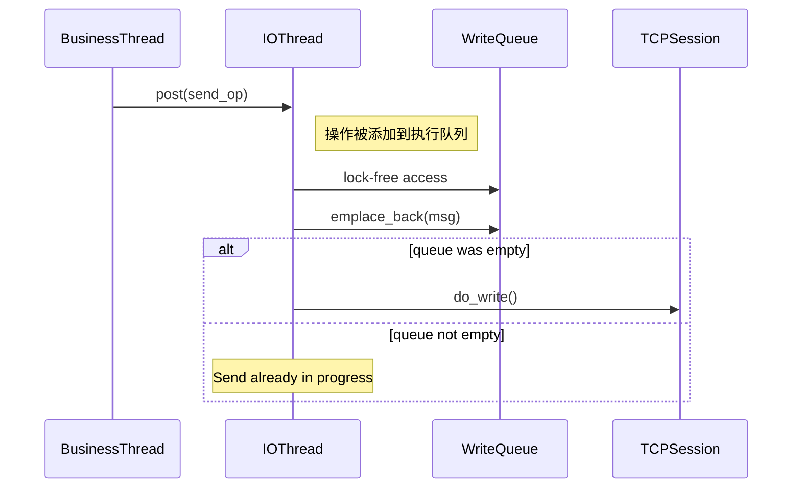

这段代码是 `TCPSession` 类中用于异步发送消息的核心方法。让我们逐部分详细解释它的工作原理和设计考虑：

### 代码解析

```cpp
void TCPSession::send(const std::string& message) {
    // 将发送操作投递到套接字的执行器中，确保线程安全
    net::post(socket_.get_executor(),
        [this, self = shared_from_this(), msg = std::move(message)]() mutable {
            bool write_in_progress = !write_queue_.empty();
            write_queue_.push_back(std::move(msg));
            
            // 如果没有正在进行的写操作，立即开始发送
            if (!write_in_progress) {
                do_write();
            }
        });
}
```

### 1. `net::post` 的作用

```cpp
net::post(socket_.get_executor(), ...);
```

- **`net::post`**：这是 Boost.Asio 提供的异步操作提交函数。它将指定的函数对象（lambda）投递到与套接字关联的执行器（executor）中排队执行
- **`socket_.get_executor()`**：获取与套接字关联的执行器（通常是 I/O 上下文或 strand）。这确保了：
  - 操作在正确的线程上下文执行（I/O 线程）
  - 避免了多线程并发访问共享资源（如写队列）的竞争条件
- **为什么需要 post**：
  - 调用 `send()` 的线程可能不是 I/O 线程（可能是业务线程）
  - 直接操作写队列会导致线程安全问题
  - 通过 `post` 将操作转移到套接字的执行器线程，保证了线程安全

### 2. Lambda 捕获列表

```cpp
[this, self = shared_from_this(), msg = std::move(message)]() mutable
```

- **`this`**：捕获当前 `TCPSession` 对象的指针，以便访问成员变量和方法
- **`self = shared_from_this()`**：
  - 创建共享指针副本，延长当前对象生命周期
  - 确保在 lambda 执行时，`TCPSession` 对象不会被意外销毁
  - 这是 `enable_shared_from_this` 的标准用法
- **`msg = std::move(message)`**：
  - 使用 `std::move` 将传入的消息移动到 lambda 的局部变量 `msg`
  - 这里发生了第一次移动：从函数参数 `message` 移动到捕获的 `msg`

### 3. 为什么要连续两次 `std::move`？

在调用处可能这样使用：
```cpp
std::string data = "Hello";
session->send(std::move(data));  // 第一次移动：data -> 参数message
```

在 `send` 内部：
```cpp
[msg = std::move(message)]  // 第二次移动：参数message -> lambda局部msg
```

两次移动的目的：
1. **避免不必要的拷贝**：字符串内容只移动所有权，不复制数据
2. **最小化锁定时长**：在业务线程快速移交所有权，减少锁竞争
3. **支持右值传递**：允许调用者使用 `std::move` 优化
4. **效率优化**：移动操作时间复杂度 O(1)，复制操作 O(n)

### 4. 为什么不用 `emplace_back`？

```cpp
write_queue_.push_back(std::move(msg));
```

这里确实可以使用 `emplace_back` 优化：
```cpp
write_queue_.emplace_back(std::move(msg));  // 更优的写法
```

`emplace_back` 的优势：
- 直接在容器中构造元素，避免临时对象的创建
- 对于字符串，可以节省一次移动构造操作
- 性能更好（特别是对于复杂类型）

推荐修改为：
```cpp
write_queue_.emplace_back(std::move(msg));  // 最佳实践
```

### 5. 写队列管理逻辑

```cpp
bool write_in_progress = !write_queue_.empty();
write_queue_.push_back(std::move(msg));
if (!write_in_progress) {
    do_write();
}
```

这段逻辑实现了：
1. **非阻塞发送队列**：
   - 所有发送请求都先加入队列
   - 实际发送操作异步执行
   
2. **串行化发送操作**：
   - `write_in_progress` 标志当前是否有进行中的发送
   - 如果没有进行中的发送，立即启动发送过程
   - 如果有，新消息加入队列，由当前发送操作完成后继续处理

3. **流量控制**：
   - 避免同时发起多个异步写操作
   - 保证消息按顺序发送
   - 防止发送缓冲区溢出

### 完整工作流程

1. **业务线程**调用 `send("message")`
2. 消息被移动到 lambda 捕获
3. Lambda 被投递到 I/O 线程队列
4. **I/O 线程**执行 lambda：
   - 检查当前发送状态
   - 移动消息到写队列
   - 如果没有进行中的发送，调用 `do_write()`
5. `do_write()` 异步发送队列中的消息
6. 发送完成后，检查队列中是否还有消息，继续发送

### 线程安全分析



- **线程安全保证**：
  - 所有队列操作都在 I/O 线程执行（单线程访问）
  - 共享状态（`write_queue_`）不需要额外加锁
  - `shared_from_this` 保证对象生命周期安全

### 为什么这样设计？

1. **异步模型**：
   - 避免阻塞调用线程
   - 允许高并发发送

2. **零拷贝优化**：
   - 最多两次移动构造（可优化为一次）
   - 避免大消息的内存复制

3. **背压控制**：
   - 队列自然形成背压机制
   - 当发送速度跟不上时，队列增长，调用方需等待

4. **顺序保证**：
   - 消息按提交顺序发送
   - 不会出现消息交叉

### 优化建议

1. 使用 `emplace_back` 替代 `push_back`：
   ```cpp
   write_queue_.emplace_back(std::move(msg));
   ```

2. 添加队列长度监控：
   ```cpp
   if (write_queue_.size() > max_queue_size) {
       // 处理背压：丢弃消息或通知调用方
   }
   ```

3. 支持移动语义重载：
   ```cpp
   void send(std::string&& message) { // 右值引用重载
       net::post(socket_.get_executor(),
           [this, self = shared_from_this(), msg = std::move(message)]() mutable {
               // ...
           });
   }
   ```

4. 添加优先级支持（如果需要）：
   ```cpp
   void send(Message&& msg, Priority priority = Normal) {
       net::post(/*...*/ [this, msg = std::move(msg), priority] {
           auto it = priority == High 
                   ? write_queue_.begin() 
                   : write_queue_.end();
           write_queue_.emplace(it, std::move(msg));
           // ...
       });
   }
   ```

这段代码是高性能网络编程中典型的异步发送模式，平衡了线程安全、性能和资源效率，是 Boost.Asio 库的经典用法。


要解决编译错误 `boost::asio::io_context` 的拷贝赋值不可访问的问题，关键在于理解 Boost.Asio 中 `io_context` 的设计限制：**它不允许拷贝构造或拷贝赋值**。因此，如果你在 `TCPServer` 中将 `io_context_` 声明为值类型（如 `boost::asio::io_context`），并在构造函数中试图用 `IOServicePool::GetInstance().GetIOService()` 初始化它，就会触发这个错误。

---

### ✅ 问题定位

你当前的 `TCPServer` 类中，`io_context_` 的声明如下：

```cpp
boost::asio::io_context io_context_;
```

而你在构造函数中使用了：

```cpp
TCPServer::TCPServer(unsigned short port)
    : io_context_(IOServicePool::GetInstance().GetIOService()),
      ...
```

此时，`GetIOService()` 返回的是 `boost::asio::io_context&`，你试图用这个引用去初始化一个 `boost::asio::io_context` 类型的成员变量，这会调用拷贝构造函数，而 `io_context` 的拷贝构造函数是被删除的（`= delete`），因此编译失败。

---

### ✅ 解决方案

要解决这个问题，你需要将 `io_context_` 的类型从值类型改为引用类型。这样，它就不会尝试拷贝 `io_context`，而是直接引用 `IOServicePool` 提供的实例。

#### ✅ 修改 `TCPServer` 类的成员变量声明

将 `io_context_` 的声明从：

```cpp
boost::asio::io_context io_context_;
```

改为：

```cpp
boost::asio::io_context& io_context_;
```

---

### ✅ 修改构造函数初始化列表

确保构造函数初始化列表中使用 `GetIOService()` 返回的引用：

```cpp
TCPServer::TCPServer(unsigned short port)
    : io_context_(IOServicePool::GetInstance().GetIOService()),
      acceptor_(io_context_, tcp::endpoint(tcp::v4(), port)),
      signals_(io_context_, SIGINT, SIGTERM)
{
    // ...
}
```

这样，`io_context_` 就会正确绑定到 `IOServicePool` 提供的 `io_context` 实例上，而不会触发拷贝构造。

---

### ✅ 注意事项

- **不要在类中保存 `io_context` 的副本**，因为 `io_context` 不可拷贝。
- **确保 `IOServicePool::GetIOService()` 返回的是有效的 `io_context&`**，避免引用悬空。
- **避免在类中使用 `io_context_ = ...` 进行赋值操作**，因为赋值操作同样被禁用。

---

### ✅ 总结

| 错误原因 | 解决方法 |
|----------|----------|
| `io_context` 被声明为值类型，导致调用拷贝构造函数 | 将 `io_context_` 声明为引用类型 `boost::asio::io_context&` |
| 构造函数中使用了 `GetIOService()` 返回的引用初始化值类型 | 修改初始化方式，确保引用绑定正确 |

---

通过以上修改，你的 `TCPServer` 就能正确使用 `IOServicePool` 提供的 `io_context`，避免拷贝构造错误，并正确集成到你的服务架构中。


