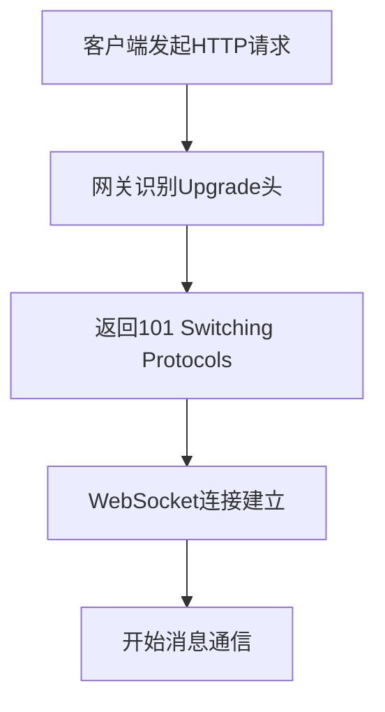
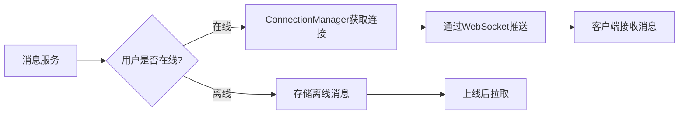

好的！WebSocket连接管理类和连接管理器是即时通讯系统的核心组件，它们负责**维护客户端与网关的长连接**和**实现消息精准投递**。下面我会用**新手友好**的方式，带你一步步设计和实现这两个关键组件。

---

### 一、WebSocket连接管理类设计

#### 1. **为什么需要WebSocket？**
- ✅ 全双工通信：服务端可主动推送消息
- ✅ 低延迟：避免HTTP轮询开销
- ✅ 节省资源：单连接复用，减少握手开销
- ✅ 实时性：适合消息、通知等场景

#### 2. **WebSocket vs TCP 连接管理**
| 对比项 | TCP连接管理 | WebSocket连接管理 |
|--------|-------------|-------------------|
| 协议 | 原生TCP | WebSocket协议 |
| 握手 | 无 | HTTP升级握手 |
| 消息格式 | 二进制流 | 帧格式（有opcode） |
| 适用场景 | 服务间通信 | 客户端与网关通信 |
| 调试难度 | 高（需工具解析） | 中（可直接查看文本帧） |

#### 3. **WebSocket连接管理类设计（WebSocketConnection）**

##### (1) 头文件设计
```cpp
// network/websocket_connection.h
#pragma once

#include <boost/beast/websocket.hpp>
#include <memory>
#include "tcp_connection.h"  // 复用TCPConnection基础能力

namespace im {

class WebSocketConnection : public std::enable_shared_from_this<WebSocketConnection> {
public:
    using Pointer = std::shared_ptr<WebSocketConnection>;

    // 创建WebSocket连接（基于已有的TCP socket）
    static Pointer create(boost::asio::io_context& io) {
        return Pointer(new WebSocketConnection(io));
    }

    // 获取底层WebSocket流
    boost::beast::websocket::stream<boost::beast::tcp_stream>& ws() { return ws_; }

    // 开始WebSocket握手
    void start_handshake(const std::string& target = "/");

    // 启动消息接收
    void start();

    // 发送二进制消息
    void send_binary(const std::string& message);

    // 发送文本消息（调试用）
    void send_text(const std::string& message);

    // 关闭连接
    void close();

    // 设置消息处理回调
    void set_message_handler(std::function<void(Pointer, const char*, size_t)> handler) {
        message_handler_ = handler;
    }

    // 设置连接关闭回调
    void set_close_handler(std::function<void(Pointer)> handler) {
        close_handler_ = handler;
    }

    // 获取用户ID（如果已认证）
    std::string get_user_id() const { return user_id_; }
    
    // 设置用户ID（认证后调用）
    void set_user_id(const std::string& user_id) { user_id_ = user_id; }

private:
    WebSocketConnection(boost::asio::io_context& io);
    
    // 处理接收的消息
    void do_read();
    
    // 处理WebSocket握手完成
    void on_handshake(boost::system::error_code ec);
    
    // 处理消息接收完成
    void on_read(boost::system::error_code ec, size_t bytes_transferred);

    boost::beast::websocket::stream<boost::beast::tcp_stream> ws_;
    boost::beast::flat_buffer buffer_;
    
    std::string user_id_;  // 认证后设置
    std::function<void(Pointer, const char*, size_t)> message_handler_;
    std::function<void(Pointer)> close_handler_;
};

}  // namespace im
```

##### (2) 实现文件设计
```cpp
// network/websocket_connection.cpp
#include "websocket_connection.h"
#include "utils/logger.h"

namespace im {

WebSocketConnection::WebSocketConnection(boost::asio::io_context& io)
    : ws_(io) {}

void WebSocketConnection::start_handshake(const std::string& target) {
    auto self = shared_from_this();
    ws_.async_handshake(
        "localhost",  // 服务器域名（实际使用时从请求获取）
        target,       // 路径（如"/"）
        [self](boost::system::error_code ec) {
            if (!ec) {
                self->start();
            } else {
                SPDLOG_ERROR("WebSocket handshake failed: {}", ec.message());
                if (self->close_handler_) {
                    self->close_handler_(self);
                }
            }
        }
    );
}

void WebSocketConnection::start() {
    do_read();
}

void WebSocketConnection::do_read() {
    auto self = shared_from_this();
    ws_.async_read(buffer_,
        [self](boost::system::error_code ec, size_t bytes_transferred) {
            if (!ec) {
                self->on_read(ec, bytes_transferred);
            } else {
                if (self->close_handler_) {
                    self->close_handler_(self);
                }
            }
        }
    );
}

void WebSocketConnection::on_read(boost::system::error_code ec, size_t bytes_transferred) {
    if (ec) {
        if (close_handler_) {
            close_handler_(shared_from_this());
        }
        return;
    }

    // 调用消息处理回调
    if (message_handler_) {
        message_handler_(
            shared_from_this(),
            static_cast<const char*>(buffer_.data().data()),
            bytes_transferred
        );
    }

    // 继续读取下一条消息
    buffer_.consume(bytes_transferred);
    do_read();
}

void WebSocketConnection::send_binary(const std::string& message) {
    auto self = shared_from_this();
    ws_.binary(true);  // 设置为二进制消息
    ws_.async_write(boost::asio::buffer(message),
        [self](boost::system::error_code ec, size_t) {
            if (ec) {
                SPDLOG_ERROR("WebSocket write failed: {}", ec.message());
            }
        }
    );
}

void WebSocketConnection::send_text(const std::string& message) {
    auto self = shared_from_this();
    ws_.text(true);  // 设置为文本消息
    ws_.async_write(boost::asio::buffer(message),
        [self](boost::system::error_code ec, size_t) {
            if (ec) {
                SPDLOG_ERROR("WebSocket write failed: {}", ec.message());
            }
        }
    );
}

void WebSocketConnection::close() {
    ws_.async_close(boost::beast::websocket::close_code::normal,
        [self = shared_from_this()](boost::system::error_code ec) {
            if (ec) {
                SPDLOG_ERROR("WebSocket close failed: {}", ec.message());
            }
            if (self->close_handler_) {
                self->close_handler_(self);
            }
        }
    );
}

}  // namespace im
```

#### 4. **关键设计要点**

##### (1) WebSocket握手流程


##### (2) 与Protobuf编解码器集成
```cpp
// 在网关中设置WebSocket消息处理
auto ws_conn = WebSocketConnection::create(io_context);
ws_conn->set_message_handler([](
    WebSocketConnection::Pointer conn, 
    const char* data, 
    size_t len
) {
    // 直接使用ProtobufCodec处理消息
    ProtobufCodec::on_message(conn, data, len);
});
```

##### (3) 心跳检测实现
```cpp
// 添加到WebSocketConnection类
void start_heartbeat(int interval_seconds = 30) {
    heartbeat_timer_.expires_after(std::chrono::seconds(interval_seconds));
    heartbeat_timer_.async_wait([self = shared_from_this()](auto ec) {
        if (!ec) {
            self->send_ping();
            self->start_heartbeat();
        }
    });
}

void send_ping() {
    ws_.async_ping("", [](auto ec) {
        if (ec) SPDLOG_ERROR("Ping failed: {}", ec.message());
    });
}
```

##### (4) 错误处理策略
- **握手失败**：记录日志，关闭连接
- **消息解析失败**：记录警告，不关闭连接
- **心跳超时**：主动关闭连接
- **连接断开**：触发close_handler_回调

---

### 二、连接管理器类设计（ConnectionManager）

#### 1. **为什么需要连接管理器？**
- ✅ 维护用户ID与连接的映射关系
- ✅ 支持消息精准投递（知道用户连接在哪）
- ✅ 处理多设备登录场景
- ✅ 实现用户状态同步

#### 2. **连接管理器类设计**

##### (1) 头文件设计
```cpp
// network/connection_manager.h
#pragma once

#include <unordered_map>
#include <mutex>
#include "websocket_connection.h"

namespace im {

class ConnectionManager {
public:
    static ConnectionManager& instance() {
        static ConnectionManager manager;
        return manager;
    }

    // 添加连接（认证后调用）
    void add_connection(const std::string& user_id, WebSocketConnection::Pointer conn);

    // 移除连接
    void remove_connection(const std::string& user_id);

    // 获取用户连接
    WebSocketConnection::Pointer get_connection(const std::string& user_id);

    // 向用户发送消息
    bool send_to_user(const std::string& user_id, const std::string& message);

    // 获取在线用户数
    size_t online_count() const;

    // 检查用户是否在线
    bool is_online(const std::string& user_id) const;

private:
    ConnectionManager() = default;
    ConnectionManager(const ConnectionManager&) = delete;
    ConnectionManager& operator=(const ConnectionManager&) = delete;

    std::unordered_map<std::string, WebSocketConnection::Pointer> connections_;
    mutable std::mutex mutex_;
};

}  // namespace im
```

##### (2) 实现文件设计
```cpp
// network/connection_manager.cpp
#include "connection_manager.h"
#include "utils/logger.h"

namespace im {

void ConnectionManager::add_connection(const std::string& user_id, WebSocketConnection::Pointer conn) {
    std::lock_guard<std::mutex> lock(mutex_);
    
    // 如果用户已在线，先移除旧连接
    auto it = connections_.find(user_id);
    if (it != connections_.end()) {
        SPDLOG_INFO("User {} reconnected, replacing old connection", user_id);
        it->second->close();
        connections_.erase(it);
    }
    
    // 添加新连接
    connections_[user_id] = conn;
    SPDLOG_INFO("User {} connected, total online: {}", user_id, connections_.size());
}

void ConnectionManager::remove_connection(const std::string& user_id) {
    std::lock_guard<std::mutex> lock(mutex_);
    connections_.erase(user_id);
    SPDLOG_INFO("User {} disconnected, total online: {}", user_id, connections_.size());
}

WebSocketConnection::Pointer ConnectionManager::get_connection(const std::string& user_id) {
    std::lock_guard<std::mutex> lock(mutex_);
    auto it = connections_.find(user_id);
    return (it != connections_.end()) ? it->second : nullptr;
}

bool ConnectionManager::send_to_user(const std::string& user_id, const std::string& message) {
    auto conn = get_connection(user_id);
    if (conn) {
        conn->send_binary(message);
        return true;
    }
    return false;
}

size_t ConnectionManager::online_count() const {
    std::lock_guard<std::mutex> lock(mutex_);
    return connections_.size();
}

bool ConnectionManager::is_online(const std::string& user_id) const {
    std::lock_guard<std::mutex> lock(mutex_);
    return connections_.find(user_id) != connections_.end();
}

}  // namespace im
```

#### 3. **关键设计要点**

##### (1) 多设备登录支持
```cpp
// 扩展连接管理器支持多设备
class ConnectionManager {
    // 使用二级映射：user_id -> device_id -> connection
    std::unordered_map<std::string, std::unordered_map<std::string, WebSocketConnection::Pointer>> connections_;
    
    void add_connection(
        const std::string& user_id, 
        const std::string& device_id,
        WebSocketConnection::Pointer conn
    ) {
        std::lock_guard<std::mutex> lock(mutex_);
        connections_[user_id][device_id] = conn;
    }
    
    // 获取用户所有设备连接
    std::vector<WebSocketConnection::Pointer> get_all_connections(const std::string& user_id) {
        std::lock_guard<std::mutex> lock(mutex_);
        std::vector<WebSocketConnection::Pointer> result;
        if (auto it = connections_.find(user_id); it != connections_.end()) {
            for (const auto& [_, conn] : it->second) {
                result.push_back(conn);
            }
        }
        return result;
    }
};
```

##### (2) 连接清理机制
```cpp
// 在WebSocketConnection中设置关闭回调
conn->set_close_handler([user_id](auto conn) {
    ConnectionManager::instance().remove_connection(user_id);
    // 通知好友下线
    PresenceService::user_offline(user_id);
});
```

##### (3) 消息推送流程


##### (4) 用户状态同步
```cpp
// 用户上线时
void on_user_online(const std::string& user_id) {
    // 1. 更新连接管理器
    ConnectionManager::instance().add_connection(user_id, conn);
    
    // 2. 通知好友
    for (const auto& friend_id : FriendService::get_friends(user_id)) {
        if (ConnectionManager::instance().is_online(friend_id)) {
            PresenceService::notify_online(friend_id, user_id);
        }
    }
}

// 用户下线时
void on_user_offline(const std::string& user_id) {
    // 1. 清理连接
    ConnectionManager::instance().remove_connection(user_id);
    
    // 2. 通知好友
    for (const auto& friend_id : FriendService::get_friends(user_id)) {
        if (ConnectionManager::instance().is_online(friend_id)) {
            PresenceService::notify_offline(friend_id, user_id);
        }
    }
}
```

---

### 三、在网关中整合WebSocket与连接管理器

#### 1. **WebSocket服务器实现**
```cpp
// gateway/websocket_server.h
#pragma once

#include <boost/asio.hpp>
#include "websocket_connection.h"

namespace im {

class WebSocketServer {
public:
    WebSocketServer(boost::asio::io_context& io, short port)
        : acceptor_(io, tcp::endpoint(tcp::v4(), port)) {
        start_accept();
    }

    void start_accept() {
        auto socket = std::make_shared<tcp::socket>(acceptor_.get_executor().context());
        acceptor_.async_accept(*socket, [this, socket](boost::system::error_code ec) {
            if (!ec) {
                handle_accept(socket);
            }
            start_accept();
        });
    }

    void handle_accept(std::shared_ptr<tcp::socket> socket) {
        // 创建WebSocket连接
        auto ws_conn = WebSocketConnection::create(acceptor_.get_executor().context());
        
        // 转移socket所有权
        ws_conn->ws().next_layer() = std::move(*socket);
        
        // 设置消息处理
        ws_conn->set_message_handler([this](auto conn, const char* data, size_t len) {
            // 使用Protobuf编解码器处理消息
            ProtobufCodec::on_message(conn, data, len);
        });
        
        // 设置关闭回调
        ws_conn->set_close_handler([this](auto conn) {
            if (!conn->get_user_id().empty()) {
                ConnectionManager::instance().remove_connection(conn->get_user_id());
            }
        });
        
        // 开始握手
        ws_conn->start_handshake();
    }

private:
    tcp::acceptor acceptor_;
};

}  // namespace im
```

#### 2. **网关主程序整合**
```cpp
// gateway/main.cpp
#include "websocket_server.h"
#include "protobuf_codec.h"
#include "connection_manager.h"
#include "services/user_service.h"

int main() {
    boost::asio::io_context io;
    
    // 1. 初始化连接管理器
    ConnectionManager& conn_manager = ConnectionManager::instance();
    
    // 2. 设置Protobuf消息处理器
    ProtobufCodec::set_message_handler([](
        const IMHeader& header, 
        const std::string& payload, 
        TCPConnection::Pointer conn
    ) {
        // 1. 验证Token
        if (!verify_token(header.token())) {
            send_error(conn, "Invalid token");
            return;
        }
        
        // 2. 认证成功，绑定用户ID
        auto ws_conn = std::static_pointer_cast<WebSocketConnection>(conn);
        ws_conn->set_user_id(header.from_uid());
        conn_manager.add_connection(header.from_uid(), ws_conn);
        
        // 3. 路由处理
        switch (header.cmd_id()) {
            case CMD_LOGIN:
                UserService::login(header, payload, conn);
                break;
            case CMD_SEND_MESSAGE:
                MessageService::send(header, payload);
                break;
            // 其他命令字处理...
        }
    });
    
    // 3. 启动WebSocket服务器
    WebSocketServer ws_server(io, 8080);
    
    // 4. 启动事件循环
    io.run();
    return 0;
}
```

#### 3. **消息推送示例**
```cpp
// services/message_service.cpp
#include "connection_manager.h"

void MessageService::send(const IMHeader& header, const std::string& payload) {
    // 1. 解析消息
    TextMessage msg;
    msg.ParseFromString(payload);
    
    // 2. 存储消息
    MessageDB::save(msg);
    
    // 3. 推送消息
    if (ConnectionManager::instance().is_online(msg.to_id())) {
        // 构造响应消息
        IMHeader response_header = header;
        response_header.set_cmd_id(CMD_PUSH_MESSAGE);
        
        // 发送消息
        ConnectionManager::instance().send_to_user(
            msg.to_id(), 
            serialize_message(response_header, payload)
        );
    } else {
        // 存储离线消息
        OfflineMessageService::save(msg);
    }
}
```

---

### 四、新手避坑指南

#### 1. **WebSocket握手问题**
- **错误**：忽略HTTP握手直接处理WebSocket帧
- **正确**：必须先完成WebSocket握手
  ```cpp
  // 必须先调用async_handshake
  ws_conn->start_handshake();
  ```

#### 2. **二进制消息 vs 文本消息**
- **错误**：对Protobuf消息使用send_text
  ```cpp
  // 错误：Protobuf是二进制数据
  ws_conn->send_text(protobuf_data);
  ```
- **正确**：对Protobuf消息使用send_binary
  ```cpp
  ws_conn->send_binary(protobuf_data);
  ```

#### 3. **连接生命周期管理**
- **错误**：不处理连接断开
  ```cpp
  // 错误：没有设置close_handler
  ws_conn->set_close_handler([](auto conn) {
      // 未清理连接管理器
  });
  ```
- **正确**：清理连接管理器
  ```cpp
  ws_conn->set_close_handler([user_id](auto conn) {
      ConnectionManager::instance().remove_connection(user_id);
  });
  ```

#### 4. **多设备登录处理**
- **错误**：只保存一个连接
  ```cpp
  // 错误：覆盖旧连接
  connections_[user_id] = conn;
  ```
- **正确**：支持多设备
  ```cpp
  // 支持多设备登录
  connections_[user_id][device_id] = conn;
  ```

#### 5. **线程安全问题**
- **错误**：不加锁操作共享数据
  ```cpp
  // 错误：没有互斥锁
  void add_connection(...) {
      connections_[user_id] = conn;
  }
  ```
- **正确**：使用互斥锁
  ```cpp
  void add_connection(...) {
      std::lock_guard<std::mutex> lock(mutex_);
      connections_[user_id] = conn;
  }
  ```

---

### 五、测试验证方法

#### 1. **WebSocket连接测试（使用Chrome开发者工具）**
```javascript
// 在浏览器控制台测试
const ws = new WebSocket('ws://localhost:8080');

ws.onopen = () => {
  console.log('Connected');
  // 发送登录请求
  const header = { cmd_id: 1001, from_uid: "U001" };
  const payload = { username: "user1", password: "pass123" };
  const message = serialize(header, payload);
  ws.send(message);
};

ws.onmessage = (event) => {
  console.log('Received:', event.data);
  // 解析Protobuf消息
  const response = parse(event.data);
  console.log('Response:', response);
};

ws.onerror = (error) => {
  console.error('WebSocket error:', error);
};
```

#### 2. **连接管理器单元测试**
```cpp
// test/connection_manager_test.cpp
#include "connection_manager.h"
#include "mock_websocket_connection.h"

TEST(ConnectionManagerTest, BasicOperations) {
    // 1. 创建模拟连接
    auto conn1 = MockWebSocketConnection::create();
    auto conn2 = MockWebSocketConnection::create();
    
    // 2. 添加连接
    ConnectionManager::instance().add_connection("U001", conn1);
    ConnectionManager::instance().add_connection("U002", conn2);
    
    // 3. 验证在线状态
    EXPECT_TRUE(ConnectionManager::instance().is_online("U001"));
    EXPECT_TRUE(ConnectionManager::instance().is_online("U002"));
    EXPECT_EQ(ConnectionManager::instance().online_count(), 2);
    
    // 4. 发送消息
    EXPECT_TRUE(ConnectionManager::instance().send_to_user("U001", "Hello"));
    
    // 5. 移除连接
    ConnectionManager::instance().remove_connection("U001");
    EXPECT_FALSE(ConnectionManager::instance().is_online("U001"));
    EXPECT_EQ(ConnectionManager::instance().online_count(), 1);
}
```

#### 3. **多设备登录测试**
```cpp
TEST(ConnectionManagerTest, MultiDevice) {
    // 1. 模拟同一用户多设备登录
    auto conn1 = MockWebSocketConnection::create();
    auto conn2 = MockWebSocketConnection::create();
    
    // 2. 添加连接
    ConnectionManager::instance().add_connection("U001", "D001", conn1);
    ConnectionManager::instance().add_connection("U001", "D002", conn2);
    
    // 3. 验证连接
    auto connections = ConnectionManager::instance().get_all_connections("U001");
    EXPECT_EQ(connections.size(), 2);
    
    // 4. 移除一个设备
    ConnectionManager::instance().remove_device("U001", "D001");
    connections = ConnectionManager::instance().get_all_connections("U001");
    EXPECT_EQ(connections.size(), 1);
}
```

---

### 六、常见问题解答

#### Q：WebSocketConnection 和 TCPConnection 有什么关系？
A：**WebSocketConnection 基于 TCPConnection**：
- WebSocketConnection 使用 `boost::beast::websocket::stream` 包装 TCP socket
- 它处理 WebSocket 握手、帧解析等协议细节
- 但底层仍是 TCP 连接

#### Q：为什么需要 set_user_id 方法？
A：WebSocket 连接建立时**用户尚未认证**：
1. 客户端建立 WebSocket 连接
2. 发送登录请求（包含 Token）
3. 网关验证 Token 后调用 `set_user_id`
4. 连接管理器才能将连接与用户绑定

#### Q：如何处理 WebSocket 连接断开？
A：关键步骤：
```cpp
// 1. 设置关闭回调
ws_conn->set_close_handler([user_id](auto conn) {
    // 2. 从连接管理器移除
    ConnectionManager::instance().remove_connection(user_id);
    
    // 3. 通知相关服务
    PresenceService::user_offline(user_id);
    
    // 4. 清理资源
    conn->close();
});
```

#### Q：如何支持 WebSocket 和 TCP 双协议？
A：设计可扩展的连接管理器：
```cpp
// 支持多种连接类型
class ConnectionManager {
    std::unordered_map<std::string, std::shared_ptr<ConnectionBase>> connections_;
    
    template <typename T>
    void add_connection(const std::string& user_id, std::shared_ptr<T> conn) {
        connections_[user_id] = conn;
    }
};
```

#### Q：如何处理消息推送失败？
A：实现重试机制：
```cpp
bool send_with_retry(const std::string& user_id, const std::string& message, int retry = 3) {
    for (int i = 0; i < retry; ++i) {
        if (ConnectionManager::instance().send_to_user(user_id, message)) {
            return true;
        }
        std::this_thread::sleep_for(std::chrono::milliseconds(100 * (i + 1)));
    }
    return false;
}
```

---

### 七、下一步行动建议

1. **立即执行**：先实现 `WebSocketConnection` 类，确保能完成握手和消息收发。
2. **测试验证**：使用浏览器或简单客户端连接网关，验证WebSocket功能。
3. **整合连接管理器**：实现用户ID与连接的绑定，支持消息推送。
4. **文档记录**：为每个类写简要说明（如 WebSocketConnection 的作用）。

如果你需要我为你提供某个类的完整代码示例（如WebSocket服务器完整实现、连接管理器优化），欢迎随时提问！建议你现在先实现最基础的 `WebSocketConnection` 类，我会持续为你提供指导。

当你完成这些后，你的即时通讯系统将具备：
- ✅ 客户端与网关的长连接
- ✅ 实时消息推送能力
- ✅ 用户状态管理
- ✅ 消息精准投递

这是即时通讯系统的核心骨架，后续可以在此基础上添加业务逻辑（登录、消息、好友等）。