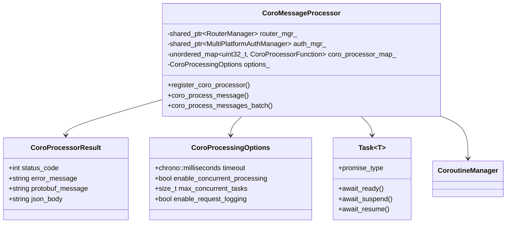
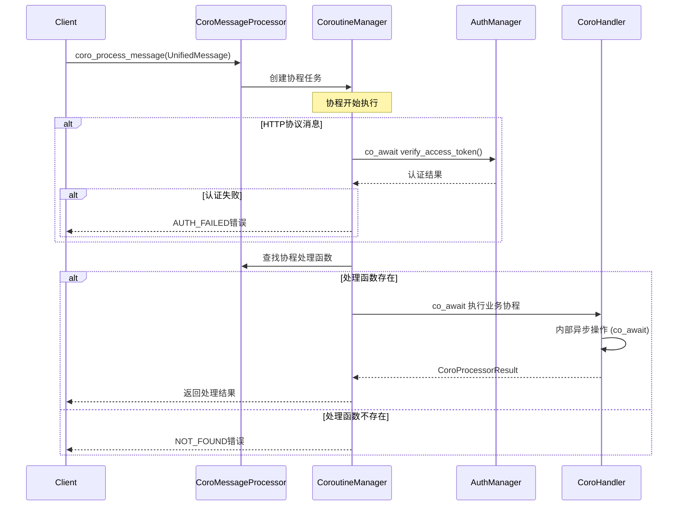

# CoroMessageProcessor 协程消息处理器使用文档

## 📋 目录
1. [概述](#概述)
2. [核心特性](#核心特性)
3. [架构设计](#架构设计)
4. [API接口](#api接口)
5. [使用示例](#使用示例)
6. [协程处理器开发](#协程处理器开发)
7. [性能优化](#性能优化)
8. [错误处理](#错误处理)
9. [最佳实践](#最佳实践)
10. [与Future版本对比](#与future版本对比)

---

## 概述

CoroMessageProcessor是MyChat网关基于C++20协程的高级异步消息处理器。它在保持与MessageProcessor相同功能的基础上，提供了更直观的异步编程体验、更高的性能和更强的异步流程控制能力。

### 🎯 设计目标
- **协程优先**：基于C++20协程提供更自然的异步编程体验
- **高性能**：协程开销比线程更小，支持更高的并发数
- **复杂流程**：支持复杂的异步流程控制，如并发处理、超时控制
- **向下兼容**：保持与原版本相同的认证、路由和错误处理机制

### 🏗️ 架构位置
```
UnifiedMessage → CoroMessageProcessor → 协程处理函数 → CoroProcessorResult → 客户端响应
                      ↓
                [CoroutineManager] ← 协程调度和管理
```

### 🆚 与Future版本的区别

| 特性 | MessageProcessor (Future) | CoroMessageProcessor (Coroutine) |
|------|--------------------------|----------------------------------|
| 异步模型 | std::future + 线程池 | C++20协程 |
| 内存开销 | 每个任务一个线程栈 | 协程栈，开销更小 |
| 并发能力 | 受线程数限制 | 支持数万个协程 |
| 代码复杂度 | 回调或阻塞等待 | 同步风格的异步代码 |
| 异步组合 | 复杂 | 简单直观 |
| 编译要求 | C++11+ | C++20+ |

---

## 核心特性

### 1. 协程化异步处理
- **co_await语法**：支持在处理函数内部使用co_await进行异步操作
- **同步风格**：异步代码写起来像同步代码，避免回调地狱
- **异常传播**：协程中的异常能够自然传播到调用方

### 2. 高级流程控制
- **超时控制**：内置超时机制，防止长时间运行的协程
- **并发限制**：可配置的最大并发协程数量
- **批量处理**：支持批量消息的并发处理

### 3. 性能监控和日志
- **详细统计**：协程执行时间、成功率、错误率统计
- **请求日志**：可配置的详细请求日志记录
- **性能分析**：支持协程性能分析和调优

### 4. 灵活配置
- **处理选项**：丰富的配置选项控制协程行为
- **动态调整**：运行时可调整部分配置参数
- **环境适配**：支持开发、测试、生产环境的不同配置

---

## 架构设计

### 类结构图



### 协程处理流程



---

## API接口

### 构造函数

```cpp
/**
 * @brief 构造函数（使用现有管理器实例）
 * @param router_mgr 路由管理器，用于服务发现和路由
 * @param auth_mgr 多平台认证管理器，用于Token验证
 * @param options 协程处理选项配置
 */
CoroMessageProcessor(std::shared_ptr<RouterManager> router_mgr,
                     std::shared_ptr<MultiPlatformAuthManager> auth_mgr,
                     const CoroProcessingOptions& options = CoroProcessingOptions{});

/**
 * @brief 构造函数（从配置文件创建管理器）
 * @param router_config_file 路由配置文件路径
 * @param auth_config_file 认证配置文件路径
 * @param options 协程处理选项配置
 */
CoroMessageProcessor(const std::string& router_config_file, 
                     const std::string& auth_config_file,
                     const CoroProcessingOptions& options = CoroProcessingOptions{});
```

### 核心协程接口

#### 协程消息处理

```cpp
/**
 * @brief 协程化处理消息
 * @param message 待处理的统一消息对象
 * @return Task<CoroProcessorResult> 协程任务，包含处理结果
 * 
 * @details 处理流程：
 *          1. 对于HTTP协议消息，协程化验证Access Token
 *          2. 根据cmd_id查找对应的协程处理函数
 *          3. 执行协程处理函数，支持内部异步操作
 *          4. 应用超时控制和并发限制
 */
Task<CoroProcessorResult> coro_process_message(std::unique_ptr<UnifiedMessage> message);

/**
 * @brief 批量协程处理消息
 * @param messages 待处理的消息列表
 * @return Task<std::vector<CoroProcessorResult>> 批量处理结果
 */
Task<std::vector<CoroProcessorResult>> coro_process_messages_batch(
    std::vector<std::unique_ptr<UnifiedMessage>> messages);
```

#### 协程处理函数管理

```cpp
/**
 * @brief 注册协程消息处理函数
 * @param cmd_id 命令ID，用于路由消息到对应的处理函数
 * @param processor 协程处理函数，返回Task<CoroProcessorResult>
 * @return 注册结果码（与MessageProcessor相同）
 */
int register_coro_processor(uint32_t cmd_id, CoroProcessorFunction processor);

/**
 * @brief 获取已注册的协程处理函数数量
 * @return 当前注册的协程处理函数数量
 */
int get_coro_callback_count() const;
```

### 配置和统计

#### 处理选项配置

```cpp
/**
 * @brief 协程处理选项配置
 */
struct CoroProcessingOptions {
    std::chrono::milliseconds timeout{30000};           ///< 处理超时时间，默认30秒
    bool enable_concurrent_processing{true};             ///< 是否启用并发处理
    size_t max_concurrent_tasks{100};                    ///< 最大并发任务数
    bool enable_request_logging{true};                   ///< 是否启用请求日志
    bool enable_performance_monitoring{true};           ///< 是否启用性能监控
    
    CoroProcessingOptions() = default;
};

/**
 * @brief 更新处理选项
 * @param new_options 新的配置选项
 */
void update_processing_options(const CoroProcessingOptions& new_options);
```

#### 统计信息

```cpp
/**
 * @brief 协程处理器统计信息
 */
struct CoroProcessorStats {
    std::atomic<uint64_t> total_processed{0};            ///< 总处理数
    std::atomic<uint64_t> success_count{0};              ///< 成功数
    std::atomic<uint64_t> error_count{0};                ///< 错误数
    std::atomic<uint64_t> timeout_count{0};              ///< 超时数
    std::atomic<uint64_t> avg_processing_time_ms{0};     ///< 平均处理时间
    std::atomic<uint32_t> current_active_coroutines{0};  ///< 当前活跃协程数
    std::atomic<uint32_t> max_concurrent_coroutines{0};  ///< 最大并发协程数
};

/**
 * @brief 获取统计信息
 * @return 统计信息快照
 */
CoroProcessorStats get_coro_stats() const;

/**
 * @brief 重置统计信息
 */
void reset_coro_stats();
```

### 类型定义

```cpp
/**
 * @brief 协程处理函数类型定义
 */
using CoroProcessorFunction = std::function<Task<CoroProcessorResult>(const UnifiedMessage&)>;

/**
 * @brief 协程处理结果（与ProcessorResult保持一致）
 */
struct CoroProcessorResult {
    int status_code;                ///< 状态码，0表示成功
    std::string error_message;      ///< 错误信息描述
    std::string protobuf_message;   ///< Protobuf格式的响应数据
    std::string json_body;          ///< JSON格式的响应数据

    // 构造函数与ProcessorResult相同
    CoroProcessorResult();
    CoroProcessorResult(int code, std::string err_msg);
    CoroProcessorResult(int code, std::string err_msg, std::string pb_msg, std::string json);
};
```

---

## 使用示例

### 基础使用

```cpp
#include "coro_message_processor.hpp"
#include "../../common/utils/coroutine_manager.hpp"
#include <iostream>

using namespace im::gateway;
using namespace im::common;

int main() {
    try {
        // 1. 配置协程处理选项
        CoroProcessingOptions options;
        options.timeout = std::chrono::seconds(30);
        options.max_concurrent_tasks = 200;
        options.enable_performance_monitoring = true;
        
        // 2. 创建协程处理器
        auto processor = std::make_unique<CoroMessageProcessor>(
            "config/router_config.json",
            "config/auth_config.json",
            options
        );
        
        // 3. 注册协程处理函数
        
        // 登录处理 (cmd_id: 1001)
        auto login_result = processor->register_coro_processor(1001, 
            [](const UnifiedMessage& msg) -> Task<CoroProcessorResult> {
                std::cout << "开始协程登录处理" << std::endl;
                
                try {
                    // 解析登录参数
                    nlohmann::json request = nlohmann::json::parse(msg.get_json_body());
                    std::string username = request["username"];
                    std::string password = request["password"];
                    
                    // 异步验证用户凭据（模拟数据库查询）
                    auto auth_result = co_await async_authenticate_user(username, password);
                    
                    if (auth_result.success) {
                        // 异步生成访问令牌
                        auto token = co_await async_generate_token(username);
                        
                        // 异步更新用户状态
                        co_await async_update_user_status(username, "online");
                        
                        nlohmann::json response = {
                            {"status", "success"},
                            {"user_id", auth_result.user_id},
                            {"access_token", token},
                            {"expires_in", 7200}
                        };
                        
                        co_return CoroProcessorResult(0, "", "", response.dump());
                    } else {
                        co_return CoroProcessorResult(ErrorCode::AUTH_FAILED, 
                            "Invalid username or password");
                    }
                    
                } catch (const std::exception& e) {
                    co_return CoroProcessorResult(ErrorCode::SERVER_ERROR, e.what());
                }
            });
        
        if (login_result == 0) {
            std::cout << "登录协程处理器注册成功" << std::endl;
        }
        
        // 发送消息处理 (cmd_id: 2001)
        processor->register_coro_processor(2001,
            [](const UnifiedMessage& msg) -> Task<CoroProcessorResult> {
                std::cout << "开始协程消息发送处理" << std::endl;
                
                try {
                    nlohmann::json request = nlohmann::json::parse(msg.get_json_body());
                    
                    std::string from_uid = msg.get_from_uid();
                    std::string to_uid = request["to_uid"];
                    std::string content = request["content"];
                    
                    // 并发执行多个异步操作
                    auto sender_info_task = async_get_user_info(from_uid);
                    auto receiver_info_task = async_get_user_info(to_uid);
                    auto permission_task = async_check_send_permission(from_uid, to_uid);
                    
                    // 等待所有操作完成
                    auto sender_info = co_await std::move(sender_info_task);
                    auto receiver_info = co_await std::move(receiver_info_task);
                    auto has_permission = co_await std::move(permission_task);
                    
                    if (!has_permission) {
                        co_return CoroProcessorResult(ErrorCode::FORBIDDEN,
                            "No permission to send message");
                    }
                    
                    // 异步发送消息
                    auto message_id = co_await async_send_message(from_uid, to_uid, content);
                    
                    // 异步推送通知
                    co_await async_push_notification(to_uid, "New message from " + sender_info.username);
                    
                    nlohmann::json response = {
                        {"message_id", message_id},
                        {"timestamp", std::time(nullptr)},
                        {"status", "sent"}
                    };
                    
                    co_return CoroProcessorResult(0, "", "", response.dump());
                    
                } catch (const std::exception& e) {
                    co_return CoroProcessorResult(ErrorCode::SERVER_ERROR, e.what());
                }
            });
        
        // 4. 处理消息示例
        auto message = create_test_message(1001);
        
        // 创建协程任务
        auto task = processor->coro_process_message(std::move(message));
        
        // 调度执行协程
        CoroutineManager::getInstance().schedule(std::move(task));
        
        // 等待协程完成（在实际应用中，这通常由事件循环处理）
        std::this_thread::sleep_for(std::chrono::seconds(1));
        
    } catch (const std::exception& e) {
        std::cerr << "错误: " << e.what() << std::endl;
    }
    
    return 0;
}
```

### 复杂异步业务处理

```cpp
// 复杂的用户信息更新处理器
Task<CoroProcessorResult> handle_user_profile_update(const UnifiedMessage& msg) {
    try {
        // 解析更新请求
        nlohmann::json request = nlohmann::json::parse(msg.get_json_body());
        std::string user_id = msg.get_from_uid();
        
        // 1. 并发验证用户权限和获取当前信息
        auto auth_task = async_verify_user_permission(user_id, "profile_update");
        auto current_profile_task = async_get_user_profile(user_id);
        
        auto has_permission = co_await std::move(auth_task);
        auto current_profile = co_await std::move(current_profile_task);
        
        if (!has_permission) {
            co_return CoroProcessorResult(ErrorCode::FORBIDDEN, 
                "No permission to update profile");
        }
        
        // 2. 验证更新数据
        std::vector<Task<bool>> validation_tasks;
        
        if (request.contains("email")) {
            validation_tasks.push_back(async_validate_email(request["email"]));
        }
        if (request.contains("phone")) {
            validation_tasks.push_back(async_validate_phone(request["phone"]));
        }
        if (request.contains("nickname")) {
            validation_tasks.push_back(async_validate_nickname(request["nickname"]));
        }
        
        // 等待所有验证完成
        for (auto& task : validation_tasks) {
            bool is_valid = co_await std::move(task);
            if (!is_valid) {
                co_return CoroProcessorResult(ErrorCode::INVALID_REQUEST,
                    "Invalid profile data");
            }
        }
        
        // 3. 执行更新操作
        auto update_result = co_await async_update_user_profile(user_id, request);
        
        if (!update_result.success) {
            co_return CoroProcessorResult(ErrorCode::SERVER_ERROR,
                "Failed to update profile: " + update_result.error);
        }
        
        // 4. 后续操作（并发执行）
        auto cache_update_task = async_update_user_cache(user_id);
        auto log_task = async_log_profile_change(user_id, current_profile, request);
        auto notification_task = async_send_profile_update_notification(user_id);
        
        // 不等待这些操作完成，让它们在后台执行
        CoroutineManager::getInstance().schedule(std::move(cache_update_task));
        CoroutineManager::getInstance().schedule(std::move(log_task));
        CoroutineManager::getInstance().schedule(std::move(notification_task));
        
        // 5. 返回成功结果
        nlohmann::json response = {
            {"status", "success"},
            {"updated_fields", get_updated_fields(request)},
            {"timestamp", std::time(nullptr)}
        };
        
        co_return CoroProcessorResult(0, "", "", response.dump());
        
    } catch (const nlohmann::json::exception& e) {
        co_return CoroProcessorResult(ErrorCode::INVALID_REQUEST,
            "Invalid JSON: " + std::string(e.what()));
    } catch (const std::exception& e) {
        co_return CoroProcessorResult(ErrorCode::SERVER_ERROR,
            "Internal error: " + std::string(e.what()));
    }
}
```

### 批量处理示例

```cpp
// 批量处理多个消息
Task<void> handle_message_batch_example() {
    try {
        CoroProcessingOptions options;
        options.max_concurrent_tasks = 50;  // 限制并发数
        
        auto processor = std::make_unique<CoroMessageProcessor>(
            router_mgr, auth_mgr, options);
        
        // 注册批量友好的处理器
        processor->register_coro_processor(3001, 
            [](const UnifiedMessage& msg) -> Task<CoroProcessorResult> {
                // 模拟快速处理
                co_await async_sleep(std::chrono::milliseconds(10));
                
                nlohmann::json response = {
                    {"processed_at", std::time(nullptr)},
                    {"message_id", msg.get_session_id()}
                };
                
                co_return CoroProcessorResult(0, "", "", response.dump());
            });
        
        // 创建大量消息
        std::vector<std::unique_ptr<UnifiedMessage>> messages;
        for (int i = 0; i < 1000; ++i) {
            auto msg = create_test_message(3001, "batch_" + std::to_string(i));
            messages.push_back(std::move(msg));
        }
        
        auto start_time = std::chrono::steady_clock::now();
        
        // 批量处理
        auto results = co_await processor->coro_process_messages_batch(std::move(messages));
        
        auto end_time = std::chrono::steady_clock::now();
        auto duration = std::chrono::duration_cast<std::chrono::milliseconds>(
            end_time - start_time);
        
        // 统计结果
        size_t success_count = 0;
        size_t error_count = 0;
        
        for (const auto& result : results) {
            if (result.status_code == 0) {
                success_count++;
            } else {
                error_count++;
            }
        }
        
        std::cout << "批量处理完成:" << std::endl;
        std::cout << "总数: " << results.size() << std::endl;
        std::cout << "成功: " << success_count << std::endl;
        std::cout << "失败: " << error_count << std::endl;
        std::cout << "耗时: " << duration.count() << "ms" << std::endl;
        std::cout << "QPS: " << (results.size() * 1000.0 / duration.count()) << std::endl;
        
    } catch (const std::exception& e) {
        std::cerr << "批量处理错误: " << e.what() << std::endl;
    }
}
```

---

## 协程处理器开发

### 协程处理器规范

#### 1. 基本协程函数结构

```cpp
// 标准协程处理器函数签名
Task<CoroProcessorResult> your_coro_handler(const UnifiedMessage& message);

// 使用lambda表达式
auto lambda_coro_handler = [](const UnifiedMessage& msg) -> Task<CoroProcessorResult> {
    // 协程处理逻辑，可以使用co_await
    co_return CoroProcessorResult(0, "", "", "{}");
};

// 使用协程函数对象
class CoroHandlerClass {
public:
    Task<CoroProcessorResult> operator()(const UnifiedMessage& msg) {
        // 协程处理逻辑
        co_return CoroProcessorResult(0, "", "", "{}");
    }
};
```

#### 2. 协程中的异步操作

```cpp
Task<CoroProcessorResult> example_coro_handler(const UnifiedMessage& msg) {
    try {
        // 1. 基本信息获取（同步操作）
        uint32_t cmd_id = msg.get_cmd_id();
        std::string user_id = msg.get_from_uid();
        
        // 2. 单个异步操作
        auto user_info = co_await async_get_user_info(user_id);
        
        // 3. 串行异步操作
        auto auth_result = co_await async_verify_permission(user_id, "read");
        if (!auth_result.success) {
            co_return CoroProcessorResult(ErrorCode::FORBIDDEN, auth_result.error);
        }
        
        auto data = co_await async_fetch_data(user_id);
        
        // 4. 并行异步操作
        auto cache_task = async_update_cache(user_id, data);
        auto log_task = async_log_access(user_id, cmd_id);
        
        // 可以选择等待或不等待
        co_await std::move(cache_task);  // 等待缓存更新完成
        // log_task继续在后台运行
        
        // 5. 构造响应
        nlohmann::json response = {
            {"user_info", user_info.to_json()},
            {"data", data},
            {"timestamp", std::time(nullptr)}
        };
        
        co_return CoroProcessorResult(0, "", "", response.dump());
        
    } catch (const std::exception& e) {
        co_return CoroProcessorResult(ErrorCode::SERVER_ERROR, e.what());
    }
}
```

#### 3. 超时和取消处理

```cpp
Task<CoroProcessorResult> timeout_aware_handler(const UnifiedMessage& msg) {
    try {
        // 设置局部超时（比全局超时更短）
        auto timeout_duration = std::chrono::seconds(10);
        
        // 使用超时包装器
        auto result = co_await with_timeout(
            async_long_running_operation(msg.get_json_body()),
            timeout_duration
        );
        
        if (result.timed_out) {
            co_return CoroProcessorResult(ErrorCode::REQUEST_TIMEOUT,
                "Operation timed out");
        }
        
        co_return CoroProcessorResult(0, "", "", result.data);
        
    } catch (const TimeoutException& e) {
        co_return CoroProcessorResult(ErrorCode::REQUEST_TIMEOUT, e.what());
    } catch (const std::exception& e) {
        co_return CoroProcessorResult(ErrorCode::SERVER_ERROR, e.what());
    }
}
```

### 异步辅助函数示例

```cpp
// 异步数据库查询
Task<UserInfo> async_get_user_info(const std::string& user_id) {
    // 模拟异步数据库操作
    co_await async_sleep(std::chrono::milliseconds(50));
    
    // 实际实现中这里会是真正的数据库查询
    UserInfo info;
    info.user_id = user_id;
    info.username = "user_" + user_id;
    info.email = user_id + "@example.com";
    
    co_return info;
}

// 异步缓存操作
Task<std::string> async_redis_get(const std::string& key) {
    co_await async_sleep(std::chrono::milliseconds(10));
    
    // 模拟Redis查询结果
    co_return "cached_value_for_" + key;
}

// 异步HTTP调用
Task<HttpResponse> async_http_call(const std::string& url, const std::string& data) {
    co_await async_sleep(std::chrono::milliseconds(100));
    
    HttpResponse response;
    response.status_code = 200;
    response.body = R"({"result": "success"})";
    
    co_return response;
}

// 带超时的异步操作包装器
template<typename T>
Task<TimeoutResult<T>> with_timeout(Task<T> task, std::chrono::milliseconds timeout) {
    auto timeout_task = async_sleep(timeout);
    
    // 等待任务或超时，哪个先完成
    auto result = co_await when_any(std::move(task), std::move(timeout_task));
    
    TimeoutResult<T> timeout_result;
    if (result.index == 0) {
        // 任务先完成
        timeout_result.timed_out = false;
        timeout_result.value = std::get<0>(result.values);
    } else {
        // 超时
        timeout_result.timed_out = true;
    }
    
    co_return timeout_result;
}
```

### 协程处理器测试

```cpp
#include <gtest/gtest.h>
#include "../../common/utils/coroutine_manager.hpp"

class CoroMessageProcessorTest : public ::testing::Test {
protected:
    void SetUp() override {
        CoroProcessingOptions options;
        options.timeout = std::chrono::seconds(5);
        
        processor_ = std::make_unique<CoroMessageProcessor>(
            "test_config/router.json",
            "test_config/auth.json",
            options
        );
        
        // 注册测试协程处理器
        processor_->register_coro_processor(9999, test_coro_handler);
    }
    
    static Task<CoroProcessorResult> test_coro_handler(const UnifiedMessage& msg) {
        co_await async_sleep(std::chrono::milliseconds(10));
        co_return CoroProcessorResult(0, "", "", R"({"test": "success"})");
    }
    
    std::unique_ptr<CoroMessageProcessor> processor_;
};

TEST_F(CoroMessageProcessorTest, BasicCoroProcessing) {
    // 创建测试消息
    auto message = create_test_message(9999);
    
    // 创建协程任务
    auto task = processor_->coro_process_message(std::move(message));
    
    // 同步等待协程完成（测试用）
    auto result = sync_wait(std::move(task));
    
    // 验证结果
    EXPECT_EQ(result.status_code, 0);
    EXPECT_EQ(result.json_body, R"({"test": "success"})");
}

TEST_F(CoroMessageProcessorTest, BatchProcessing) {
    // 创建多个测试消息
    std::vector<std::unique_ptr<UnifiedMessage>> messages;
    for (int i = 0; i < 10; ++i) {
        messages.push_back(create_test_message(9999));
    }
    
    // 批量处理
    auto task = processor_->coro_process_messages_batch(std::move(messages));
    auto results = sync_wait(std::move(task));
    
    // 验证结果
    EXPECT_EQ(results.size(), 10);
    for (const auto& result : results) {
        EXPECT_EQ(result.status_code, 0);
    }
}

TEST_F(CoroMessageProcessorTest, TimeoutHandling) {
    // 注册一个会超时的处理器
    processor_->register_coro_processor(8888, 
        [](const UnifiedMessage& msg) -> Task<CoroProcessorResult> {
            // 模拟长时间运行的操作
            co_await async_sleep(std::chrono::seconds(10));
            co_return CoroProcessorResult(0, "", "", "{}");
        });
    
    auto message = create_test_message(8888);
    auto task = processor_->coro_process_message(std::move(message));
    
    // 这应该会超时
    auto result = sync_wait(std::move(task));
    EXPECT_NE(result.status_code, 0); // 应该返回错误
}
```

---

## 性能优化

### 1. 协程池管理

```cpp
class CoroProcessorPool {
private:
    std::queue<std::unique_ptr<CoroMessageProcessor>> available_processors_;
    std::mutex pool_mutex_;
    size_t pool_size_;
    
public:
    CoroProcessorPool(size_t pool_size, 
                      const std::string& router_config,
                      const std::string& auth_config) 
        : pool_size_(pool_size) {
        
        // 预创建处理器
        for (size_t i = 0; i < pool_size; ++i) {
            CoroProcessingOptions options;
            options.max_concurrent_tasks = 50;
            
            auto processor = std::make_unique<CoroMessageProcessor>(
                router_config, auth_config, options);
                
            available_processors_.push(std::move(processor));
        }
    }
    
    class ProcessorGuard {
        CoroProcessorPool& pool_;
        std::unique_ptr<CoroMessageProcessor> processor_;
        
    public:
        ProcessorGuard(CoroProcessorPool& pool, 
                      std::unique_ptr<CoroMessageProcessor> processor)
            : pool_(pool), processor_(std::move(processor)) {}
        
        ~ProcessorGuard() {
            pool_.return_processor(std::move(processor_));
        }
        
        CoroMessageProcessor& operator*() { return *processor_; }
        CoroMessageProcessor* operator->() { return processor_.get(); }
    };
    
    ProcessorGuard acquire_processor() {
        std::lock_guard<std::mutex> lock(pool_mutex_);
        
        if (!available_processors_.empty()) {
            auto processor = std::move(available_processors_.front());
            available_processors_.pop();
            return ProcessorGuard(*this, std::move(processor));
        }
        
        // 池为空，创建新的临时处理器
        CoroProcessingOptions options;
        auto processor = std::make_unique<CoroMessageProcessor>(
            "config/router.json", "config/auth.json", options);
        return ProcessorGuard(*this, std::move(processor));
    }
    
private:
    void return_processor(std::unique_ptr<CoroMessageProcessor> processor) {
        std::lock_guard<std::mutex> lock(pool_mutex_);
        if (available_processors_.size() < pool_size_) {
            available_processors_.push(std::move(processor));
        }
        // 如果池已满，让处理器自动销毁
    }
};
```

### 2. 内存优化

```cpp
class OptimizedCoroProcessor {
private:
    // 协程结果对象池
    class CoroResultPool {
        std::queue<std::unique_ptr<CoroProcessorResult>> pool_;
        std::mutex mutex_;
        
    public:
        std::unique_ptr<CoroProcessorResult> acquire() {
            std::lock_guard<std::mutex> lock(mutex_);
            if (!pool_.empty()) {
                auto result = std::move(pool_.front());
                pool_.pop();
                // 重置对象状态
                *result = CoroProcessorResult();
                return result;
            }
            return std::make_unique<CoroProcessorResult>();
        }
        
        void release(std::unique_ptr<CoroProcessorResult> result) {
            std::lock_guard<std::mutex> lock(mutex_);
            if (pool_.size() < 200) { // 限制池大小
                pool_.push(std::move(result));
            }
        }
    };
    
    CoroResultPool result_pool_;
    
public:
    Task<CoroProcessorResult> process_message_optimized(
        std::unique_ptr<UnifiedMessage> message) {
        
        // 从池中获取结果对象
        auto result_ptr = result_pool_.acquire();
        
        try {
            // 处理逻辑...
            *result_ptr = co_await process_internal_coro(*message);
            
            // 复制结果并归还对象到池中
            CoroProcessorResult result = *result_ptr;
            result_pool_.release(std::move(result_ptr));
            
            co_return result;
            
        } catch (const std::exception& e) {
            result_pool_.release(std::move(result_ptr));
            throw;
        }
    }
};
```

### 3. 批量优化策略

```cpp
class BatchOptimizedCoroProcessor {
public:
    Task<std::vector<CoroProcessorResult>> process_messages_batch_optimized(
        std::vector<std::unique_ptr<UnifiedMessage>> messages) {
        
        // 按cmd_id分组以优化处理
        std::unordered_map<uint32_t, std::vector<std::unique_ptr<UnifiedMessage>>> 
            grouped_messages;
        
        for (auto& msg : messages) {
            uint32_t cmd_id = msg->get_cmd_id();
            grouped_messages[cmd_id].push_back(std::move(msg));
        }
        
        // 为每个组创建协程任务
        std::vector<Task<std::vector<CoroProcessorResult>>> group_tasks;
        
        for (auto& [cmd_id, group_msgs] : grouped_messages) {
            group_tasks.push_back(process_group_coro(cmd_id, std::move(group_msgs)));
        }
        
        // 等待所有组处理完成
        std::vector<CoroProcessorResult> all_results;
        
        for (auto& task : group_tasks) {
            auto group_results = co_await std::move(task);
            all_results.insert(all_results.end(), 
                             std::make_move_iterator(group_results.begin()),
                             std::make_move_iterator(group_results.end()));
        }
        
        co_return all_results;
    }
    
private:
    Task<std::vector<CoroProcessorResult>> process_group_coro(
        uint32_t cmd_id, 
        std::vector<std::unique_ptr<UnifiedMessage>> messages) {
        
        std::vector<CoroProcessorResult> results;
        results.reserve(messages.size());
        
        // 查找协程处理函数
        auto handler_it = coro_processor_map_.find(cmd_id);
        if (handler_it == coro_processor_map_.end()) {
            // 所有消息都返回未找到错误
            for (size_t i = 0; i < messages.size(); ++i) {
                results.emplace_back(ErrorCode::NOT_FOUND, 
                    "Unknown command: " + std::to_string(cmd_id));
            }
            co_return results;
        }
        
        // 创建协程任务列表
        std::vector<Task<CoroProcessorResult>> tasks;
        for (auto& msg : messages) {
            tasks.push_back(handler_it->second(*msg));
        }
        
        // 并发执行所有任务
        for (auto& task : tasks) {
            results.push_back(co_await std::move(task));
        }
        
        co_return results;
    }
};
```

---

## 错误处理

### 协程异常处理

```cpp
class CoroErrorHandler {
public:
    static Task<CoroProcessorResult> safe_execute(
        CoroProcessorFunction handler,
        const UnifiedMessage& msg) {
        
        try {
            // 执行协程处理函数
            auto result = co_await handler(msg);
            co_return result;
            
        } catch (const TimeoutException& e) {
            LogManager::GetLogger("coro_processor")
                ->warn("Coroutine timeout: {}", e.what());
            co_return CoroProcessorResult(ErrorCode::REQUEST_TIMEOUT, e.what());
            
        } catch (const AuthenticationException& e) {
            LogManager::GetLogger("coro_processor")
                ->warn("Authentication failed: {}", e.what());
            co_return CoroProcessorResult(ErrorCode::AUTH_FAILED, e.what());
            
        } catch (const ValidationException& e) {
            LogManager::GetLogger("coro_processor")
                ->warn("Validation failed: {}", e.what());
            co_return CoroProcessorResult(ErrorCode::INVALID_REQUEST, e.what());
            
        } catch (const DatabaseException& e) {
            LogManager::GetLogger("coro_processor")
                ->error("Database error: {}", e.what());
            co_return CoroProcessorResult(ErrorCode::SERVER_ERROR, 
                "Database operation failed");
                
        } catch (const std::exception& e) {
            LogManager::GetLogger("coro_processor")
                ->error("Unexpected error: {}", e.what());
            co_return CoroProcessorResult(ErrorCode::SERVER_ERROR, 
                "Internal server error");
        }
    }
};
```

### 错误恢复和重试

```cpp
template<typename T>
Task<T> retry_with_backoff(
    std::function<Task<T>()> operation,
    int max_retries = 3,
    std::chrono::milliseconds base_delay = std::chrono::milliseconds(100)) {
    
    for (int attempt = 1; attempt <= max_retries; ++attempt) {
        try {
            auto result = co_await operation();
            co_return result;
            
        } catch (const RecoverableException& e) {
            if (attempt == max_retries) {
                throw; // 最后一次尝试失败，重新抛出异常
            }
            
            // 指数退避
            auto delay = base_delay * (1 << (attempt - 1));
            co_await async_sleep(delay);
            
            LogManager::GetLogger("retry")
                ->info("Retrying operation, attempt {}/{}", attempt + 1, max_retries);
                
        } catch (...) {
            // 不可恢复的异常，直接抛出
            throw;
        }
    }
}

// 使用示例
Task<CoroProcessorResult> resilient_handler(const UnifiedMessage& msg) {
    try {
        auto result = co_await retry_with_backoff([&]() -> Task<DatabaseResult> {
            return async_database_operation(msg.get_user_id());
        });
        
        nlohmann::json response = {
            {"data", result.data},
            {"status", "success"}
        };
        
        co_return CoroProcessorResult(0, "", "", response.dump());
        
    } catch (const std::exception& e) {
        co_return CoroProcessorResult(ErrorCode::SERVER_ERROR, e.what());
    }
}
```

---

## 最佳实践

### 1. 协程生命周期管理

```cpp
class CoroLifecycleManager {
private:
    std::unordered_set<std::coroutine_handle<>> active_coroutines_;
    std::mutex coroutines_mutex_;
    std::atomic<bool> shutting_down_{false};
    
public:
    void register_coroutine(std::coroutine_handle<> handle) {
        if (shutting_down_) return;
        
        std::lock_guard<std::mutex> lock(coroutines_mutex_);
        active_coroutines_.insert(handle);
    }
    
    void unregister_coroutine(std::coroutine_handle<> handle) {
        std::lock_guard<std::mutex> lock(coroutines_mutex_);
        active_coroutines_.erase(handle);
    }
    
    void shutdown_gracefully(std::chrono::milliseconds timeout) {
        shutting_down_ = true;
        
        auto start_time = std::chrono::steady_clock::now();
        
        while (true) {
            {
                std::lock_guard<std::mutex> lock(coroutines_mutex_);
                if (active_coroutines_.empty()) {
                    break;
                }
            }
            
            auto elapsed = std::chrono::steady_clock::now() - start_time;
            if (elapsed > timeout) {
                LogManager::GetLogger("lifecycle")
                    ->warn("Graceful shutdown timeout, {} coroutines still active", 
                           active_coroutines_.size());
                break;
            }
            
            std::this_thread::sleep_for(std::chrono::milliseconds(10));
        }
    }
};
```

### 2. 性能监控和调优

```cpp
class CoroPerformanceMonitor {
private:
    struct CoroHandlerMetrics {
        std::atomic<uint64_t> call_count{0};
        std::atomic<uint64_t> total_time_ns{0};
        std::atomic<uint64_t> max_time_ns{0};
        std::atomic<uint64_t> error_count{0};
        std::atomic<uint32_t> current_active{0};
        std::atomic<uint32_t> max_concurrent{0};
    };
    
    std::unordered_map<uint32_t, CoroHandlerMetrics> handler_metrics_;
    
public:
    template<typename CoroFunc>
    Task<CoroProcessorResult> monitor_coro_execution(
        uint32_t cmd_id, 
        const UnifiedMessage& msg, 
        CoroFunc&& handler) {
        
        auto& metrics = handler_metrics_[cmd_id];
        
        // 更新活跃协程计数
        uint32_t current_active = ++metrics.current_active;
        uint32_t current_max = metrics.max_concurrent.load();
        while (current_active > current_max && 
               !metrics.max_concurrent.compare_exchange_weak(current_max, current_active)) {
            // 重试直到成功更新最大并发数
        }
        
        auto start_time = std::chrono::high_resolution_clock::now();
        
        try {
            auto result = co_await handler(msg);
            
            // 记录成功统计
            auto end_time = std::chrono::high_resolution_clock::now();
            auto duration = std::chrono::duration_cast<std::chrono::nanoseconds>(
                end_time - start_time);
            
            metrics.call_count++;
            metrics.total_time_ns += duration.count();
            
            // 更新最大耗时
            uint64_t current_max_time = metrics.max_time_ns.load();
            while (duration.count() > current_max_time && 
                   !metrics.max_time_ns.compare_exchange_weak(current_max_time, duration.count())) {
                // 重试直到成功更新
            }
            
            if (result.status_code != 0) {
                metrics.error_count++;
            }
            
            --metrics.current_active;
            co_return result;
            
        } catch (const std::exception& e) {
            --metrics.current_active;
            metrics.error_count++;
            throw;
        }
    }
    
    void print_performance_report() const {
        std::cout << "=== Coroutine Handler Performance Report ===" << std::endl;
        
        for (const auto& [cmd_id, metrics] : handler_metrics_) {
            uint64_t call_count = metrics.call_count.load();
            if (call_count > 0) {
                uint64_t avg_time_ns = metrics.total_time_ns.load() / call_count;
                double avg_time_ms = avg_time_ns / 1000000.0;
                double max_time_ms = metrics.max_time_ns.load() / 1000000.0;
                double error_rate = (double)metrics.error_count.load() / call_count * 100.0;
                
                std::cout << "CMD " << cmd_id << ":" << std::endl;
                std::cout << "  Calls: " << call_count << std::endl;
                std::cout << "  Avg Time: " << std::fixed << std::setprecision(2) 
                         << avg_time_ms << "ms" << std::endl;
                std::cout << "  Max Time: " << max_time_ms << "ms" << std::endl;
                std::cout << "  Max Concurrent: " << metrics.max_concurrent.load() << std::endl;
                std::cout << "  Error Rate: " << std::setprecision(1) 
                         << error_rate << "%" << std::endl;
                std::cout << std::endl;
            }
        }
    }
};
```

### 3. 生产环境配置

```cpp
class ProductionCoroProcessor {
public:
    static std::unique_ptr<CoroMessageProcessor> create_production_instance() {
        CoroProcessingOptions options;
        
        // 生产环境优化配置
        options.timeout = std::chrono::seconds(30);
        options.max_concurrent_tasks = 1000;
        options.enable_concurrent_processing = true;
        options.enable_performance_monitoring = true;
        options.enable_request_logging = false; // 生产环境关闭详细日志
        
        auto processor = std::make_unique<CoroMessageProcessor>(
            "config/production/router.json",
            "config/production/auth.json",
            options
        );
        
        // 注册生产环境处理器
        register_production_handlers(*processor);
        
        return processor;
    }
    
private:
    static void register_production_handlers(CoroMessageProcessor& processor) {
        // 用户服务处理器
        for (uint32_t cmd_id = 1001; cmd_id <= 1010; ++cmd_id) {
            processor.register_coro_processor(cmd_id, create_user_service_handler());
        }
        
        // 消息服务处理器
        for (uint32_t cmd_id = 2001; cmd_id <= 2010; ++cmd_id) {
            processor.register_coro_processor(cmd_id, create_message_service_handler());
        }
        
        // 更多服务处理器...
    }
    
    static CoroProcessorFunction create_user_service_handler() {
        return [](const UnifiedMessage& msg) -> Task<CoroProcessorResult> {
            // 生产级用户服务处理逻辑
            co_return co_await handle_user_service_request(msg);
        };
    }
};
```

---

## 与Future版本对比

### 功能对比

| 功能特性 | MessageProcessor | CoroMessageProcessor |
|---------|------------------|---------------------|
| 异步模型 | std::future | C++20 协程 |
| 代码复杂度 | 中等 | 简单 |
| 性能开销 | 线程开销 | 协程开销（更小） |
| 并发能力 | 受线程池限制 | 支持大量协程 |
| 异步组合 | 复杂（嵌套future） | 简单（co_await） |
| 错误处理 | 异常 + 错误码 | 协程异常传播 |
| 调试难度 | 中等 | 相对简单 |
| 编译要求 | C++11+ | C++20+ |

### 性能对比测试

```cpp
void performance_comparison_test() {
    const int message_count = 10000;
    
    // Future版本测试
    auto future_processor = std::make_unique<MessageProcessor>(
        router_mgr, auth_mgr);
    
    auto future_start = std::chrono::steady_clock::now();
    
    std::vector<std::future<ProcessorResult>> future_results;
    for (int i = 0; i < message_count; ++i) {
        auto msg = create_test_message(1001);
        future_results.push_back(future_processor->process_message(std::move(msg)));
    }
    
    for (auto& future : future_results) {
        future.get();
    }
    
    auto future_end = std::chrono::steady_clock::now();
    auto future_duration = std::chrono::duration_cast<std::chrono::milliseconds>(
        future_end - future_start);
    
    // 协程版本测试
    CoroProcessingOptions options;
    options.max_concurrent_tasks = 500;
    
    auto coro_processor = std::make_unique<CoroMessageProcessor>(
        router_mgr, auth_mgr, options);
    
    auto coro_start = std::chrono::steady_clock::now();
    
    std::vector<std::unique_ptr<UnifiedMessage>> messages;
    for (int i = 0; i < message_count; ++i) {
        messages.push_back(create_test_message(1001));
    }
    
    auto batch_task = coro_processor->coro_process_messages_batch(std::move(messages));
    auto coro_results = sync_wait(std::move(batch_task));
    
    auto coro_end = std::chrono::steady_clock::now();
    auto coro_duration = std::chrono::duration_cast<std::chrono::milliseconds>(
        coro_end - coro_start);
    
    // 输出对比结果
    std::cout << "=== 性能对比结果 ===" << std::endl;
    std::cout << "消息数量: " << message_count << std::endl;
    std::cout << "Future版本耗时: " << future_duration.count() << "ms" << std::endl;
    std::cout << "协程版本耗时: " << coro_duration.count() << "ms" << std::endl;
    std::cout << "性能提升: " << std::fixed << std::setprecision(1)
              << (double)future_duration.count() / coro_duration.count() << "x" << std::endl;
    
    double future_qps = message_count * 1000.0 / future_duration.count();
    double coro_qps = message_count * 1000.0 / coro_duration.count();
    
    std::cout << "Future版本QPS: " << std::setprecision(0) << future_qps << std::endl;
    std::cout << "协程版本QPS: " << coro_qps << std::endl;
}
```

### 迁移指南

#### 从Future版本迁移到协程版本

```cpp
// 原Future版本处理器
ProcessorResult future_handler(const UnifiedMessage& msg) {
    try {
        // 同步调用或阻塞等待
        auto user_info = get_user_info_sync(msg.get_user_id());
        auto result = process_business_logic(user_info);
        
        return ProcessorResult(0, "", "", result);
    } catch (const std::exception& e) {
        return ProcessorResult(ErrorCode::SERVER_ERROR, e.what());
    }
}

// 迁移后的协程版本
Task<CoroProcessorResult> coro_handler(const UnifiedMessage& msg) {
    try {
        // 使用co_await进行异步调用
        auto user_info = co_await async_get_user_info(msg.get_user_id());
        auto result = co_await async_process_business_logic(user_info);
        
        co_return CoroProcessorResult(0, "", "", result);
    } catch (const std::exception& e) {
        co_return CoroProcessorResult(ErrorCode::SERVER_ERROR, e.what());
    }
}
```

---

## 总结

CoroMessageProcessor是MyChat网关的下一代消息处理器，基于C++20协程提供了更高性能和更简洁的异步编程体验。它在保持与Future版本完全兼容的功能基础上，提供了更强的异步流程控制能力和更好的性能表现。

### 主要优势
1. **性能卓越**：协程开销比线程更小，支持更高并发
2. **代码简洁**：同步风格的异步代码，避免回调地狱
3. **功能完整**：保持完整的认证、路由、错误处理功能
4. **易于调试**：协程异常传播机制简化错误处理
5. **生产就绪**：完善的监控、统计和配置管理

### 选择建议
- **新项目**：推荐直接使用CoroMessageProcessor
- **现有项目**：可以渐进式迁移，两个版本可以并存
- **高并发场景**：协程版本有明显性能优势
- **复杂异步逻辑**：协程版本更容易开发和维护

### 下一步学习
- [MessageParser使用文档](./MessageParser使用文档.md) - 消息解析器详细文档
- [MessageProcessor使用文档](./MessageProcessor使用文档.md) - Future版本处理器对比
- [CoroutineManager文档](./CoroutineManager使用文档.md) - 协程管理器详细文档