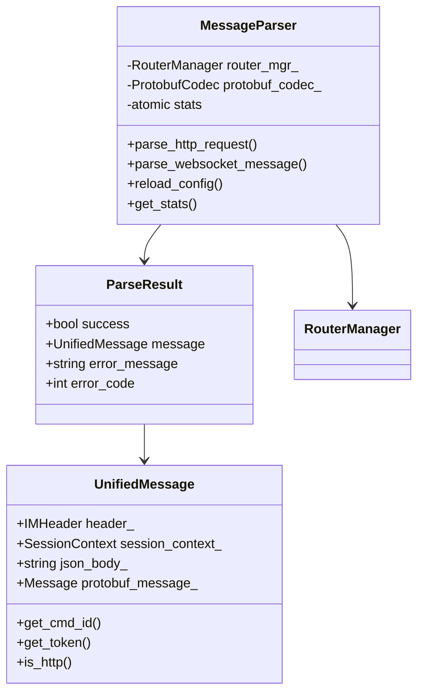
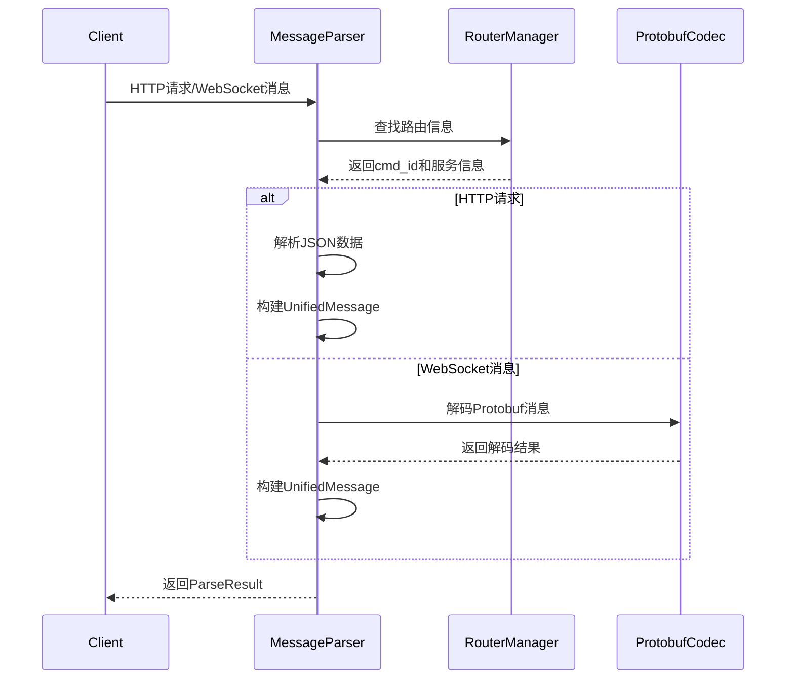

# MessageParser 消息解析器使用文档

## 📋 目录
1. [概述](#概述)
2. [核心功能](#核心功能)
3. [架构设计](#架构设计)
4. [API接口](#api接口)
5. [使用示例](#使用示例)
6. [错误处理](#错误处理)
7. [性能优化](#性能优化)
8. [最佳实践](#最佳实践)

---

## 概述

MessageParser是MyChat网关的统一消息解析器，负责将HTTP请求和WebSocket消息转换为统一的`UnifiedMessage`格式。它是消息处理流水线的第一环，为上层MessageProcessor提供标准化的消息输入。

### 🎯 设计目标
- **协议统一**：将HTTP和WebSocket两种不同协议的消息统一为相同格式
- **路由集成**：基于RouterManager实现自动路由解析
- **格式转换**：支持JSON和Protobuf两种数据格式的解析
- **错误处理**：提供详细的解析错误信息和错误码

### 🏗️ 架构位置
```
HTTP请求/WebSocket消息 → MessageParser → UnifiedMessage → MessageProcessor → 业务处理
```

---

## 核心功能

### 1. 协议解析支持
- **HTTP请求解析**：解析HTTP POST/GET请求，提取Header和Body
- **WebSocket消息解析**：解码Protobuf二进制消息
- **统一格式输出**：两种协议都转换为UnifiedMessage格式

### 2. 路由集成
- **自动路由解析**：基于HTTP路径自动查找对应的cmd_id
- **服务发现**：集成RouterManager实现服务端点发现
- **配置驱动**：支持动态重新加载路由配置

### 3. 数据格式支持
- **JSON解析**：HTTP请求的JSON格式数据解析
- **Protobuf解码**：WebSocket的二进制Protobuf消息解码
- **格式验证**：自动验证数据格式的正确性

### 4. 会话管理
- **会话ID生成**：为每个消息生成唯一的会话标识
- **上下文保存**：保存协议类型、客户端IP、接收时间等信息
- **原始数据保留**：保留原始HTTP路径和请求体用于调试

---

## 架构设计

### 类结构图



### 处理流程



---

## API接口

### 构造函数

```cpp
/**
 * @brief 构造消息解析器
 * @param config_file 路由配置文件路径
 * @throws std::runtime_error 配置文件无效时抛出
 */
explicit MessageParser(const std::string& config_file);
```

### 核心解析接口

#### HTTP请求解析

```cpp
/**
 * @brief 解析HTTP请求
 * @param req HTTP请求对象
 * @param session_id 会话ID（可选，为空时自动生成）
 * @return 统一消息对象，失败返回nullptr
 */
std::unique_ptr<UnifiedMessage> parse_http_request(
    const httplib::Request& req,
    const std::string& session_id = ""
);

/**
 * @brief 解析HTTP请求（增强版本）
 * @param req HTTP请求对象
 * @param session_id 会话ID（可选）
 * @return 详细的解析结果，包含错误信息
 */
ParseResult parse_http_request_enhanced(
    const httplib::Request& req,
    const std::string& session_id = ""
);
```

#### WebSocket消息解析

```cpp
/**
 * @brief 解析WebSocket消息
 * @param raw_message 原始二进制消息
 * @param session_id 会话ID（可选）
 * @return 统一消息对象，失败返回nullptr
 */
std::unique_ptr<UnifiedMessage> parse_websocket_message(
    const std::string& raw_message,
    const std::string& session_id = ""
);

/**
 * @brief 解析WebSocket消息（增强版本）
 * @param raw_message 原始二进制消息
 * @param session_id 会话ID（可选）
 * @return 详细的解析结果，包含错误信息
 */
ParseResult parse_websocket_message_enhanced(
    const std::string& raw_message,
    const std::string& session_id = ""
);
```

### 配置管理

```cpp
/**
 * @brief 重新加载配置
 * @return true 成功，false 失败
 */
bool reload_config();

/**
 * @brief 获取路由管理器引用
 * @return RouterManager引用
 */
const RouterManager& get_router_manager() const;
```

### 统计信息

```cpp
/**
 * @brief 解析器统计信息
 */
struct ParserStats {
    size_t http_requests_parsed{0};      ///< 解析的HTTP请求数
    size_t websocket_messages_parsed{0}; ///< 解析的WebSocket消息数
    size_t routing_failures{0};          ///< 路由失败次数
    size_t decode_failures{0};           ///< 解码失败次数
    RouterManager::RouterStats router_stats; ///< 路由器统计信息
};

/**
 * @brief 获取统计信息
 */
ParserStats get_stats() const;

/**
 * @brief 重置统计信息
 */
void reset_stats();
```

---

## 使用示例

### 基础使用

```cpp
#include "message_parser.hpp"
#include <iostream>

int main() {
    try {
        // 1. 创建解析器
        auto parser = std::make_unique<MessageParser>("config/router_config.json");
        
        // 2. 解析HTTP请求
        httplib::Request req;
        req.method = "POST";
        req.path = "/api/v1/auth/login";
        req.body = R"({"username": "test", "password": "123456"})";
        req.set_header("Content-Type", "application/json");
        req.set_header("Authorization", "Bearer token123");
        req.set_header("Device-Id", "device001");
        
        auto message = parser->parse_http_request(req);
        if (message) {
            std::cout << "解析成功，cmd_id: " << message->get_cmd_id() << std::endl;
            std::cout << "Token: " << message->get_token() << std::endl;
            std::cout << "JSON Body: " << message->get_json_body() << std::endl;
        }
        
        // 3. 解析WebSocket消息
        std::string protobuf_data = "..."; // 二进制Protobuf数据
        auto ws_message = parser->parse_websocket_message(protobuf_data, "ws_session_123");
        if (ws_message) {
            std::cout << "WebSocket消息解析成功" << std::endl;
        }
        
    } catch (const std::exception& e) {
        std::cerr << "初始化失败: " << e.what() << std::endl;
    }
    
    return 0;
}
```

### 增强版本使用

```cpp
#include "message_parser.hpp"

void handle_http_request(MessageParser& parser, const httplib::Request& req) {
    // 使用增强版本获取详细错误信息
    auto result = parser.parse_http_request_enhanced(req);
    
    if (result.success) {
        // 处理成功
        auto& message = result.message;
        std::cout << "解析成功，开始处理业务逻辑..." << std::endl;
        
        // 访问消息信息
        std::cout << "命令ID: " << message->get_cmd_id() << std::endl;
        std::cout << "用户Token: " << message->get_token() << std::endl;
        std::cout << "设备ID: " << message->get_device_id() << std::endl;
        std::cout << "平台: " << message->get_platform() << std::endl;
        
        if (message->is_http()) {
            std::cout << "HTTP方法: " << message->get_session_context().http_method << std::endl;
            std::cout << "原始路径: " << message->get_session_context().original_path << std::endl;
        }
        
    } else {
        // 处理失败，根据错误码进行不同处理
        switch (result.error_code) {
            case ParseResult::ROUTING_FAILED:
                std::cerr << "路由失败: " << result.error_message << std::endl;
                // 返回404错误
                break;
                
            case ParseResult::DECODE_FAILED:
                std::cerr << "解码失败: " << result.error_message << std::endl;
                // 返回400错误
                break;
                
            case ParseResult::INVALID_REQUEST:
                std::cerr << "无效请求: " << result.error_message << std::endl;
                // 返回400错误
                break;
                
            default:
                std::cerr << "解析错误: " << result.error_message << std::endl;
                // 返回500错误
                break;
        }
    }
}
```

### 统计信息监控

```cpp
void monitor_parser_stats(const MessageParser& parser) {
    auto stats = parser.get_stats();
    
    std::cout << "=== MessageParser 统计信息 ===" << std::endl;
    std::cout << "HTTP请求解析数: " << stats.http_requests_parsed << std::endl;
    std::cout << "WebSocket消息解析数: " << stats.websocket_messages_parsed << std::endl;
    std::cout << "路由失败次数: " << stats.routing_failures << std::endl;
    std::cout << "解码失败次数: " << stats.decode_failures << std::endl;
    
    // 路由器统计信息
    std::cout << "\n=== 路由器统计信息 ===" << std::endl;
    std::cout << "路由查找次数: " << stats.router_stats.total_lookups << std::endl;
    std::cout << "路由命中次数: " << stats.router_stats.successful_lookups << std::endl;
    
    // 计算成功率
    double success_rate = 0.0;
    size_t total_parsed = stats.http_requests_parsed + stats.websocket_messages_parsed;
    size_t total_failures = stats.routing_failures + stats.decode_failures;
    
    if (total_parsed > 0) {
        success_rate = (double)(total_parsed - total_failures) / total_parsed * 100.0;
    }
    
    std::cout << "总体成功率: " << std::fixed << std::setprecision(2) 
              << success_rate << "%" << std::endl;
}
```

### 配置热重载

```cpp
class MessageParserManager {
private:
    std::unique_ptr<MessageParser> parser_;
    std::string config_file_;
    
public:
    MessageParserManager(const std::string& config_file) 
        : config_file_(config_file) {
        parser_ = std::make_unique<MessageParser>(config_file);
    }
    
    // 热重载配置
    bool reload_configuration() {
        if (parser_->reload_config()) {
            std::cout << "配置重载成功" << std::endl;
            return true;
        } else {
            std::cerr << "配置重载失败" << std::endl;
            return false;
        }
    }
    
    MessageParser& get_parser() { return *parser_; }
};

// 使用信号处理进行热重载
void setup_config_reload(MessageParserManager& manager) {
    signal(SIGUSR1, [](int sig) {
        // 在信号处理函数中触发重载
        // 注意：实际项目中应该使用更安全的方式
        static MessageParserManager* mgr = nullptr;
        if (mgr) {
            mgr->reload_configuration();
        }
    });
}
```

---

## 错误处理

### 错误码定义

```cpp
struct ParseResult {
    static constexpr int SUCCESS = 0;           ///< 解析成功
    static constexpr int ROUTING_FAILED = 1001; ///< 路由失败
    static constexpr int DECODE_FAILED = 1002;  ///< 解码失败
    static constexpr int INVALID_REQUEST = 1003; ///< 无效请求
    static constexpr int PARSE_ERROR = 1999;    ///< 通用解析错误
};
```

### 常见错误场景

#### 1. 路由失败
```cpp
// 原因：HTTP路径在配置中未找到对应的cmd_id
// 示例：POST /api/unknown/path
// 错误码：ROUTING_FAILED (1001)
// 处理：返回404 Not Found
```

#### 2. 解码失败
```cpp
// 原因：WebSocket消息的Protobuf数据格式错误
// 示例：发送了损坏的二进制数据
// 错误码：DECODE_FAILED (1002)  
// 处理：返回400 Bad Request
```

#### 3. 无效请求
```cpp
// 原因：请求格式不符合要求
// 示例：HTTP请求缺少必要的Header
// 错误码：INVALID_REQUEST (1003)
// 处理：返回400 Bad Request
```

### 错误处理最佳实践

```cpp
class ErrorHandler {
public:
    static httplib::Response handle_parse_error(const ParseResult& result) {
        httplib::Response response;
        
        switch (result.error_code) {
            case ParseResult::ROUTING_FAILED:
                response.status = 404;
                response.body = R"({"error": "endpoint_not_found", "message": ")" 
                              + result.error_message + R"("})";
                break;
                
            case ParseResult::DECODE_FAILED:
            case ParseResult::INVALID_REQUEST:
                response.status = 400;
                response.body = R"({"error": "bad_request", "message": ")" 
                              + result.error_message + R"("})";
                break;
                
            default:
                response.status = 500;
                response.body = R"({"error": "internal_error", "message": ")" 
                              + result.error_message + R"("})";
                break;
        }
        
        response.set_header("Content-Type", "application/json");
        return response;
    }
};
```

---

## 性能优化

### 1. 内存管理优化

```cpp
// 使用对象池减少内存分配
class UnifiedMessagePool {
private:
    std::queue<std::unique_ptr<UnifiedMessage>> pool_;
    std::mutex mutex_;
    
public:
    std::unique_ptr<UnifiedMessage> acquire() {
        std::lock_guard<std::mutex> lock(mutex_);
        if (!pool_.empty()) {
            auto message = std::move(pool_.front());
            pool_.pop();
            return message;
        }
        return std::make_unique<UnifiedMessage>();
    }
    
    void release(std::unique_ptr<UnifiedMessage> message) {
        // 清理消息内容但保留对象
        message->clear(); // 假设有clear方法
        
        std::lock_guard<std::mutex> lock(mutex_);
        if (pool_.size() < 100) { // 限制池大小
            pool_.push(std::move(message));
        }
    }
};
```

### 2. 解析缓存

```cpp
class ParseCache {
private:
    std::unordered_map<std::string, uint32_t> path_to_cmd_cache_;
    std::shared_mutex cache_mutex_;
    
public:
    std::optional<uint32_t> get_cmd_id(const std::string& path) {
        std::shared_lock<std::shared_mutex> lock(cache_mutex_);
        auto it = path_to_cmd_cache_.find(path);
        return it != path_to_cmd_cache_.end() ? 
               std::make_optional(it->second) : std::nullopt;
    }
    
    void cache_cmd_id(const std::string& path, uint32_t cmd_id) {
        std::unique_lock<std::shared_mutex> lock(cache_mutex_);
        path_to_cmd_cache_[path] = cmd_id;
    }
};
```

### 3. 批量处理

```cpp
class BatchMessageParser {
public:
    struct BatchResult {
        std::vector<std::unique_ptr<UnifiedMessage>> successful_messages;
        std::vector<ParseResult> failed_results;
    };
    
    BatchResult parse_batch_http_requests(
        const std::vector<httplib::Request>& requests) {
        
        BatchResult result;
        result.successful_messages.reserve(requests.size());
        
        for (const auto& req : requests) {
            auto parse_result = parse_http_request_enhanced(req);
            if (parse_result.success) {
                result.successful_messages.push_back(std::move(parse_result.message));
            } else {
                result.failed_results.push_back(std::move(parse_result));
            }
        }
        
        return result;
    }
};
```

---

## 最佳实践

### 1. 初始化和配置

```cpp
// ✅ 推荐：在应用启动时验证配置
class ApplicationStartup {
public:
    static bool initialize_message_parser(const std::string& config_file) {
        try {
            auto parser = std::make_unique<MessageParser>(config_file);
            
            // 验证关键路由是否存在
            std::vector<std::string> critical_paths = {
                "/api/v1/auth/login",
                "/api/v1/auth/logout", 
                "/api/v1/message/send"
            };
            
            for (const auto& path : critical_paths) {
                httplib::Request test_req;
                test_req.method = "POST";
                test_req.path = path;
                
                auto result = parser->parse_http_request_enhanced(test_req);
                if (!result.success && result.error_code == ParseResult::ROUTING_FAILED) {
                    std::cerr << "关键路由缺失: " << path << std::endl;
                    return false;
                }
            }
            
            std::cout << "MessageParser初始化成功" << std::endl;
            return true;
            
        } catch (const std::exception& e) {
            std::cerr << "MessageParser初始化失败: " << e.what() << std::endl;
            return false;
        }
    }
};
```

### 2. 错误处理和日志

```cpp
// ✅ 推荐：结构化的错误处理
class StructuredErrorHandler {
public:
    static void log_parse_error(const ParseResult& result, 
                               const std::string& source_info) {
        
        nlohmann::json error_log = {
            {"timestamp", std::time(nullptr)},
            {"source", source_info},
            {"error_code", result.error_code},
            {"error_message", result.error_message},
            {"success", result.success}
        };
        
        // 根据错误级别选择不同的日志级别
        if (result.error_code == ParseResult::ROUTING_FAILED) {
            LogManager::GetLogger("message_parser")->warn("Parse error: {}", error_log.dump());
        } else {
            LogManager::GetLogger("message_parser")->error("Parse error: {}", error_log.dump());
        }
    }
};
```

### 3. 监控和指标

```cpp
// ✅ 推荐：定期监控解析器性能
class ParserMonitor {
private:
    std::chrono::steady_clock::time_point last_check_;
    MessageParser::ParserStats last_stats_;
    
public:
    void periodic_check(const MessageParser& parser) {
        auto now = std::chrono::steady_clock::now();
        auto current_stats = parser.get_stats();
        
        if (last_check_ != std::chrono::steady_clock::time_point{}) {
            auto duration = std::chrono::duration_cast<std::chrono::seconds>(
                now - last_check_).count();
            
            // 计算QPS
            auto http_qps = (current_stats.http_requests_parsed - 
                           last_stats_.http_requests_parsed) / duration;
            auto ws_qps = (current_stats.websocket_messages_parsed - 
                         last_stats_.websocket_messages_parsed) / duration;
            
            std::cout << "HTTP QPS: " << http_qps << ", WebSocket QPS: " << ws_qps << std::endl;
            
            // 检查错误率
            auto total_new = (current_stats.http_requests_parsed + 
                            current_stats.websocket_messages_parsed) -
                           (last_stats_.http_requests_parsed + 
                            last_stats_.websocket_messages_parsed);
            auto total_errors = (current_stats.routing_failures + 
                               current_stats.decode_failures) -
                              (last_stats_.routing_failures + 
                               last_stats_.decode_failures);
            
            if (total_new > 0) {
                double error_rate = (double)total_errors / total_new * 100.0;
                if (error_rate > 5.0) { // 错误率超过5%时告警
                    std::cerr << "警告：解析错误率过高 " << error_rate << "%" << std::endl;
                }
            }
        }
        
        last_check_ = now;
        last_stats_ = current_stats;
    }
};
```

### 4. 线程安全

```cpp
// ✅ 推荐：在多线程环境中安全使用
class ThreadSafeParserWrapper {
private:
    std::unique_ptr<MessageParser> parser_;
    mutable std::shared_mutex parser_mutex_;
    
public:
    ThreadSafeParserWrapper(const std::string& config_file) 
        : parser_(std::make_unique<MessageParser>(config_file)) {}
    
    // 读操作使用共享锁
    std::unique_ptr<UnifiedMessage> parse_http_request(const httplib::Request& req) {
        std::shared_lock<std::shared_mutex> lock(parser_mutex_);
        return parser_->parse_http_request(req);
    }
    
    // 配置重载使用独占锁
    bool reload_config() {
        std::unique_lock<std::shared_mutex> lock(parser_mutex_);
        return parser_->reload_config();
    }
};
```

---

## 总结

MessageParser是MyChat网关系统的核心组件，负责协议统一和消息格式转换。通过合理使用其API接口和遵循最佳实践，可以构建高性能、可靠的消息处理系统。

### 关键要点
1. **统一接口**：为HTTP和WebSocket提供统一的解析接口
2. **错误处理**：完善的错误码体系和错误信息
3. **性能优化**：支持批量处理和缓存机制
4. **监控支持**：详细的统计信息便于监控和调优
5. **线程安全**：支持多线程并发使用

### 下一步
了解MessageParser后，建议继续学习：
- [MessageProcessor使用文档](./MessageProcessor使用文档.md) - 基于Future的消息处理器
- [CoroMessageProcessor使用文档](./CoroMessageProcessor使用文档.md) - 基于协程的消息处理器
- [RouterManager使用文档](./RouterManager使用文档.md) - 路由管理器详细文档