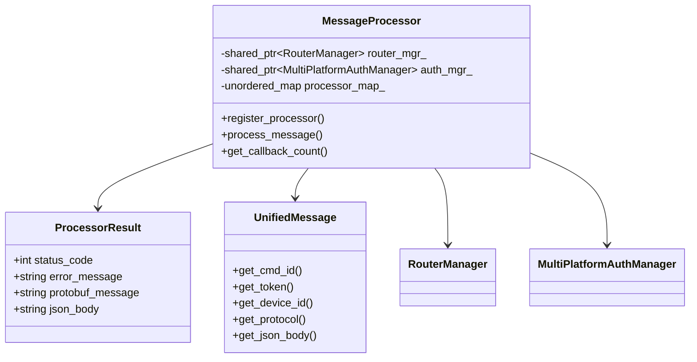
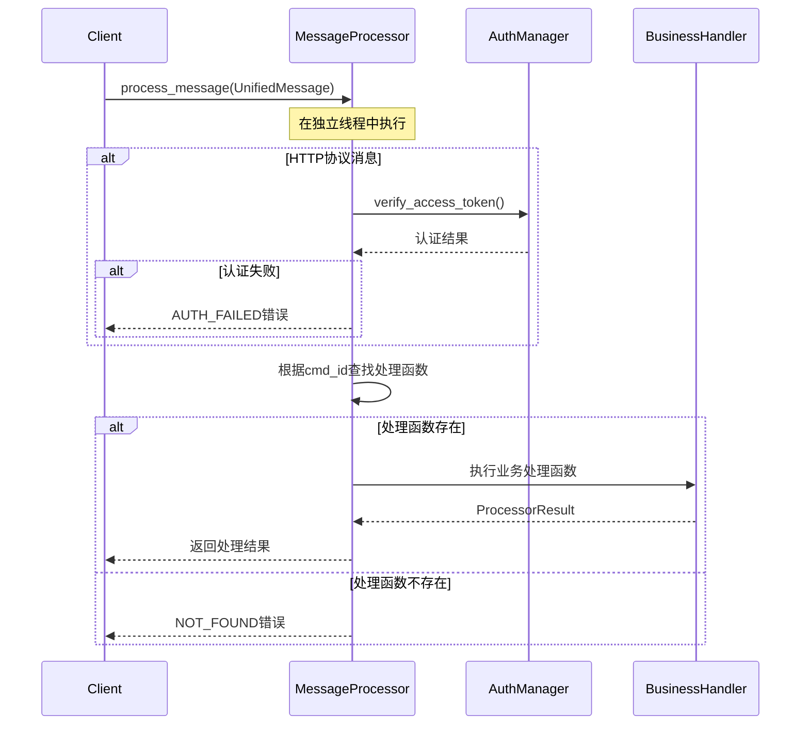

# MessageProcessor 异步消息处理器使用文档

## 📋 目录
1. [概述](#概述)
2. [核心特性](#核心特性)
3. [架构设计](#架构设计)
4. [API接口](#api接口)
5. [使用示例](#使用示例)
6. [业务处理器开发](#业务处理器开发)
7. [错误处理](#错误处理)
8. [性能调优](#性能调优)
9. [最佳实践](#最佳实践)

---

## 概述

MessageProcessor是MyChat网关的异步消息处理器，基于`std::future`实现异步处理能力。它接收MessageParser解析后的统一消息，根据cmd_id路由到对应的业务处理函数，并提供完整的认证、错误处理和日志记录功能。

### 🎯 设计目标
- **异步处理**：基于std::future避免阻塞，提高并发能力
- **回调路由**：通过cmd_id将消息路由到注册的处理函数
- **认证集成**：自动进行HTTP Token验证，WebSocket连接时验证
- **错误统一**：提供统一的错误处理和响应格式

### 🏗️ 架构位置
```
UnifiedMessage → MessageProcessor → 业务处理函数 → ProcessorResult → 客户端响应
```

---

## 核心特性

### 1. 异步处理能力
- **非阻塞执行**：使用std::async在独立线程中处理消息
- **并发支持**：支持同时处理多个消息请求
- **Future模式**：返回std::future对象，支持异步等待结果

### 2. 灵活的回调机制
- **动态注册**：支持运行时动态注册/取消注册处理函数
- **cmd_id路由**：根据消息的cmd_id自动路由到对应处理函数
- **函数式编程**：支持lambda表达式和函数对象

### 3. 完整的认证体系
- **协议差异化**：HTTP每次请求验证Token，WebSocket连接时验证
- **多平台支持**：集成MultiPlatformAuthManager支持多平台认证
- **自动验证**：处理器自动进行认证验证，业务函数无需关心

### 4. 统一错误处理
- **标准化错误码**：使用ErrorCode枚举统一错误类型
- **详细错误信息**：提供具体的错误描述信息
- **异常安全**：完善的异常捕获和处理机制

---

## 架构设计

### 类结构图



### 处理流程



---

## API接口

### 构造函数

```cpp
/**
 * @brief 构造函数（使用现有管理器实例）
 * @param router_mgr 路由管理器，用于服务发现和路由
 * @param auth_mgr 多平台认证管理器，用于Token验证
 */
MessageProcessor(std::shared_ptr<RouterManager> router_mgr,
                 std::shared_ptr<MultiPlatformAuthManager> auth_mgr);

/**
 * @brief 构造函数（从配置文件创建管理器）
 * @param router_config_file 路由配置文件路径
 * @param auth_config_file 认证配置文件路径
 */
MessageProcessor(const std::string& router_config_file, 
                 const std::string& auth_config_file);
```

### 核心处理接口

#### 异步消息处理

```cpp
/**
 * @brief 异步处理消息
 * @param message 待处理的统一消息对象
 * @return std::future<ProcessorResult> 异步处理结果
 * 
 * @details 处理流程：
 *          1. 对于HTTP协议消息，验证Access Token
 *          2. 根据cmd_id查找对应的处理函数
 *          3. 在独立线程中执行处理函数
 *          4. 返回处理结果的future对象
 */
std::future<ProcessorResult> process_message(std::unique_ptr<UnifiedMessage> message);
```

#### 处理函数管理

```cpp
/**
 * @brief 注册消息处理函数
 * @param cmd_id 命令ID，用于路由消息到对应的处理函数
 * @param processor 处理函数，接收UnifiedMessage并返回ProcessorResult
 * @return 注册结果码:
 *         0  -> 注册成功
 *         1  -> 处理函数已存在（重复注册）
 *         -1 -> 在路由配置中未找到对应的服务
 *         -2 -> 传入的处理函数无效（nullptr）
 */
int register_processor(
    uint32_t cmd_id, 
    std::function<ProcessorResult(const UnifiedMessage&)> processor);

/**
 * @brief 获取已注册的处理函数数量
 * @return 当前注册的处理函数数量
 */
int get_callback_count() const;
```

### ProcessorResult结构

```cpp
/**
 * @brief 消息处理结果结构体
 *  json_body: {
 *     code,
 *     body,
 *     err_msg
 *  }
 */
struct ProcessorResult {
    int status_code;                ///< 状态码，0表示成功，其他表示错误类型
    std::string error_message;      ///< 错误信息描述
    std::string protobuf_message;   ///< Protobuf格式的响应数据,结合protobufcodec使用
    std::string json_body;          ///< JSON格式的响应数据

    // 构造函数
    ProcessorResult();  // 默认成功状态
    ProcessorResult(int code, std::string err_msg);
    ProcessorResult(int code, std::string err_msg, std::string pb_msg, std::string json);
};
```

---

## 使用示例

### 基础使用

```cpp
#include "message_processor.hpp"
#include "message_parser.hpp"
#include <iostream>
#include <memory>

int main() {
    try {
        // 1. 创建消息处理器
        auto processor = std::make_unique<MessageProcessor>(
            "config/router_config.json",
            "config/auth_config.json"
        );
        
        // 2. 注册处理函数
        
        // 登录处理 (cmd_id: 1001)
        auto login_result = processor->register_processor(1001, 
            [](const UnifiedMessage& msg) -> ProcessorResult {
                std::cout << "处理登录请求" << std::endl;
                
                // 解析登录参数
                auto json_body = msg.get_json_body();
                // ... 登录业务逻辑
                
                // 返回成功结果
                return ProcessorResult(0, "", "", 
                    R"({"status": "success", "user_id": "123", "token": "new_token"})");
            });
        
        if (login_result == 0) {
            std::cout << "登录处理器注册成功" << std::endl;
        }
        
        // 发送消息处理 (cmd_id: 2001)
        processor->register_processor(2001,
            [](const UnifiedMessage& msg) -> ProcessorResult {
                std::cout << "处理发送消息请求" << std::endl;
                std::cout << "发送者: " << msg.get_from_uid() << std::endl;
                std::cout << "接收者: " << msg.get_to_uid() << std::endl;
                
                // 消息发送逻辑
                // ...
                
                return ProcessorResult(0, "", "",
                    R"({"message_id": "msg_456", "timestamp": 1640995200})");
            });
        
        // 3. 创建消息解析器
        auto parser = std::make_unique<MessageParser>("config/router_config.json");
        
        // 4. 模拟处理HTTP请求
        httplib::Request req;
        req.method = "POST";
        req.path = "/api/v1/auth/login";
        req.body = R"({"username": "testuser", "password": "123456"})";
        req.set_header("Authorization", "Bearer valid_token");
        req.set_header("Device-Id", "device_001");
        
        // 解析消息
        auto message = parser->parse_http_request(req);
        if (message) {
            // 异步处理消息
            auto future_result = processor->process_message(std::move(message));
            
            // 等待处理完成
            auto result = future_result.get();
            
            if (result.status_code == 0) {
                std::cout << "处理成功!" << std::endl;
                std::cout << "响应: " << result.json_body << std::endl;
            } else {
                std::cout << "处理失败: " << result.error_message << std::endl;
            }
        }
        
    } catch (const std::exception& e) {
        std::cerr << "错误: " << e.what() << std::endl;
    }
    
    return 0;
}
```

### 并发处理示例

```cpp
#include <vector>
#include <future>

void concurrent_processing_example() {
    auto processor = std::make_unique<MessageProcessor>(
        router_mgr, auth_mgr);
    
    // 注册处理函数
    processor->register_processor(3001, [](const UnifiedMessage& msg) {
        // 模拟耗时操作
        std::this_thread::sleep_for(std::chrono::milliseconds(100));
        return ProcessorResult(0, "", "", R"({"result": "success"})");
    });
    
    // 创建多个消息
    std::vector<std::unique_ptr<UnifiedMessage>> messages;
    for (int i = 0; i < 10; ++i) {
        auto msg = create_test_message(3001, "session_" + std::to_string(i));
        messages.push_back(std::move(msg));
    }
    
    // 并发处理所有消息
    std::vector<std::future<ProcessorResult>> futures;
    auto start_time = std::chrono::steady_clock::now();
    
    for (auto& msg : messages) {
        futures.push_back(processor->process_message(std::move(msg)));
    }
    
    // 等待所有处理完成
    for (auto& future : futures) {
        auto result = future.get();
        std::cout << "处理结果: " << result.status_code << std::endl;
    }
    
    auto end_time = std::chrono::steady_clock::now();
    auto duration = std::chrono::duration_cast<std::chrono::milliseconds>(
        end_time - start_time);
    
    std::cout << "并发处理10个消息耗时: " << duration.count() << "ms" << std::endl;
}
```

### 高级处理器注册

```cpp
class AdvancedMessageHandlers {
public:
    // 用户服务处理器
    static ProcessorResult handle_user_service(const UnifiedMessage& msg) {
        auto cmd_id = msg.get_cmd_id();
        
        switch (cmd_id) {
            case 1001: // 登录
                return handle_login(msg);
            case 1002: // 登出
                return handle_logout(msg);
            case 1003: // 获取用户信息
                return handle_get_user_info(msg);
            default:
                return ProcessorResult(ErrorCode::NOT_FOUND, 
                    "Unknown user service command");
        }
    }
    
    // 聊天服务处理器
    static ProcessorResult handle_chat_service(const UnifiedMessage& msg) {
        auto cmd_id = msg.get_cmd_id();
        
        switch (cmd_id) {
            case 2001: // 发送消息
                return handle_send_message(msg);
            case 2002: // 获取消息历史
                return handle_get_message_history(msg);
            case 2003: // 删除消息
                return handle_delete_message(msg);
            default:
                return ProcessorResult(ErrorCode::NOT_FOUND,
                    "Unknown chat service command");
        }
    }
    
private:
    static ProcessorResult handle_login(const UnifiedMessage& msg) {
        try {
            // 解析登录参数
            nlohmann::json request = nlohmann::json::parse(msg.get_json_body());
            std::string username = request["username"];
            std::string password = request["password"];
            
            // 验证用户凭据
            if (authenticate_user(username, password)) {
                // 生成新的访问令牌
                std::string new_token = generate_access_token(username);
                
                nlohmann::json response = {
                    {"status", "success"},
                    {"user_id", get_user_id(username)},
                    {"access_token", new_token},
                    {"expires_in", 7200}
                };
                
                return ProcessorResult(0, "", "", response.dump());
            } else {
                return ProcessorResult(ErrorCode::AUTH_FAILED, 
                    "Invalid username or password");
            }
            
        } catch (const std::exception& e) {
            return ProcessorResult(ErrorCode::INVALID_REQUEST,
                "Invalid login request: " + std::string(e.what()));
        }
    }
    
    static ProcessorResult handle_send_message(const UnifiedMessage& msg) {
        try {
            nlohmann::json request = nlohmann::json::parse(msg.get_json_body());
            
            std::string from_uid = msg.get_from_uid();
            std::string to_uid = request["to_uid"];
            std::string content = request["content"];
            std::string msg_type = request.value("type", "text");
            
            // 发送消息到消息服务
            auto message_id = send_message_to_service(from_uid, to_uid, content, msg_type);
            
            nlohmann::json response = {
                {"message_id", message_id},
                {"timestamp", std::time(nullptr)},
                {"status", "sent"}
            };
            
            return ProcessorResult(0, "", "", response.dump());
            
        } catch (const std::exception& e) {
            return ProcessorResult(ErrorCode::SERVER_ERROR,
                "Failed to send message: " + std::string(e.what()));
        }
    }
    
    // 辅助函数
    static bool authenticate_user(const std::string& username, const std::string& password);
    static std::string generate_access_token(const std::string& username);
    static std::string get_user_id(const std::string& username);
    static std::string send_message_to_service(const std::string& from, const std::string& to,
                                              const std::string& content, const std::string& type);
};

// 注册高级处理器
void register_advanced_handlers(MessageProcessor& processor) {
    // 注册用户服务处理器 (1001-1010)
    for (uint32_t cmd_id = 1001; cmd_id <= 1010; ++cmd_id) {
        processor.register_processor(cmd_id, AdvancedMessageHandlers::handle_user_service);
    }
    
    // 注册聊天服务处理器 (2001-2010)
    for (uint32_t cmd_id = 2001; cmd_id <= 2010; ++cmd_id) {
        processor.register_processor(cmd_id, AdvancedMessageHandlers::handle_chat_service);
    }
}
```

---

## 业务处理器开发

### 处理器开发规范

#### 1. 函数签名

```cpp
// 标准处理器函数签名
ProcessorResult your_handler(const UnifiedMessage& message);

// 使用lambda表达式
auto lambda_handler = [](const UnifiedMessage& msg) -> ProcessorResult {
    // 处理逻辑
    return ProcessorResult(0, "", "", "{}");
};

// 使用函数对象
class HandlerClass {
public:
    ProcessorResult operator()(const UnifiedMessage& msg) {
        // 处理逻辑
        return ProcessorResult(0, "", "", "{}");
    }
};
```

#### 2. 消息信息获取

```cpp
ProcessorResult example_handler(const UnifiedMessage& msg) {
    // 基本信息
    uint32_t cmd_id = msg.get_cmd_id();
    std::string token = msg.get_token();
    std::string device_id = msg.get_device_id();
    std::string platform = msg.get_platform();
    
    // 用户信息
    std::string from_uid = msg.get_from_uid();
    std::string to_uid = msg.get_to_uid();
    uint64_t timestamp = msg.get_timestamp();
    
    // 消息内容
    std::string json_body = msg.get_json_body();
    const auto* protobuf_msg = msg.get_protobuf_message();
    
    // 会话信息
    const auto& session_ctx = msg.get_session_context();
    std::string session_id = session_ctx.session_id;
    std::string client_ip = session_ctx.client_ip;
    
    if (msg.is_http()) {
        std::string http_method = session_ctx.http_method;
        std::string original_path = session_ctx.original_path;
    }
    
    // 处理业务逻辑
    // ...
    
    return ProcessorResult(0, "", "", "{}");
}
```

#### 3. 错误处理规范

```cpp
ProcessorResult robust_handler(const UnifiedMessage& msg) {
    try {
        // 1. 输入验证
        if (msg.get_json_body().empty()) {
            return ProcessorResult(ErrorCode::INVALID_REQUEST, 
                "Request body is empty");
        }
        
        // 2. JSON解析
        nlohmann::json request;
        try {
            request = nlohmann::json::parse(msg.get_json_body());
        } catch (const nlohmann::json::parse_error& e) {
            return ProcessorResult(ErrorCode::INVALID_REQUEST,
                "Invalid JSON format: " + std::string(e.what()));
        }
        
        // 3. 必要参数检查
        if (!request.contains("required_field")) {
            return ProcessorResult(ErrorCode::INVALID_REQUEST,
                "Missing required field: required_field");
        }
        
        // 4. 业务逻辑处理
        auto result = process_business_logic(request);
        
        // 5. 构造响应
        nlohmann::json response = {
            {"status", "success"},
            {"data", result}
        };
        
        return ProcessorResult(0, "", "", response.dump());
        
    } catch (const std::exception& e) {
        // 6. 异常处理
        LogManager::GetLogger("business_handler")
            ->error("Handler exception: {}", e.what());
        
        return ProcessorResult(ErrorCode::SERVER_ERROR,
            "Internal server error");
    }
}
```

### 异步业务处理

```cpp
// 对于需要调用外部服务的处理器
ProcessorResult async_business_handler(const UnifiedMessage& msg) {
    try {
        // 解析请求
        nlohmann::json request = nlohmann::json::parse(msg.get_json_body());
        
        // 并发调用多个服务
        auto user_future = std::async(std::launch::async, [&]() {
            return call_user_service(request["user_id"]);
        });
        
        auto order_future = std::async(std::launch::async, [&]() {
            return call_order_service(request["order_id"]);
        });
        
        auto payment_future = std::async(std::launch::async, [&]() {
            return call_payment_service(request["payment_id"]);
        });
        
        // 等待所有服务调用完成
        auto user_info = user_future.get();
        auto order_info = order_future.get();
        auto payment_info = payment_future.get();
        
        // 组装响应
        nlohmann::json response = {
            {"user", user_info},
            {"order", order_info},
            {"payment", payment_info}
        };
        
        return ProcessorResult(0, "", "", response.dump());
        
    } catch (const std::exception& e) {
        return ProcessorResult(ErrorCode::SERVER_ERROR, e.what());
    }
}
```

### 处理器测试

```cpp
#include <gtest/gtest.h>

class MessageProcessorTest : public ::testing::Test {
protected:
    void SetUp() override {
        // 创建测试用的处理器
        processor_ = std::make_unique<MessageProcessor>(
            "test_config/router.json",
            "test_config/auth.json"
        );
        
        // 注册测试处理器
        processor_->register_processor(9999, test_handler);
    }
    
    static ProcessorResult test_handler(const UnifiedMessage& msg) {
        return ProcessorResult(0, "", "", R"({"test": "success"})");
    }
    
    std::unique_ptr<MessageProcessor> processor_;
};

TEST_F(MessageProcessorTest, BasicProcessing) {
    // 创建测试消息
    auto message = create_test_message(9999);
    
    // 异步处理
    auto future = processor_->process_message(std::move(message));
    auto result = future.get();
    
    // 验证结果
    EXPECT_EQ(result.status_code, 0);
    EXPECT_EQ(result.json_body, R"({"test": "success"})");
}

TEST_F(MessageProcessorTest, UnknownCommand) {
    // 测试未注册的命令
    auto message = create_test_message(8888); // 未注册的cmd_id
    
    auto future = processor_->process_message(std::move(message));
    auto result = future.get();
    
    // 验证错误处理
    EXPECT_EQ(result.status_code, ErrorCode::NOT_FOUND);
    EXPECT_THAT(result.error_message, testing::HasSubstr("Unknown command"));
}

TEST_F(MessageProcessorTest, AuthenticationFailure) {
    // 创建带有无效token的消息
    auto message = create_test_message_with_invalid_token(9999);
    
    auto future = processor_->process_message(std::move(message));
    auto result = future.get();
    
    // 验证认证失败
    EXPECT_EQ(result.status_code, ErrorCode::AUTH_FAILED);
    EXPECT_EQ(result.error_message, "Invalid token");
}
```

---

## 错误处理

### 错误码体系

```cpp
// 使用im::base::ErrorCode枚举
enum class ErrorCode {
    SUCCESS = 0,           // 成功
    INVALID_REQUEST = 400, // 无效请求
    AUTH_FAILED = 401,     // 认证失败
    FORBIDDEN = 403,       // 权限不足
    NOT_FOUND = 404,       // 未找到
    SERVER_ERROR = 500     // 服务器错误
};
```

### 错误处理策略

```cpp
class ErrorHandlingProcessor {
public:
    static ProcessorResult handle_with_retry(
        const UnifiedMessage& msg,
        std::function<ProcessorResult()> business_logic,
        int max_retries = 3) {
        
        for (int attempt = 1; attempt <= max_retries; ++attempt) {
            try {
                auto result = business_logic();
                
                // 成功或不可重试的错误直接返回
                if (result.status_code == 0 || 
                    !is_retryable_error(result.status_code)) {
                    return result;
                }
                
                // 重试前等待
                if (attempt < max_retries) {
                    std::this_thread::sleep_for(
                        std::chrono::milliseconds(attempt * 100));
                }
                
            } catch (const std::exception& e) {
                if (attempt == max_retries) {
                    return ProcessorResult(ErrorCode::SERVER_ERROR,
                        "Max retries exceeded: " + std::string(e.what()));
                }
            }
        }
        
        return ProcessorResult(ErrorCode::SERVER_ERROR, "All retries failed");
    }
    
private:
    static bool is_retryable_error(int error_code) {
        return error_code == ErrorCode::SERVER_ERROR ||
               error_code == 503 || // Service Unavailable
               error_code == 504;   // Gateway Timeout
    }
};
```

### 错误响应格式化

```cpp
class ErrorResponseFormatter {
public:
    static ProcessorResult format_error_response(
        int error_code, 
        const std::string& error_message,
        const std::string& request_id = "") {
        
        nlohmann::json error_response = {
            {"error", {
                {"code", error_code},
                {"message", error_message},
                {"timestamp", std::time(nullptr)}
            }}
        };
        
        if (!request_id.empty()) {
            error_response["error"]["request_id"] = request_id;
        }
        
        // 根据错误类型添加额外信息
        switch (error_code) {
            case ErrorCode::AUTH_FAILED:
                error_response["error"]["type"] = "authentication_error";
                error_response["error"]["suggestion"] = "Please check your token";
                break;
                
            case ErrorCode::INVALID_REQUEST:
                error_response["error"]["type"] = "validation_error";
                error_response["error"]["suggestion"] = "Please check request parameters";
                break;
                
            case ErrorCode::NOT_FOUND:
                error_response["error"]["type"] = "not_found_error";
                error_response["error"]["suggestion"] = "Please check the endpoint";
                break;
                
            default:
                error_response["error"]["type"] = "server_error";
                error_response["error"]["suggestion"] = "Please try again later";
                break;
        }
        
        return ProcessorResult(error_code, error_message, "", error_response.dump());
    }
};
```

---

## 性能调优

### 1. 处理器性能监控

```cpp
class ProcessorPerformanceMonitor {
private:
    struct HandlerStats {
        std::atomic<uint64_t> call_count{0};
        std::atomic<uint64_t> total_time_ms{0};
        std::atomic<uint64_t> error_count{0};
        std::atomic<uint64_t> max_time_ms{0};
    };
    
    std::unordered_map<uint32_t, HandlerStats> handler_stats_;
    
public:
    template<typename Func>
    ProcessorResult monitor_handler_execution(
        uint32_t cmd_id, 
        const UnifiedMessage& msg, 
        Func&& handler) {
        
        auto start_time = std::chrono::steady_clock::now();
        
        try {
            auto result = handler(msg);
            
            // 记录统计信息
            auto end_time = std::chrono::steady_clock::now();
            auto duration = std::chrono::duration_cast<std::chrono::milliseconds>(
                end_time - start_time);
            
            auto& stats = handler_stats_[cmd_id];
            stats.call_count++;
            stats.total_time_ms += duration.count();
            
            // 更新最大耗时
            uint64_t current_max = stats.max_time_ms.load();
            while (duration.count() > current_max && 
                   !stats.max_time_ms.compare_exchange_weak(current_max, duration.count())) {
                // 重试直到成功更新
            }
            
            if (result.status_code != 0) {
                stats.error_count++;
            }
            
            return result;
            
        } catch (const std::exception& e) {
            handler_stats_[cmd_id].error_count++;
            throw;
        }
    }
    
    void print_statistics() const {
        std::cout << "=== Handler Performance Statistics ===" << std::endl;
        for (const auto& [cmd_id, stats] : handler_stats_) {
            uint64_t call_count = stats.call_count.load();
            if (call_count > 0) {
                uint64_t avg_time = stats.total_time_ms.load() / call_count;
                double error_rate = (double)stats.error_count.load() / call_count * 100.0;
                
                std::cout << "CMD " << cmd_id << ": "
                         << "Calls=" << call_count
                         << ", Avg=" << avg_time << "ms"
                         << ", Max=" << stats.max_time_ms.load() << "ms"
                         << ", Errors=" << std::fixed << std::setprecision(1) 
                         << error_rate << "%" << std::endl;
            }
        }
    }
};
```

### 2. 内存优化

```cpp
class OptimizedMessageProcessor : public MessageProcessor {
private:
    // 对象池减少内存分配
    class ResultPool {
        std::queue<std::unique_ptr<ProcessorResult>> pool_;
        std::mutex mutex_;
        
    public:
        std::unique_ptr<ProcessorResult> acquire() {
            std::lock_guard<std::mutex> lock(mutex_);
            if (!pool_.empty()) {
                auto result = std::move(pool_.front());
                pool_.pop();
                // 重置对象状态
                *result = ProcessorResult();
                return result;
            }
            return std::make_unique<ProcessorResult>();
        }
        
        void release(std::unique_ptr<ProcessorResult> result) {
            std::lock_guard<std::mutex> lock(mutex_);
            if (pool_.size() < 100) {
                pool_.push(std::move(result));
            }
        }
    };
    
    ResultPool result_pool_;
    
public:
    std::future<ProcessorResult> process_message_optimized(
        std::unique_ptr<UnifiedMessage> message) {
        
        return std::async(std::launch::async, 
            [this, msg = std::move(message)]() mutable -> ProcessorResult {
            
            // 从池中获取结果对象
            auto result_ptr = result_pool_.acquire();
            
            try {
                // 处理逻辑...
                *result_ptr = process_internal(*msg);
                
                // 复制结果并归还对象到池中
                ProcessorResult result = *result_ptr;
                result_pool_.release(std::move(result_ptr));
                
                return result;
                
            } catch (const std::exception& e) {
                result_pool_.release(std::move(result_ptr));
                throw;
            }
        });
    }
};
```

### 3. 批量处理优化

```cpp
class BatchMessageProcessor {
public:
    struct BatchProcessResult {
        std::vector<ProcessorResult> results;
        size_t successful_count;
        size_t failed_count;
    };
    
    BatchProcessResult process_message_batch(
        std::vector<std::unique_ptr<UnifiedMessage>> messages) {
        
        BatchProcessResult batch_result;
        batch_result.results.reserve(messages.size());
        
        // 按cmd_id分组以优化处理
        std::unordered_map<uint32_t, std::vector<std::unique_ptr<UnifiedMessage>>> 
            grouped_messages;
        
        for (auto& msg : messages) {
            uint32_t cmd_id = msg->get_cmd_id();
            grouped_messages[cmd_id].push_back(std::move(msg));
        }
        
        // 并发处理每个组
        std::vector<std::future<std::vector<ProcessorResult>>> group_futures;
        
        for (auto& [cmd_id, group_msgs] : grouped_messages) {
            group_futures.push_back(
                std::async(std::launch::async, [this, cmd_id, &group_msgs]() {
                    return process_group(cmd_id, group_msgs);
                })
            );
        }
        
        // 收集所有结果
        for (auto& future : group_futures) {
            auto group_results = future.get();
            for (auto& result : group_results) {
                if (result.status_code == 0) {
                    batch_result.successful_count++;
                } else {
                    batch_result.failed_count++;
                }
                batch_result.results.push_back(std::move(result));
            }
        }
        
        return batch_result;
    }
    
private:
    std::vector<ProcessorResult> process_group(
        uint32_t cmd_id, 
        std::vector<std::unique_ptr<UnifiedMessage>>& messages) {
        
        std::vector<ProcessorResult> results;
        results.reserve(messages.size());
        
        // 查找处理函数
        auto handler_it = processor_map_.find(cmd_id);
        if (handler_it == processor_map_.end()) {
            // 所有消息都返回未找到错误
            for (size_t i = 0; i < messages.size(); ++i) {
                results.emplace_back(ErrorCode::NOT_FOUND, 
                    "Unknown command: " + std::to_string(cmd_id));
            }
            return results;
        }
        
        // 批量处理相同cmd_id的消息
        for (auto& msg : messages) {
            try {
                results.push_back(handler_it->second(*msg));
            } catch (const std::exception& e) {
                results.emplace_back(ErrorCode::SERVER_ERROR, e.what());
            }
        }
        
        return results;
    }
};
```

---

## 最佳实践

### 1. 初始化和配置

```cpp
class MessageProcessorFactory {
public:
    static std::unique_ptr<MessageProcessor> create_production_processor() {
        // 生产环境配置
        auto processor = std::make_unique<MessageProcessor>(
            "config/production/router.json",
            "config/production/auth.json"
        );
        
        // 注册核心业务处理器
        register_core_handlers(*processor);
        
        // 验证关键处理器
        validate_critical_handlers(*processor);
        
        return processor;
    }
    
    static std::unique_ptr<MessageProcessor> create_test_processor() {
        // 测试环境配置
        auto processor = std::make_unique<MessageProcessor>(
            "config/test/router.json",
            "config/test/auth.json"
        );
        
        // 注册测试处理器
        register_test_handlers(*processor);
        
        return processor;
    }
    
private:
    static void register_core_handlers(MessageProcessor& processor) {
        // 用户服务
        for (uint32_t cmd_id = 1001; cmd_id <= 1010; ++cmd_id) {
            processor.register_processor(cmd_id, UserServiceHandler::handle);
        }
        
        // 消息服务
        for (uint32_t cmd_id = 2001; cmd_id <= 2010; ++cmd_id) {
            processor.register_processor(cmd_id, MessageServiceHandler::handle);
        }
        
        // 好友服务
        for (uint32_t cmd_id = 3001; cmd_id <= 3010; ++cmd_id) {
            processor.register_processor(cmd_id, FriendServiceHandler::handle);
        }
    }
    
    static void validate_critical_handlers(const MessageProcessor& processor) {
        std::vector<uint32_t> critical_commands = {1001, 1002, 2001, 2002};
        
        for (uint32_t cmd_id : critical_commands) {
            if (processor.get_callback_count() == 0) {
                throw std::runtime_error("Critical handler missing: " + 
                                       std::to_string(cmd_id));
            }
        }
    }
};
```

### 2. 生产环境监控

```cpp
class ProductionMonitor {
private:
    MessageProcessor& processor_;
    std::thread monitor_thread_;
    std::atomic<bool> running_{true};
    
public:
    ProductionMonitor(MessageProcessor& processor) 
        : processor_(processor) {
        start_monitoring();
    }
    
    ~ProductionMonitor() {
        stop_monitoring();
    }
    
private:
    void start_monitoring() {
        monitor_thread_ = std::thread([this]() {
            while (running_) {
                try {
                    check_processor_health();
                    std::this_thread::sleep_for(std::chrono::seconds(30));
                } catch (const std::exception& e) {
                    LogManager::GetLogger("monitor")
                        ->error("Monitor error: {}", e.what());
                }
            }
        });
    }
    
    void stop_monitoring() {
        running_ = false;
        if (monitor_thread_.joinable()) {
            monitor_thread_.join();
        }
    }
    
    void check_processor_health() {
        // 检查处理器状态
        int handler_count = processor_.get_callback_count();
        if (handler_count == 0) {
            LogManager::GetLogger("monitor")
                ->warn("No handlers registered!");
        }
        
        // 可以添加更多健康检查
        // - 内存使用情况
        // - 处理队列长度
        // - 错误率统计
        // - 响应时间统计
    }
};
```

### 3. 优雅关闭

```cpp
class GracefulShutdownProcessor {
private:
    std::unique_ptr<MessageProcessor> processor_;
    std::atomic<bool> shutting_down_{false};
    std::atomic<int> active_requests_{0};
    
public:
    std::future<ProcessorResult> process_message_safe(
        std::unique_ptr<UnifiedMessage> message) {
        
        if (shutting_down_) {
            auto promise = std::make_shared<std::promise<ProcessorResult>>();
            promise->set_value(ProcessorResult(ErrorCode::SERVER_ERROR, 
                "Server is shutting down"));
            return promise->get_future();
        }
        
        active_requests_++;
        
        auto future = processor_->process_message(std::move(message));
        
        // 包装future以在完成时减少计数
        return std::async(std::launch::deferred, [this, future = std::move(future)]() mutable {
            auto result = future.get();
            active_requests_--;
            return result;
        });
    }
    
    void initiate_shutdown(std::chrono::milliseconds timeout = std::chrono::seconds(30)) {
        shutting_down_ = true;
        
        auto start_time = std::chrono::steady_clock::now();
        
        // 等待所有活跃请求完成
        while (active_requests_ > 0) {
            auto elapsed = std::chrono::steady_clock::now() - start_time;
            if (elapsed > timeout) {
                LogManager::GetLogger("shutdown")
                    ->warn("Shutdown timeout, {} requests still active", 
                           active_requests_.load());
                break;
            }
            
            std::this_thread::sleep_for(std::chrono::milliseconds(100));
        }
        
        LogManager::GetLogger("shutdown")->info("Graceful shutdown completed");
    }
};
```

---

## 总结

MessageProcessor是MyChat网关的核心异步处理组件，基于std::future提供高性能的消息处理能力。通过合理的处理器注册、错误处理和性能优化，可以构建稳定可靠的消息处理系统。

### 关键特性
1. **异步处理**：基于std::future的非阻塞处理
2. **灵活路由**：通过cmd_id动态路由到业务处理函数
3. **认证集成**：自动进行Token验证和用户身份认证
4. **错误统一**：标准化的错误处理和响应格式
5. **监控支持**：完整的性能监控和统计功能

### 最佳实践要点
- 合理设计处理函数，避免长时间阻塞操作
- 实现完善的错误处理和异常安全
- 使用监控和统计功能进行性能调优
- 在生产环境中实现优雅关闭机制

### 下一步学习
- [CoroMessageProcessor使用文档](./CoroMessageProcessor使用文档.md) - 基于协程的高级版本
- [MessageParser使用文档](./MessageParser使用文档.md) - 消息解析器详细文档
- [多平台双tokenAuth使用文档](./多平台双tokenAuth.md) - 认证系统文档