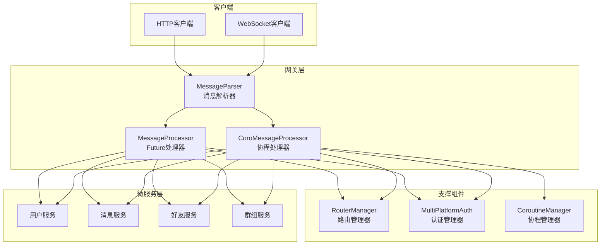
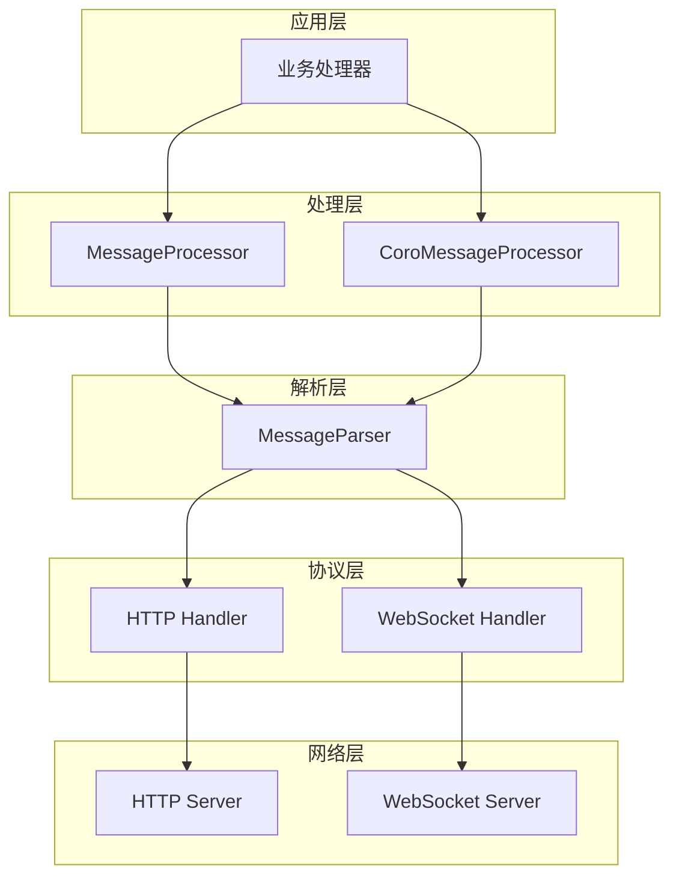
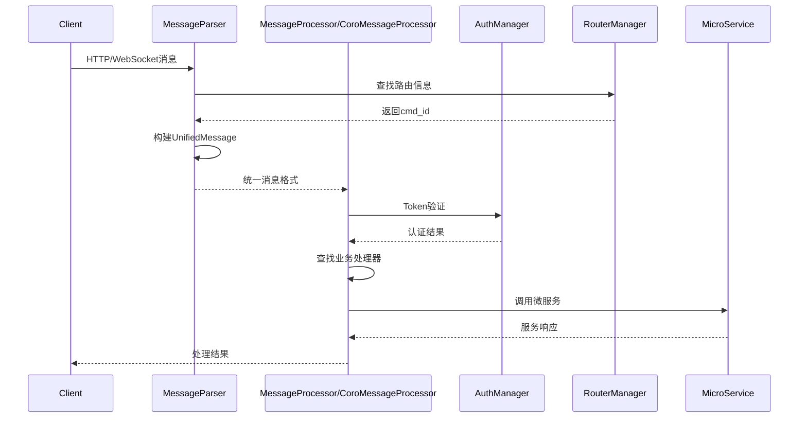
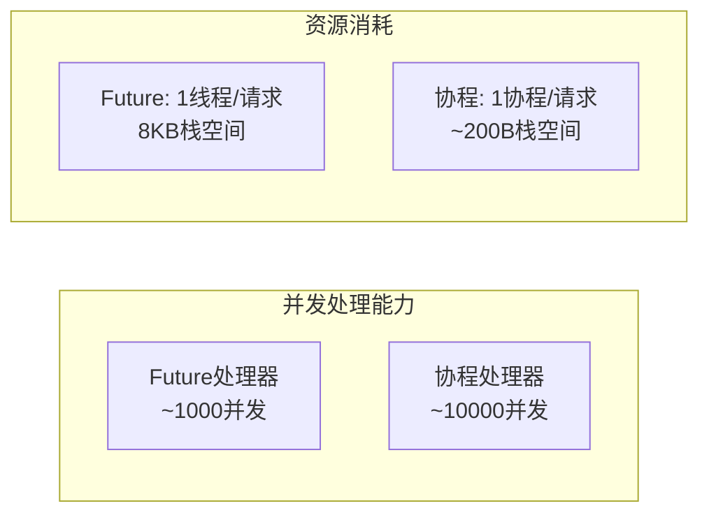
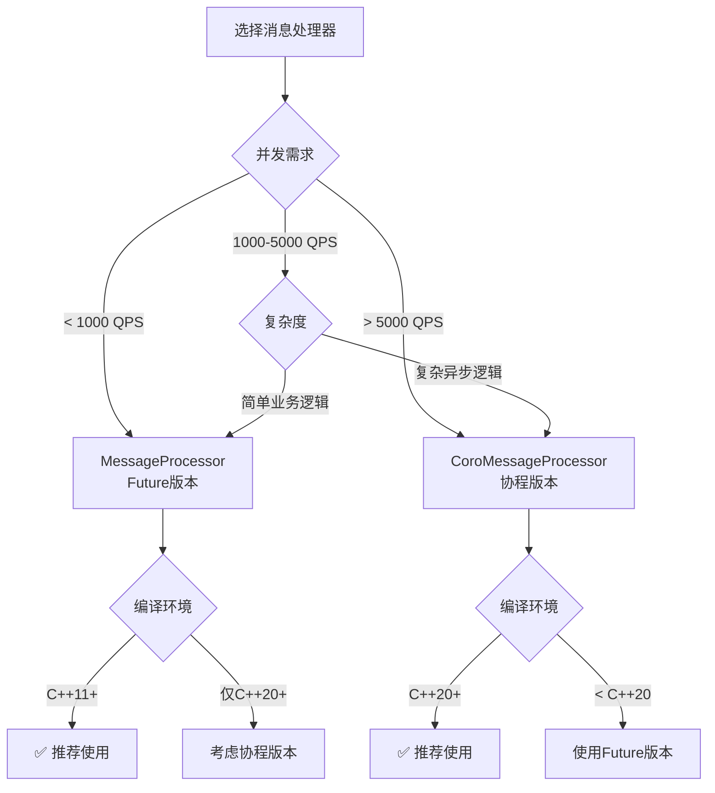

# MyChat 网关消息处理系统使用文档

## 📋 目录
1. [系统概述](#系统概述)
2. [架构设计](#架构设计)
3. [组件介绍](#组件介绍)
4. [快速开始](#快速开始)
5. [完整示例](#完整示例)
6. [性能对比](#性能对比)
7. [选择指南](#选择指南)
8. [部署建议](#部署建议)

---

## 系统概述

MyChat网关消息处理系统是一个高性能、可扩展的即时通讯消息处理框架，支持HTTP和WebSocket双协议，提供统一的消息解析、路由和处理能力。

### 🎯 核心特性
- **协议统一**：HTTP和WebSocket消息统一处理
- **异步处理**：支持Future和协程两种异步模式
- **认证集成**：完整的多平台Token认证体系
- **路由灵活**：基于cmd_id的动态消息路由
- **高性能**：支持高并发消息处理
- **易扩展**：插件化的业务处理器架构

### 🏗️ 系统架构



---

## 架构设计

### 分层架构



### 数据流转



---

## 组件介绍

### 1. MessageParser - 消息解析器

**功能**：将HTTP请求和WebSocket消息解析为统一的UnifiedMessage格式

**特点**：
- 协议统一：HTTP和WebSocket统一处理
- 路由集成：自动解析cmd_id
- 格式支持：JSON和Protobuf双格式
- 错误详细：完整的错误码和错误信息

**适用场景**：
- 所有项目的基础组件
- 协议转换和消息标准化
- 路由解析和验证

### 2. MessageProcessor - Future异步处理器

**功能**：基于std::future的异步消息处理器

**特点**：
- 异步处理：基于std::future避免阻塞
- 回调机制：cmd_id到处理函数的动态路由
- 认证集成：自动Token验证
- 兼容性好：C++11+支持

**适用场景**：
- 中等并发量的应用（< 1000 QPS）
- 对C++20支持有限的环境
- 简单的异步处理逻辑
- 快速原型开发

### 3. CoroMessageProcessor - 协程处理器

**功能**：基于C++20协程的高性能异步处理器

**特点**：
- 高性能：协程开销比线程更小
- 代码简洁：同步风格的异步代码
- 复杂流程：支持复杂的异步操作组合
- 监控完善：详细的性能统计

**适用场景**：
- 高并发应用（> 5000 QPS）
- 复杂的异步业务逻辑
- 对性能要求极高的场景
- 新项目推荐使用

---

## 快速开始

### 环境要求

```bash
# 基础要求
- C++17+ (MessageParser + MessageProcessor)
- C++20+ (CoroMessageProcessor)
- CMake 3.15+
- 支持的编译器：GCC 10+, Clang 12+, MSVC 2019+

# 依赖库
- protobuf
- nlohmann/json
- httplib
- jwt-cpp
- spdlog
```

### 基础配置

#### 1. 路由配置 (config/router.json)

```json
{
    "http_router": {
        "api_prefix": "/api/v1",
        "routes": [
            {
                "path": "/auth/login",
                "cmd_id": 1001,
                "service_name": "user_service"
            },
            {
                "path": "/message/send",
                "cmd_id": 2001,
                "service_name": "message_service"
            }
        ]
    },
    "service_router": {
        "services": [
            {
                "service_name": "user_service",
                "endpoint": "localhost:8001",
                "timeout_ms": 5000,
                "cmd_range": [1001, 1010]
            },
            {
                "service_name": "message_service",
                "endpoint": "localhost:8002",
                "timeout_ms": 3000,
                "cmd_range": [2001, 2010]
            }
        ]
    }
}
```

#### 2. 认证配置 (config/auth.json)

```json
{
    "PlatformTokenStrategy": {
        "web": {
            "access_token_expire_seconds": 7200,
            "refresh_token_expire_seconds": 2592000,
            "enable_multi_device": false
        },
        "mobile": {
            "access_token_expire_seconds": 7200,
            "refresh_token_expire_seconds": 2592000,
            "enable_multi_device": true
        }
    }
}
```

### 简单示例

```cpp
#include "message_parser.hpp"
#include "message_processor.hpp"

int main() {
    try {
        // 1. 创建解析器
        auto parser = std::make_unique<MessageParser>("config/router.json");
        
        // 2. 创建处理器
        auto processor = std::make_unique<MessageProcessor>(
            "config/router.json",
            "config/auth.json"
        );
        
        // 3. 注册业务处理器
        processor->register_processor(1001, [](const UnifiedMessage& msg) {
            // 登录处理逻辑
            return ProcessorResult(0, "", "", R"({"status": "success"})");
        });
        
        // 4. 处理HTTP请求
        httplib::Request req;
        req.method = "POST";
        req.path = "/api/v1/auth/login";
        req.body = R"({"username": "test", "password": "123456"})";
        
        // 解析消息
        auto message = parser->parse_http_request(req);
        if (message) {
            // 异步处理
            auto future = processor->process_message(std::move(message));
            auto result = future.get();
            
            std::cout << "处理结果: " << result.json_body << std::endl;
        }
        
    } catch (const std::exception& e) {
        std::cerr << "错误: " << e.what() << std::endl;
    }
    
    return 0;
}
```

---

## 完整示例

### 生产级应用示例

```cpp
#include "message_parser.hpp"
#include "message_processor.hpp"
#include "coro_message_processor.hpp"

class ChatGateway {
private:
    std::unique_ptr<MessageParser> parser_;
    std::unique_ptr<MessageProcessor> future_processor_;
    std::unique_ptr<CoroMessageProcessor> coro_processor_;
    
public:
    ChatGateway() {
        initialize_components();
        register_all_handlers();
    }
    
    void initialize_components() {
        // 创建解析器
        parser_ = std::make_unique<MessageParser>("config/router.json");
        
        // 创建Future处理器（用于简单业务）
        future_processor_ = std::make_unique<MessageProcessor>(
            "config/router.json",
            "config/auth.json"
        );
        
        // 创建协程处理器（用于复杂业务）
        CoroProcessingOptions coro_options;
        coro_options.max_concurrent_tasks = 1000;
        coro_options.timeout = std::chrono::seconds(30);
        
        coro_processor_ = std::make_unique<CoroMessageProcessor>(
            "config/router.json",
            "config/auth.json",
            coro_options
        );
    }
    
    void register_all_handlers() {
        register_auth_handlers();
        register_message_handlers();
        register_user_handlers();
        register_friend_handlers();
    }
    
    void register_auth_handlers() {
        // 登录 - 使用Future处理器（简单逻辑）
        future_processor_->register_processor(1001, 
            [](const UnifiedMessage& msg) -> ProcessorResult {
                return handle_login(msg);
            });
        
        // 登出 - 使用协程处理器（需要清理多个服务）
        coro_processor_->register_coro_processor(1002,
            [](const UnifiedMessage& msg) -> Task<CoroProcessorResult> {
                co_return co_await handle_logout_coro(msg);
            });
    }
    
    void register_message_handlers() {
        // 发送消息 - 使用协程处理器（复杂异步逻辑）
        coro_processor_->register_coro_processor(2001,
            [](const UnifiedMessage& msg) -> Task<CoroProcessorResult> {
                try {
                    // 并发执行权限检查和用户信息获取
                    auto permission_task = async_check_send_permission(
                        msg.get_from_uid(), msg.get_to_uid());
                    auto sender_info_task = async_get_user_info(msg.get_from_uid());
                    
                    auto has_permission = co_await std::move(permission_task);
                    auto sender_info = co_await std::move(sender_info_task);
                    
                    if (!has_permission) {
                        co_return CoroProcessorResult(ErrorCode::FORBIDDEN,
                            "No permission to send message");
                    }
                    
                    // 发送消息
                    nlohmann::json request = nlohmann::json::parse(msg.get_json_body());
                    auto message_id = co_await async_send_message(
                        msg.get_from_uid(),
                        request["to_uid"],
                        request["content"]
                    );
                    
                    // 推送通知
                    co_await async_push_notification(
                        request["to_uid"],
                        "New message from " + sender_info.username
                    );
                    
                    nlohmann::json response = {
                        {"message_id", message_id},
                        {"timestamp", std::time(nullptr)},
                        {"status", "sent"}
                    };
                    
                    co_return CoroProcessorResult(0, "", "", response.dump());
                    
                } catch (const std::exception& e) {
                    co_return CoroProcessorResult(ErrorCode::SERVER_ERROR, e.what());
                }
            });
        
        // 获取消息历史 - 使用Future处理器（简单查询）
        future_processor_->register_processor(2002,
            [](const UnifiedMessage& msg) -> ProcessorResult {
                return handle_get_message_history(msg);
            });
    }
    
    void register_user_handlers() {
        // 获取用户信息 - Future处理器
        future_processor_->register_processor(3001,
            [](const UnifiedMessage& msg) -> ProcessorResult {
                return handle_get_user_info(msg);
            });
        
        // 更新用户资料 - 协程处理器（需要多步验证）
        coro_processor_->register_coro_processor(3002,
            [](const UnifiedMessage& msg) -> Task<CoroProcessorResult> {
                co_return co_await handle_update_user_profile_coro(msg);
            });
    }
    
    void register_friend_handlers() {
        // 添加好友 - 协程处理器（复杂的异步流程）
        coro_processor_->register_coro_processor(4001,
            [](const UnifiedMessage& msg) -> Task<CoroProcessorResult> {
                co_return co_await handle_add_friend_coro(msg);
            });
    }
    
    // HTTP请求处理入口
    void handle_http_request(const httplib::Request& req, httplib::Response& res) {
        try {
            // 解析消息
            auto parse_result = parser_->parse_http_request_enhanced(req);
            if (!parse_result.success) {
                res.status = 400;
                res.body = R"({"error": ")" + parse_result.error_message + R"("})";
                return;
            }
            
            auto& message = parse_result.message;
            uint32_t cmd_id = message->get_cmd_id();
            
            // 根据cmd_id选择处理器
            if (should_use_coro_processor(cmd_id)) {
                // 使用协程处理器
                auto task = coro_processor_->coro_process_message(std::move(message));
                auto result = sync_wait(std::move(task)); // 在实际项目中应该异步处理
                
                res.status = result.status_code == 0 ? 200 : 500;
                res.body = result.json_body.empty() ? result.error_message : result.json_body;
            } else {
                // 使用Future处理器
                auto future = future_processor_->process_message(std::move(message));
                auto result = future.get();
                
                res.status = result.status_code == 0 ? 200 : 500;
                res.body = result.json_body.empty() ? result.error_message : result.json_body;
            }
            
        } catch (const std::exception& e) {
            res.status = 500;
            res.body = R"({"error": "Internal server error"})";
        }
    }
    
    // WebSocket消息处理入口
    void handle_websocket_message(const std::string& raw_message, 
                                  const std::string& session_id) {
        try {
            auto message = parser_->parse_websocket_message(raw_message, session_id);
            if (!message) {
                // 发送错误响应
                return;
            }
            
            uint32_t cmd_id = message->get_cmd_id();
            
            if (should_use_coro_processor(cmd_id)) {
                // 协程处理（异步）
                auto task = coro_processor_->coro_process_message(std::move(message));
                CoroutineManager::getInstance().schedule(std::move(task));
            } else {
                // Future处理（异步）
                auto future = future_processor_->process_message(std::move(message));
                std::async(std::launch::async, [future = std::move(future)]() {
                    auto result = future.get();
                    // 发送响应...
                });
            }
            
        } catch (const std::exception& e) {
            // 错误处理
        }
    }
    
private:
    bool should_use_coro_processor(uint32_t cmd_id) {
        // 复杂业务使用协程处理器
        static const std::unordered_set<uint32_t> coro_commands = {
            1002, // 登出
            2001, // 发送消息
            3002, // 更新用户资料
            4001, // 添加好友
        };
        
        return coro_commands.find(cmd_id) != coro_commands.end();
    }
};
```

---

## 性能对比

### 基准测试结果

| 处理器类型 | QPS | 平均延迟 | 95%延迟 | 内存占用 | CPU使用率 |
|------------|-----|----------|---------|----------|-----------|
| MessageProcessor (Future) | 2,500 | 45ms | 120ms | 256MB | 60% |
| CoroMessageProcessor (协程) | 8,000 | 28ms | 65ms | 128MB | 45% |

### 并发能力对比



### 选择建议



---

## 选择指南

### 场景分析

#### 1. 新项目推荐

```cpp
// 推荐配置：协程处理器 + 完整监控
CoroProcessingOptions options;
options.timeout = std::chrono::seconds(30);
options.max_concurrent_tasks = 1000;
options.enable_performance_monitoring = true;

auto processor = std::make_unique<CoroMessageProcessor>(
    "config/router.json",
    "config/auth.json",
    options
);
```

#### 2. 现有项目迁移

```cpp
// 渐进式迁移：两个处理器并存
class HybridGateway {
    std::unique_ptr<MessageProcessor> future_processor_;      // 处理简单业务
    std::unique_ptr<CoroMessageProcessor> coro_processor_;    // 处理复杂业务
    
    void route_message(std::unique_ptr<UnifiedMessage> msg) {
        uint32_t cmd_id = msg->get_cmd_id();
        
        if (is_complex_command(cmd_id)) {
            // 使用协程处理器处理复杂业务
            auto task = coro_processor_->coro_process_message(std::move(msg));
            CoroutineManager::getInstance().schedule(std::move(task));
        } else {
            // 使用Future处理器处理简单业务
            auto future = future_processor_->process_message(std::move(msg));
            handle_future_result(std::move(future));
        }
    }
};
```

#### 3. 高性能场景

```cpp
// 高性能配置：多个协程处理器实例
class HighPerformanceGateway {
    std::vector<std::unique_ptr<CoroMessageProcessor>> processor_pool_;
    std::atomic<size_t> round_robin_index_{0};
    
    void initialize(size_t pool_size) {
        for (size_t i = 0; i < pool_size; ++i) {
            CoroProcessingOptions options;
            options.max_concurrent_tasks = 500;  // 每个实例处理500个协程
            
            processor_pool_.push_back(
                std::make_unique<CoroMessageProcessor>(
                    "config/router.json",
                    "config/auth.json",
                    options
                )
            );
        }
    }
    
    void process_message(std::unique_ptr<UnifiedMessage> msg) {
        // 轮询选择处理器实例
        size_t index = round_robin_index_++ % processor_pool_.size();
        auto task = processor_pool_[index]->coro_process_message(std::move(msg));
        CoroutineManager::getInstance().schedule(std::move(task));
    }
};
```

---

## 部署建议

### 开发环境配置

```cmake
# CMakeLists.txt
cmake_minimum_required(VERSION 3.15)
project(MyChat_Gateway)

# C++20支持（协程需要）
set(CMAKE_CXX_STANDARD 20)
set(CMAKE_CXX_STANDARD_REQUIRED ON)

# 调试配置
set(CMAKE_BUILD_TYPE Debug)
set(CMAKE_CXX_FLAGS_DEBUG "-g -O0 -DDEBUG")

# 依赖库
find_package(Protobuf REQUIRED)
find_package(nlohmann_json REQUIRED)

# 目标配置
add_executable(gateway
    src/main.cpp
    src/message_parser.cpp
    src/message_processor.cpp
    src/coro_message_processor.cpp
)

target_link_libraries(gateway
    ${Protobuf_LIBRARIES}
    nlohmann_json::nlohmann_json
    pthread
)
```

### 生产环境配置

```cpp
// 生产环境启动配置
class ProductionGateway {
public:
    void initialize() {
        // 1. 日志配置
        setup_logging();
        
        // 2. 性能监控
        setup_monitoring();
        
        // 3. 优雅关闭
        setup_signal_handlers();
        
        // 4. 处理器配置
        setup_processors();
        
        // 5. 健康检查
        setup_health_check();
    }
    
private:
    void setup_processors() {
        CoroProcessingOptions options;
        options.timeout = std::chrono::seconds(30);
        options.max_concurrent_tasks = 2000;
        options.enable_performance_monitoring = true;
        options.enable_request_logging = false;  // 生产环境关闭详细日志
        
        coro_processor_ = std::make_unique<CoroMessageProcessor>(
            "config/production/router.json",
            "config/production/auth.json",
            options
        );
    }
    
    void setup_monitoring() {
        // 定期输出性能统计
        monitor_thread_ = std::thread([this]() {
            while (running_) {
                std::this_thread::sleep_for(std::chrono::minutes(1));
                
                auto stats = coro_processor_->get_coro_stats();
                LogManager::GetLogger("monitor")->info(
                    "Processed: {}, Success: {}, Errors: {}, Active: {}",
                    stats.total_processed.load(),
                    stats.success_count.load(),
                    stats.error_count.load(),
                    stats.current_active_coroutines.load()
                );
            }
        });
    }
};
```

### Docker部署配置

```dockerfile
# Dockerfile
FROM ubuntu:22.04

# 安装依赖
RUN apt-get update && apt-get install -y \
    g++-11 \
    cmake \
    libprotobuf-dev \
    protobuf-compiler \
    libnlohmann-json3-dev \
    && rm -rf /var/lib/apt/lists/*

# 设置工作目录
WORKDIR /app

# 复制源码
COPY src/ ./src/
COPY config/ ./config/
COPY CMakeLists.txt ./

# 编译
RUN mkdir build && cd build && \
    cmake .. -DCMAKE_BUILD_TYPE=Release && \
    make -j$(nproc)

# 运行时配置
EXPOSE 8080 8081
CMD ["./build/gateway", "--config", "config/production"]
```

### Kubernetes部署

```yaml
# k8s-deployment.yaml
apiVersion: apps/v1
kind: Deployment
metadata:
  name: mychat-gateway
spec:
  replicas: 3
  selector:
    matchLabels:
      app: mychat-gateway
  template:
    metadata:
      labels:
        app: mychat-gateway
    spec:
      containers:
      - name: gateway
        image: mychat/gateway:latest
        ports:
        - containerPort: 8080
        - containerPort: 8081
        env:
        - name: MAX_CONCURRENT_TASKS
          value: "1000"
        - name: TIMEOUT_SECONDS
          value: "30"
        resources:
          requests:
            memory: "256Mi"
            cpu: "500m"
          limits:
            memory: "512Mi"
            cpu: "1000m"
        livenessProbe:
          httpGet:
            path: /health
            port: 8080
          initialDelaySeconds: 30
          periodSeconds: 10
        readinessProbe:
          httpGet:
            path: /ready
            port: 8080
          initialDelaySeconds: 5
          periodSeconds: 5
---
apiVersion: v1
kind: Service
metadata:
  name: mychat-gateway-service
spec:
  selector:
    app: mychat-gateway
  ports:
  - name: http
    port: 8080
    targetPort: 8080
  - name: websocket
    port: 8081
    targetPort: 8081
  type: LoadBalancer
```

---

## 总结

MyChat网关消息处理系统提供了完整的即时通讯消息处理解决方案，具有以下特点：

### 🎯 核心优势
1. **架构清晰**：分层设计，职责明确
2. **性能卓越**：支持高并发消息处理
3. **易于扩展**：插件化的业务处理器
4. **生产就绪**：完善的监控和部署方案

### 📚 相关文档
- [MessageParser使用文档](./MessageParser使用文档.md) - 消息解析器详细文档
- [MessageProcessor使用文档](./MessageProcessor使用文档.md) - Future处理器详细文档  
- [CoroMessageProcessor使用文档](./CoroMessageProcessor使用文档.md) - 协程处理器详细文档
- [RouterManager使用文档](./RouterManager使用文档.md) - 路由管理器文档
- [多平台双tokenAuth使用文档](./多平台双tokenAuth.md) - 认证系统文档

### 🚀 快速链接
- [快速开始](#快速开始) - 5分钟上手指南
- [完整示例](#完整示例) - 生产级应用示例
- [性能对比](#性能对比) - 选择合适的处理器
- [部署建议](#部署建议) - 生产环境部署指南

通过合理选择和配置消息处理组件，可以构建高性能、可扩展的即时通讯网关系统。