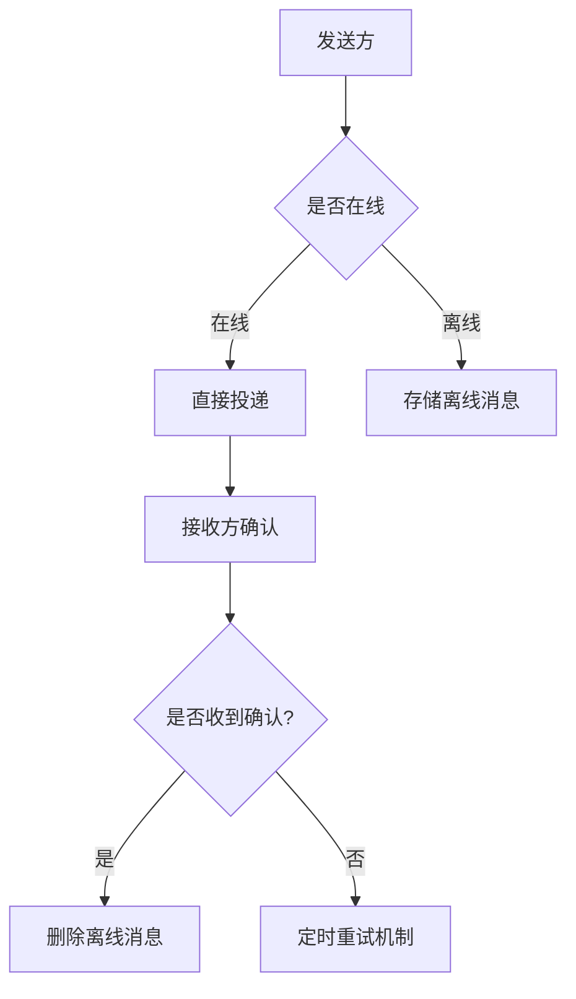
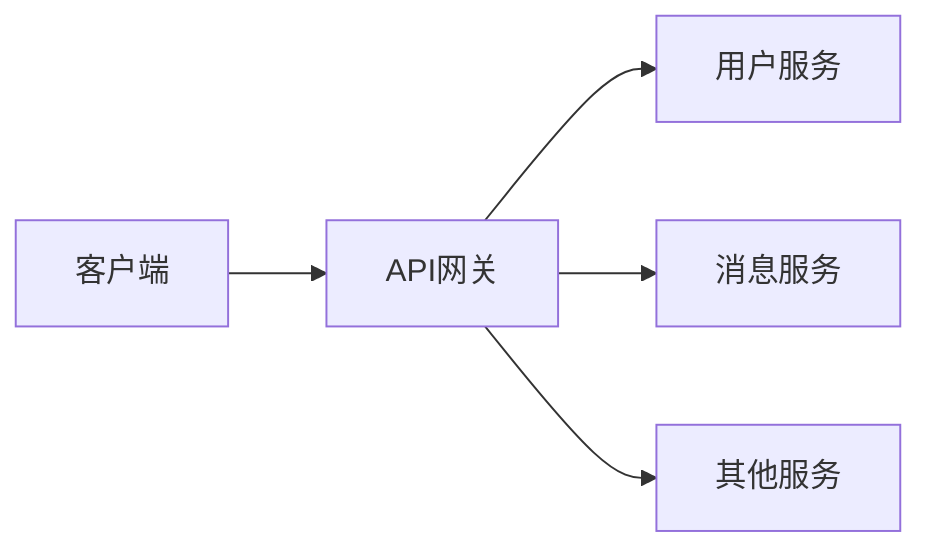
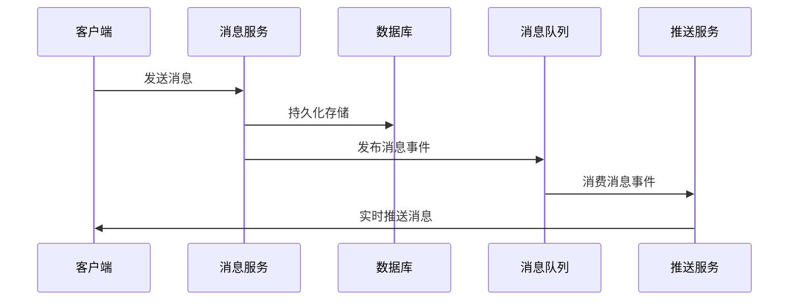
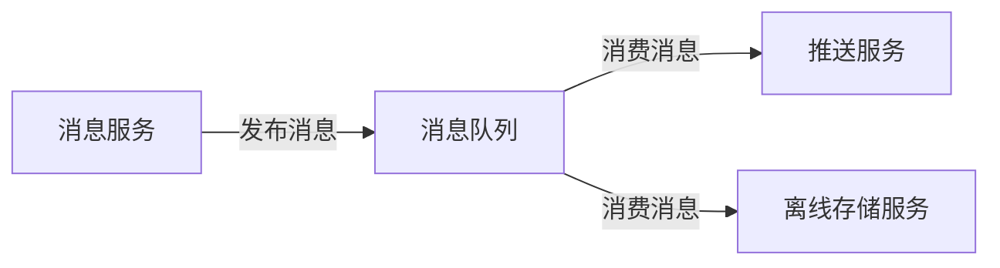
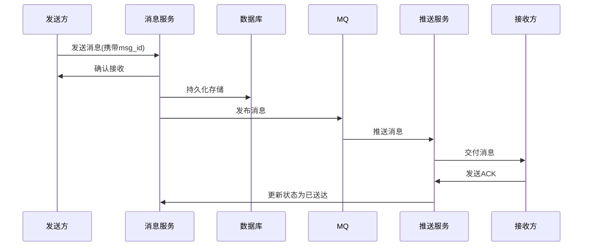

## QWEN:

我将以专业架构师的视角为你规划这个项目，考虑到你的技术目标和学习需求，我会从基础架构、技术选型、模块划分、开发步骤等方面进行系统性规划。以下是分阶段的详细设计方案：

---

### 一、整体架构蓝图（分层设计）

```
│ 客户端层        Qt客户端 / Web / Android / Electron        │
│ 网关层          WebSocket网关 + HTTP API网关               │
│ 微服务层        用户服务 | 消息服务 | 好友服务 | 群组服务   │
│ 基础设施层      数据库 | 缓存 | 消息队列 | 分布式ID | 监控   │
│ 运维层          Docker + Kubernetes + ELK + Prometheus     │
```

---

### 二、核心技术栈选型（兼顾学习价值和实用性）

| 模块       | 技术选型                   | 选择理由                         |
| ---------- | -------------------------- | -------------------------------- |
| 网络通信   | Boost.Asio + Protobuf      | 掌握底层网络编程，Protobuf跨平台 |
| 微服务框架 | RESTinC++（轻量级C++框架） | 简化HTTP服务开发                 |
| 服务发现   | Nacos                      | 国内主流方案，支持配置管理       |
| 消息队列   | RabbitMQ                   | 简单易学，满足异步通知需求       |
| 数据库     | MySQL + Redis              | 关系型数据+热点缓存经典组合      |
| 文件存储   | MinIO/S3协议               | 对象存储标准，便于后续扩展       |
| 客户端开发 | Qt5 + QML                  | 跨平台GUI，适合练手              |
| 监控体系   | Prometheus + Grafana       | 云原生监控标准方案               |

---

### 三、核心模块设计详解

#### 1. 服务模块划分（DDD领域驱动设计）

```cpp
// 用户服务（User Service）
class UserService {
    Register()          // 注册接口
    Login()             // 登录认证（JWT token）
    GetUserInfo()       // 用户详情
    SearchUser()        // 模糊搜索
};

// 好友服务（Friend Service）
class FriendService {
    AddFriend()         // 添加好友请求
    HandleRequest()     // 处理请求（同意/拒绝）
    GetFriendList()     // 获取列表（带状态）
    UpdateRemark()      // 修改备注
};

// 消息服务（Message Service）
class MessageService {
    SendMsg()           // 发送消息（支持多种类型）
    PullHistory()       // 拉取历史消息
    AckMessage()        // 消息确认回执
    PushOffline()       // 离线消息推送
};

// 群组服务（Group Service）
class GroupService {
    CreateGroup()       // 创建群组
    InviteMember()      // 邀请入群
    GetGroupInfo()      // 群资料管理
    MuteMember()        // 禁言功能
};
```

#### 2. 通信协议设计（Protobuf v3）

```protobuf
// message.proto
syntax = "proto3";

message IMHeader {
    string version = 1;
    uint32 seq = 2;         // 序列号
    uint32 cmd_id = 3;      // 命令字
    string from_id = 4;     // 发送方
    string to_id = 5;       // 接收方
    uint64 timestamp = 6;   // 时间戳
}

message TextMessage {
    IMHeader header = 1;
    string content = 2;     // 文本内容
    repeated string at_list = 3; // @用户列表
}

message FileMessage {
    IMHeader header = 1;
    string file_name = 2;
    uint64 file_size = 3;
    string md5 = 4;
    string url = 5;         // 下载地址
}

// 扩展建议：后续可增加视频消息、语音消息等类型
```

#### 3. 数据库设计范例（MySQL）

```sql
-- 用户表
CREATE TABLE `users` (
  `id` BIGINT PRIMARY KEY COMMENT '用户ID(雪花算法)',
  `username` VARCHAR(64) UNIQUE NOT NULL COMMENT '登录名',
  `password` VARCHAR(128) NOT NULL COMMENT 'BCrypt加密密码',
  `nickname` VARCHAR(64) NOT NULL COMMENT '昵称',
  `status` TINYINT DEFAULT 0 COMMENT '状态(0离线 1在线)',
  `avatar` VARCHAR(255) COMMENT '头像URL'
) ENGINE=InnoDB;

-- 消息存储表（按用户ID分表）
CREATE TABLE `messages_ {user_id % 16}` (  -- 动态分表
  `msg_id` BIGINT PRIMARY KEY,
  `from_id` BIGINT NOT NULL,
  `to_id` BIGINT NOT NULL,
  `content` TEXT NOT NULL,
  `msg_type` TINYINT NOT NULL COMMENT '消息类型',
  `is_read` TINYINT DEFAULT 0,
  `create_time` DATETIME DEFAULT CURRENT_TIMESTAMP
) ENGINE=InnoDB;
```

---

### 四、开发路线图（分阶段实施）

#### 第一阶段：基础框架搭建（2周）

1. 搭建C++网络通信层
   - 使用Boost.Asio实现TCP连接池
   - 实现Protobuf编解码器
   - 设计消息分发路由机制
2. 搭建微服务基础框架
   - 使用CMake组织项目结构
   - 实现服务注册/发现客户端
   - 集成日志系统（spdlog）

#### 第二阶段：核心服务开发（6周）

```bash
Week3-4: 用户服务开发
         ├── JWT登录认证流程
         ├── 数据库连接池实现
         └── 单元测试覆盖

Week5-6: 消息服务开发
         ├── 离线消息落盘存储
         ├── 消息幂等处理
         └── RabbitMQ异步推送

Week7-8: 好友/群组服务
         ├── 好友状态同步机制
         └── 群成员管理事务
```

#### 第三阶段：客户端开发（4周）

1. Qt客户端开发
   - 使用QWebSocket实现网络模块
   - 开发消息收发界面（QML）
   - 实现本地消息缓存（SQLite）
2. 基础功能联调
   - 登录流程调试
   - 联系人列表同步
   - 文本消息收发测试

#### 第四阶段：优化与扩展（持续进行）

- 性能优化：连接池优化、数据库索引优化
- 安全加固：HTTPS、防刷机制
- 扩展功能：音视频通话、红包系统
- 多端适配：开发Web客户端（WebSocket）

---

### 五、关键问题解决方案

#### 1. 分布式环境下消息一致性

```cpp
// 使用本地事务表方案
BEGIN TRANSACTION;
// 1. 存储消息到本地数据库
INSERT INTO messages (msg_id, from_id, to_id...) VALUES(...);

// 2. 更新对话框最近消息时间
UPDATE conversations SET last_time=NOW() WHERE conv_id=...;

// 3. 发送到MQ进行异步推送
RabbitMQ::Publish("new_message", msg);

COMMIT;
```

#### 2. 在线状态同步方案

```bash
┌──────────────┐      ┌──────────────┐
│  网关服务    │<---->│  在线状态服务 │
└──────────────┘      └──────────────┘
       │                       │
    Redis Pub/Sub          etcd注册中心
       │                       │
┌──────────────┐      ┌──────────────┐
│  消息服务    │<---->│  服务发现     │
└──────────────┘      └──────────────┘

状态同步流程：
1. 客户端连接网关时注册在线状态
2. 状态变更通过Redis广播
3. 各业务服务通过watcher感知状态变化
```

#### 3. 消息可靠性保障



---

### 六、新手避坑指南

1. **过度设计陷阱**：

   - 初期不要追求完美架构，先实现核心链路
   - 示例：先用单体MySQL，后续再做分库分表
2. **C++开发注意事项**：

   ```cpp
   // 推荐使用现代C++特性
   using ConnectionPtr = std::shared_ptr<TcpConnection>;
   // 避免裸指针使用
   auto buffer = std::make_shared<ByteBuffer>(data, size); 
   ```
3. **调试技巧**：

   - 使用Wireshark抓包分析网络问题
   - 用Valgrind检测内存泄漏
   - 通过gperftools做性能剖析
4. **渐进式测试**：

   ```bash
   # 测试顺序建议
   1. 单元测试 -> 2. 本地集成测试 -> 
   3. 单机全链路 -> 4. 分布式压测
   ```

---

### 七、学习资源推荐

1. **书籍**：

   - 《C++ Concurrency in Action》
   - 《Designing Data-Intensive Applications》
   - 《ZeroMQ云时代分布式编程》
2. **开源参考项目**：

   - OpenIM（Go语言实现）
   - Tencent NTQQ（逆向分析参考）
   - boost.beast（网络库示例）
3. **工具链**：

   - CMake + Conan包管理
   - VSCode + C/C++插件
   - Postman做API测试

---

### 八、下一步行动建议

建议你现在立即执行以下步骤：

1. 创建GitHub仓库，初始化项目结构：

   ```bash
   im-project/
   ├── gateway/        # 网关服务
   ├── services/       # 微服务目录
   │   ├── user/
   │   ├── message/
   │   └── ...
   ├── common/         # 公共库
   ├── client/         # Qt客户端
   └── docker/         # 容器化配置
   ```
2. 完成第一个helloworld服务：

   ```cpp
   // 示例：简单的HTTP服务
   #include <restincpp/rest.h>

   int main() {
       auto app = rc::create_app();
       app->route("/ping", [](auto req) {
           return rc::response("pong");
       });
       app->listen("0.0.0.0:8080");
       return 0;
   }
   ```
3. 加入即时通讯开发者社区：

   - 国内：Gitee开源IM项目交流群
   - 国外：CppCon即时通讯系统设计talks

需要我针对某个模块提供更详细的实现示例或技术文档，欢迎随时提问。建议你先从搭建开发环境和实现最简通信原型开始，我会持续为你提供指导。

好的！下面我将为你详细拆解这个仿QQ即时通讯项目的 **完整项目结构设计**，包括代码目录组织、模块依赖关系、构建系统规划等，帮助你从零开始搭建一个结构清晰、可扩展的项目框架。

---

### 一、项目根目录结构（推荐布局）

```bash
im-project/
├── CMakeLists.txt              # 顶级CMake配置文件
├── README.md                   # 项目说明文档
├── docs/                       # 技术文档（接口文档、设计文档等）
├── scripts/                    # 构建/部署脚本
│   ├── build.sh                # 构建脚本
│   ├── run.sh                  # 运行脚本
│   └── init_db.sql             # 数据库初始化脚本
├── third_party/                # 第三方库（可选，推荐用包管理器）
├── gateway/                    # 网关服务（WebSocket + HTTP）
│   ├── CMakeLists.txt
│   ├── include/
│   └── src/
├── services/                   # 微服务目录
│   ├── user/                   # 用户服务
│   ├── message/                # 消息服务
│   ├── friend/                 # 好友服务
│   └── group/                  # 群组服务
├── common/                     # 公共库（所有模块依赖）
│   ├── CMakeLists.txt
│   ├── include/
│   │   ├── utils/              # 工具类（日志、线程池、配置读取）
│   │   ├── proto/              # Protobuf协议定义
│   │   └── network/            # 网络通信基类（Asio封装）
│   └── src/
├── client/                     # 客户端代码（Qt）
│   ├── qt/                     # Qt客户端实现
│   └── web/                    # Web客户端（后续扩展）
├── test/                       # 测试代码
│   ├── unit_test/              # 单元测试
│   └── integration_test/       # 集成测试
└── docker/                     # 容器化配置
    ├── docker-compose.yml      # 多服务编排
    └── Dockerfile.*            # 各模块Docker镜像构建文件
```

---

### 二、核心模块详解

#### 1. `common/` 模块（公共依赖）

这是整个项目的基础，所有其他模块都依赖它，需优先开发。

##### 文件结构：

```bash
common/
├── CMakeLists.txt
├── include/
│   ├── utils/
│   │   ├── logger.h            # 日志模块（封装spdlog）
│   │   ├── config.h            # 配置读取（YAML格式）
│   │   └── thread_pool.h       # 线程池实现
│   ├── proto/
│   │   ├── im.pb.h             # Protobuf生成的头文件
│   │   └── message.proto       # 通信协议定义
│   └── network/
│       ├── tcp_connection.h    # TCP连接封装
│       ├── tcp_server.h        # TCP服务器基类
│       └── codec.h             # 编解码器（Protobuf）
└── src/
    ├── utils/
    │   ├── logger.cpp
    │   ├── config.cpp
    │   └── thread_pool.cpp
    └── network/
        ├── tcp_connection.cpp
        ├── tcp_server.cpp
        └── codec.cpp
```

##### 核心功能：

- **Protobuf协议**：定义所有服务间通信的协议（消息类型、命令字等）
- **网络通信基类**：封装Boost.Asio的TCP连接、异步读写逻辑
- **工具类**：日志、配置加载、线程池、数据库连接池（后续扩展）

---

#### 2. `gateway/` 网关服务

作为客户端连接入口，负责协议解析和路由转发。

##### 文件结构：

```bash
gateway/
├── CMakeLists.txt
├── config/
│   └── config.yaml             # 网关配置（监听端口、服务发现地址等）
├── include/
│   ├── ws_server.h             # WebSocket服务器
│   └── router.h                # 路由分发逻辑
└── src/
    ├── main.cpp                # 程序入口
    ├── ws_server.cpp
    └── router.cpp
```

##### 核心功能：

- WebSocket握手处理
- 消息路由到对应微服务（通过服务发现获取服务实例）
- 客户端连接管理（维护在线状态）

---

#### 3. `services/` 微服务模块

每个服务独立开发，共享公共库。

以 `user/` 用户服务为例：

```bash
user/
├── CMakeLists.txt
├── config/
│   └── config.yaml
├── include/
│   ├── user_service.h          # 用户服务接口
│   └── database.h              # 数据库操作封装
└── src/
    ├── main.cpp
    ├── user_service.cpp
    └── database.cpp
```

##### 共同特性：

- 所有服务均基于 `RESTinC++` 或自定义HTTP框架
- 通过Nacos进行服务注册/发现
- 使用Redis缓存热点数据（如用户状态）
- 数据库操作使用MySQL Connector/C++

---

#### 4. `client/` 客户端代码

初期先实现Qt客户端，后续扩展Web/Electron。

##### Qt客户端结构：

```bash
client/qt/
├── CMakeLists.txt
├── main.cpp
├── qml/                        # QML界面
│   ├── Login.qml
│   ├── ChatWindow.qml
│   └── ContactList.qml
├── src/
│   ├── network/
│   │   ├── websocket_client.h  # 网络通信层
│   │   └── message_handler.h   # 消息处理
│   └── model/
│       ├── chat_model.h        # 消息模型
│       └── contact_model.h     # 联系人模型
└── resources/                  # 资源文件（图标、样式表）
```

---

### 三、构建系统设计（CMake）

#### 1. 顶级 `CMakeLists.txt`

```cmake
cmake_minimum_required(VERSION 3.14)
project(IMProject VERSION 1.0.0 LANGUAGES CXX)

# 设置编译器选项
set(CMAKE_CXX_STANDARD 17)
set(CMAKE_CXX_STANDARD_REQUIRED ON)

# 包含公共库
add_subdirectory(common)

# 添加网关和微服务
add_subdirectory(gateway)
add_subdirectory(services/user)
add_subdirectory(services/message)
add_subdirectory(services/friend)
add_subdirectory(services/group)

# 添加客户端
add_subdirectory(client/qt)
```

#### 2. 模块依赖管理

每个子模块的 `CMakeLists.txt` 需显式声明依赖：

```cmake
# gateway/CMakeLists.txt 示例
add_executable(gateway src/main.cpp src/ws_server.cpp src/router.cpp)

target_include_directories(gateway PRIVATE ${PROJECT_SOURCE_DIR}/common/include)
target_link_libraries(gateway PRIVATE common restincpp::restincpp boost_system protobuf::libprotobuf)
```

---

### 四、开发流程建议

#### 1. 第一个可运行版本（MVP）

按以下顺序开发：

1. 实现 `common/` 模块：
   - Protobuf协议编译
   - 网络通信基类（TCP服务器/客户端）
2. 开发 `gateway/`：
   - 建立WebSocket连接
   - 实现简单Echo服务
3. 开发 `user/` 服务：
   - 实现登录接口（HTTP API）
   - 集成MySQL数据库
4. Qt客户端：
   - 实现登录界面
   - 通过WebSocket连接网关

#### 2. 逐步扩展路径

```
阶段目标：
1. 登录认证 → 2. 联系人同步 → 3. 文本消息收发 → 4. 离线消息 → 5. 群组功能
```

---

### 五、新手常见问题解决

#### 1. Protobuf编译问题

```bash
# 安装Protobuf编译器
sudo apt install protobuf-compiler

# 编译proto文件
protoc --cpp_out=./proto message.proto
```

#### 2. Boost.Asio链接问题

确保CMake正确链接Boost库：

```cmake
find_package(Boost REQUIRED COMPONENTS system)

target_link_libraries(your_target PRIVATE Boost::system)
```

#### 3. 服务启动顺序问题

使用 `docker-compose` 控制启动顺序：

```yaml
# docker-compose.yml 示例
services:
  nacos:
    image: nacos/nacos-server
  mysql:
    image: mysql:8.0
    depends_on:
      - nacos
  user-service:
    image: user-service
    depends_on:
      - mysql
```

---

### 六、下一步行动建议

1. **立即执行**：创建GitHub仓库并初始化上述目录结构
2. **第一个代码提交**：先实现 `common/proto/message.proto` 和对应的编解码器
3. **验证网络通信**：编写简单的TCP服务器和客户端测试收发Protobuf消息

需要我针对某个模块提供更详细的代码示例或技术文档，欢迎随时提问！建议从 `common/` 模块开始，我会持续为你提供指导。

## DS:

### 分布式微服务即时通讯项目基础架构设计

我将帮你规划一个类似QQ的分布式即时通讯系统，采用模块化设计，便于逐步实现和扩展。以下是基础架构设计：

#### 一、整体架构图

```
[Qt客户端] -> [API网关] -> [微服务集群] <- [公共基础设施]
        ↑
[其他未来客户端]
```

#### 二、核心模块划分

1. **接入层**

   - API网关（Gateway Service）
   - 长连接服务（Connection Service）
2. **业务服务层**

   - 用户服务（User Service）
   - 消息服务（Message Service）
   - 关系服务（Relation Service）
   - 群组服务（Group Service）
   - 推送服务（Push Service）
3. **基础设施层**

   - 服务注册发现（Consul/Etcd）
   - 配置中心（Config Service）
   - 消息队列（RabbitMQ/Kafka）
   - 存储系统（MySQL + Redis + MinIO）

#### 三、技术栈推荐

| 组件     | 推荐技术                | 作用           |
| -------- | ----------------------- | -------------- |
| RPC框架  | gRPC                    | 微服务间通信   |
| 消息协议 | Protocol Buffers        | 高效序列化     |
| 服务发现 | Consul                  | 服务注册与发现 |
| 消息队列 | RabbitMQ                | 服务解耦       |
| 数据库   | MySQL(主) + Redis(缓存) | 数据持久化     |
| 文件存储 | MinIO                   | 文件对象存储   |
| API网关  | Nginx + OpenResty       | 请求路由       |
| 长连接   | WebSocket               | 实时消息推送   |

#### 四、服务详细设计

1. **API网关服务**

```cpp
// gateway_service.cpp
class Gateway {
public:
    void Start(int port) {
        // 1. 初始化路由
        router_.AddRoute("/login", &AuthController::Login);
        router_.AddRoute("/send_msg", &MsgController::SendMessage);
    
        // 2. 连接服务发现
        service_discovery_.Connect("consul://localhost:8500");
    
        // 3. 启动HTTP/WebSocket服务器
        server_.Listen(port);
    }
  
private:
    Router router_;
    ServiceDiscovery service_discovery_;
    HttpServer server_;
};
```

2. **用户服务接口定义（Proto示例）**

```protobuf
// user_service.proto
service UserService {
    rpc Register (RegisterReq) returns (RegisterResp);
    rpc Login (LoginReq) returns (LoginResp);
    rpc GetUserInfo (UserInfoReq) returns (UserInfoResp);
}

message RegisterReq {
    string username = 1;
    string password = 2;
    string email = 3;
}

message LoginResp {
    int32 user_id = 1;
    string token = 2;
    int64 expire_time = 3;
}
```

3. **消息服务核心逻辑**

```cpp
// message_service.cpp
class MessageServiceImpl : public MessageService::Service {
    grpc::Status SendMessage(ServerContext* context, const MsgRequest* req, MsgResponse* resp) override {
        // 1. 消息持久化
        mysql_store_.SaveMessage(req->msg());
    
        // 2. 发布到消息队列
        mq_producer_.Publish("msg_queue", Serialize(req->msg()));
    
        // 3. 返回响应
        resp->set_status(SUCCESS);
        return Status::OK;
    }
  
private:
    MySqlStorage mysql_store_;
    RabbitMQProducer mq_producer_;
};
```

#### 五、开发路线规划

1. **第一阶段：基础框架搭建**

   - 搭建微服务骨架（每个服务空实现）
   - 实现服务注册发现
   - 配置API网关路由
   - 实现基础Docker部署
2. **第二阶段：核心功能实现**

   ```mermaid
   graph TD
       A[用户服务] --> B[注册/登录]
       C[消息服务] --> D[点对点消息]
       E[关系服务] --> F[好友管理]
       G[推送服务] --> H[在线状态]
   ```
3. **第三阶段：高级功能扩展**

   - 群聊功能
   - 文件传输
   - 消息漫游
   - 消息已读回执

#### 六、关键设计决策

1. **通信协议选择**

   - 客户端↔网关：HTTP/WebSocket + JSON
   - 微服务间：gRPC + Protobuf
2. **会话管理设计**

   ```cpp
   // session_manager.h
   class SessionManager {
   public:
       void AddSession(int user_id, const Session& session) {
           // 存储到Redis: key=user_id, value=session_info
           redis_->Set("session:" + std::to_string(user_id), session.Serialize());
       }

       Session GetSession(int user_id) {
           // 从Redis获取会话信息
           return Session::Deserialize(redis_->Get("session:" + std::to_string(user_id)));
       }
   };
   ```
3. **消息可靠性保证**

   - 发送方：消息持久化+ACK机制
   - 接收方：消息去重+顺序处理
   - 离线消息：Redis暂存+MySQL持久化

#### 七、项目目录结构建议

```
im-system/
├── apps/                  # 服务入口
│   ├── gateway/
│   ├── user_service/
│   └── msg_service/
├── core/                  # 核心逻辑
│   ├── libs/              # 公共库
│   ├── proto/             # Protobuf定义
│   └── storage/           # 存储接口
├── configs/               # 配置文件
├── scripts/               # 部署脚本
└── clients/
    └── qt_client/         # Qt客户端代码
```

#### 八、新手友好建议

1. 从单体开始演进：先实现核心功能再拆分
2. 使用Docker容器化：简化环境依赖
3. 重点关注消息流：
   ```
   客户端 -> 网关 -> 消息服务 -> 消息队列 -> 推送服务 -> 接收方客户端
   ```
4. 调试工具推荐：
   - gRPC: BloomRPC
   - 消息队列: RabbitMQ Management UI
   - 网络: Wireshark

建议先从用户服务和消息服务开始实现，完成登录和消息发送的基本流程。每完成一个模块，用Postman或自制客户端测试接口。遇到具体实现问题时，可以继续向我咨询细节实现方案！


好的，我将详细为你介绍每个模块的基本架构和功能作用，采用分层的方式讲解，让你对整个系统有清晰的认识：

### 一、接入层（网关服务）

**核心功能**：系统入口，处理所有客户端请求



#### 组件详解：

1. **API网关（Gateway Service）**

   - 请求路由：将请求转发到对应微服务
   - 协议转换：HTTP/WebSocket ↔ gRPC
   - 认证鉴权：JWT令牌验证
   - 限流熔断：防止服务过载
   - 日志记录：访问日志收集
2. **长连接服务（Connection Service）**

   - 管理WebSocket连接
   - 维护用户连接状态
   - 心跳检测保持连接活性
   - 连接负载均衡

**关键数据结构**：

```cpp
// 连接会话信息
struct UserSession {
    int64_t user_id;
    std::string session_id;
    std::string client_ip;
    time_t last_heartbeat;
    ConnectionType type; // PC/Web/Mobile
};
```

### 二、业务服务层

#### 1. 用户服务（User Service）

**功能**：

- 用户注册/登录/注销
- 个人信息管理
- 好友搜索与推荐
- 安全认证（密码加密）

**接口示例**：

```protobuf
service UserService {
    rpc Register(UserRegisterReq) returns (UserRegisterResp);
    rpc Login(UserLoginReq) returns (UserLoginResp);
    rpc GetUserProfile(GetUserProfileReq) returns (UserProfile);
}
```

**存储设计**：

```sql
CREATE TABLE users (
    id BIGINT PRIMARY KEY AUTO_INCREMENT,
    username VARCHAR(50) UNIQUE NOT NULL,
    password_hash CHAR(64) NOT NULL, -- SHA256
    nickname VARCHAR(50),
    avatar_url VARCHAR(255),
    created_at TIMESTAMP DEFAULT CURRENT_TIMESTAMP
);
```

#### 2. 消息服务（Message Service）

**功能**：

- 消息收发核心逻辑
- 消息持久化存储
- 消息状态管理（已发送/已送达/已读）
- 消息时序保证

**核心流程**：



#### 3. 关系服务（Relation Service）

**功能**：

- 好友关系管理（添加/删除/拉黑）
- 好友分组管理
- 好友申请处理
- 通讯录同步

**关键数据结构**：

```cpp
// 好友关系
struct FriendRelation {
    int64_t user_id;
    int64_t friend_id;
    FriendStatus status; // 正常/拉黑/删除
    std::string remark; // 好友备注
    time_t create_time;
};
```

#### 4. 群组服务（Group Service）

**功能**：

- 群组创建/解散
- 群成员管理（添加/移除）
- 群权限管理（管理员/群主）
- 群公告设置

**群组模型**：

```protobuf
message Group {
    int64 group_id = 1;
    string group_name = 2;
    int64 owner_id = 3;
    string avatar_url = 4;
    repeated GroupMember members = 5;
}

message GroupMember {
    int64 user_id = 1;
    GroupRole role = 2; // 成员/管理员/群主
    string card_name = 3; // 群名片
}
```

#### 5. 推送服务（Push Service）

**功能**：

- 实时消息推送
- 在线状态管理
- 消息可靠性保证（ACK机制）
- 离线消息处理

**核心逻辑**：

```cpp
class PushService {
public:
    void PushMessage(const Message& msg) {
        // 1. 检查接收方在线状态
        if (online_users_.count(msg.receiver_id())) {
            // 2. 通过长连接推送
            connection_mgr_.SendToUser(msg.receiver_id(), msg);
          
            // 3. 确认送达
            msg_service_.MarkAsDelivered(msg.msg_id());
        } else {
            // 4. 存储为离线消息
            offline_storage_.SaveOfflineMessage(msg);
        }
    }
};
```

### 三、基础设施层

#### 1. 服务注册与发现（Consul）

**功能**：

- 服务实例注册
- 健康检查
- 动态服务发现
- 负载均衡

**工作流程**：

1. 服务启动时向Consul注册
2. 网关从Consul获取可用服务列表
3. 定时心跳保持服务健康状态
4. 服务下线时自动注销

#### 2. 消息队列（RabbitMQ）

**使用场景**：

- 消息服务与推送服务解耦
- 事件驱动架构
- 流量削峰
- 失败重试机制

**核心交换模式**：



#### 3. 存储系统

**MySQL**：

- 用户核心数据
- 关系链数据
- 群组元数据
- 消息持久化存储

**Redis**：

- 会话信息存储
- 在线状态缓存
- 未读消息计数
- 分布式锁实现

```cpp
// Redis键设计示例
class RedisKeys {
public:
    // 用户会话 key: user_sessions:{user_id}
    static std::string UserSessions(int64_t user_id) {
        return "user_sessions:" + std::to_string(user_id);
    }
  
    // 未读消息数 key: unread_count:{user_id}:{sender_id}
    static std::string UnreadCount(int64_t user_id, int64_t sender_id) {
        return "unread_count:" + std::to_string(user_id) + ":" + std::to_string(sender_id);
    }
};
```

#### 4. 配置中心（Config Service）

**功能**：

- 统一管理配置
- 动态配置更新
- 环境隔离（dev/test/prod）
- 敏感信息加密

**配置类型**：

- 数据库连接配置
- 第三方服务密钥
- 系统参数（如消息有效期）
- 限流阈值

### 四、客户端架构（Qt实现）

#### 核心模块设计：

```plaintext
QtClient/
├── core/            # 核心逻辑
│   ├── network      # 网络通信封装
│   ├── models       # 数据模型
│   └── database     # 本地缓存
├── ui/              # 界面组件
│   ├── login        # 登录窗口
│   ├── main         # 主界面
│   ├── chat         # 聊天窗口
│   └── contacts     # 联系人列表
└── utils/           # 工具类
    ├── config       # 配置管理
    └── encrypt      # 加密工具
```

#### 网络通信层：

```cpp
class NetworkManager : public QObject {
    Q_OBJECT
public:
    void init(const QString& gatewayUrl);
  
    void login(const QString& username, const QString& password);
    void sendMessage(int64_t receiverId, const QString& content);
  
signals:
    void newMessageReceived(const Message& msg);
    void contactStatusChanged(int64_t userId, bool online);
  
private:
    QWebSocket messageSocket;   // 消息长连接
    QNetworkAccessManager httpClient; // HTTP客户端
};
```

### 五、关键设计决策详解

#### 1. 消息可靠性保证

**实现方案**：



#### 2. 会话管理设计

**分布式会话实现**：

```cpp
class SessionManager {
public:
    bool ValidateSession(const std::string& token) {
        // 从Redis查询会话
        auto session_data = redis_->Get("session:" + token);
        if (session_data.empty()) return false;
      
        // 反序列化会话信息
        Session session = Session::Deserialize(session_data);
      
        // 检查会话过期
        return session.expire_time > GetCurrentTime();
    }
  
    void CreateSession(int user_id, const std::string& device_info) {
        Session session;
        session.user_id = user_id;
        session.token = GenerateToken();
        session.expire_time = GetCurrentTime() + SESSION_TIMEOUT;
      
        // 存储到Redis
        redis_->Setex("session:" + session.token, 
                     SESSION_TIMEOUT, 
                     session.Serialize());
    }
};
```

#### 3. 在线状态管理

**状态同步机制**：

1. 用户登录时在Redis设置在线状态
2. 通过心跳包维持在线状态
3. 状态变化时发布事件到MQ
4. 相关用户接收状态更新通知

```cpp
// 状态键设计
class PresenceManager {
public:
    void SetOnline(int64_t user_id) {
        // 设置在线状态，带过期时间
        redis_->Setex("presence:" + std::to_string(user_id), 
                     HEARTBEAT_TIMEOUT * 2, 
                     "online");
      
        // 发布状态变更事件
        Event event;
        event.type = PRESENCE_CHANGE;
        event.user_id = user_id;
        event.status = ONLINE;
        mq_producer_.Publish("presence_events", event);
    }
};
```

### 六、开发路线图建议

1. **基础框架搭建**（第1周）

   - 搭建微服务骨架（gRPC + Protobuf）
   - 实现服务注册发现
   - 配置API网关路由
   - 建立Docker开发环境
2. **核心功能实现**（第2-4周）

   - 用户服务（注册/登录）
   - 消息服务（单聊消息）
   - 推送服务（在线消息推送）
   - Qt客户端基础通信
3. **关系系统实现**（第5周）

   - 好友关系管理
   - 好友申请处理
   - 通讯录同步
4. **群组功能扩展**（第6周）

   - 群组创建与管理
   - 群消息收发
   - 群成员管理
5. **高级功能**（第7-8周）

   - 文件传输服务
   - 消息已读回执
   - 离线消息同步
   - 消息历史存储

### 七、新手开发建议

1. **从单体开始演进**：

   ```mermaid
   graph LR
       A[单体架构] --> B[服务拆分]
       B --> C[数据库拆分]
       C --> D[引入消息队列]
   ```
2. **调试工具链**：

   - 网络调试：Wireshark、Postman
   - gRPC调试：BloomRPC
   - 数据库调试：MySQL Workbench
   - Redis调试：RedisInsight
3. **测试策略**：

   - 单元测试：Google Test
   - 集成测试：Testcontainers
   - 压力测试：Locust
4. **核心流程优先**：

   ```
   用户注册 → 用户登录 → 建立长连接 → 发送消息 → 接收消息
   ```

建议从用户服务开始实现，完成注册登录流程后，再实现消息服务的基础收发功能。每个阶段完成后，使用Postman或Qt客户端进行端到端测试。遇到具体实现困难时，可以针对某个模块深入讨论。
