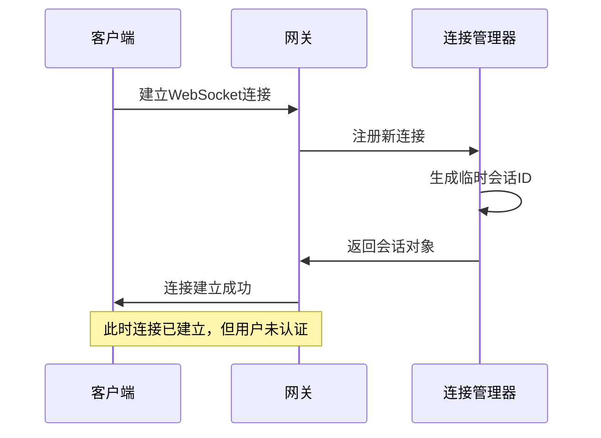
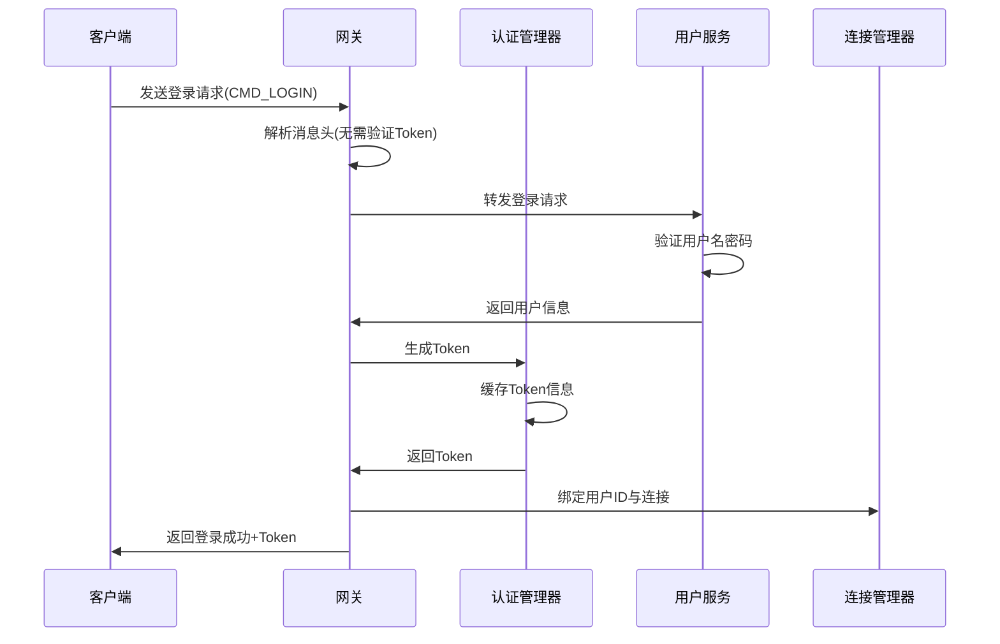
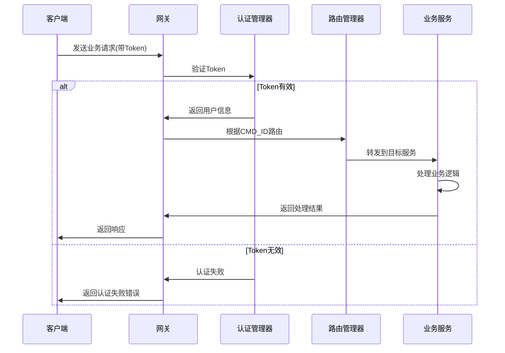
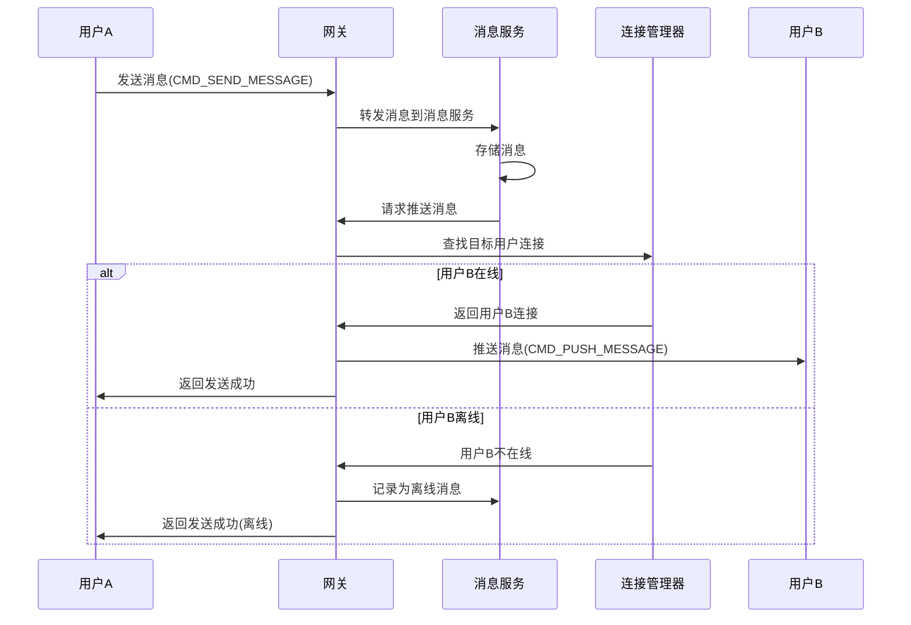
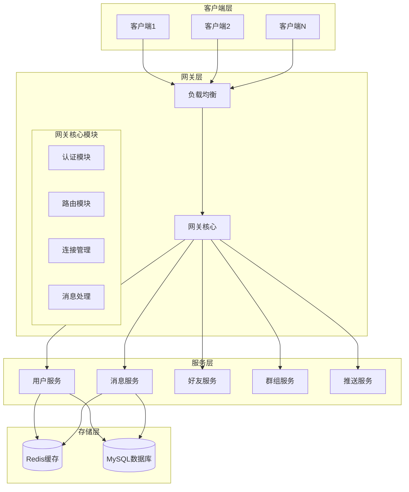

# MyChat 网关架构设计文档

## 一、架构设计目标

### 1.1 功能目标
- **统一入口**：为所有客户端提供统一的服务入口
- **身份认证**：基于 Token 的用户身份验证和授权
- **请求路由**：根据命令类型将请求路由到对应的微服务
- **连接管理**：管理客户端连接，支持 HTTP + WebSocket 双协议
- **消息推送**：支持实时消息推送到在线用户

### 1.2 技术目标
- **高性能**：基于现有的 boost::asio 异步 IO 框架
- **可扩展**：模块化设计，便于后续添加功能
- **可维护**：清晰的代码结构和职责分离
- **易理解**：适合新手学习和实践

## 二、核心架构设计

### 2.1 总体架构层次

```
┌─────────────────────────────────────────────┐
│                客户端层                      │
│  [Qt客户端] [Web客户端] [移动客户端]          │
└─────────────────┬───────────────────────────┘
                 │ HTTP/WebSocket
┌─────────────────▼───────────────────────────┐
│                网关层                        │
│  ┌─────────────────────────────────────────┐ │
│  │         网关核心服务                     │ │
│  │ [认证] [路由] [连接管理] [消息处理]      │ │
│  └─────────────────────────────────────────┘ │
└─────────────────┬───────────────────────────┘
                 │ gRPC/内部协议
┌─────────────────▼───────────────────────────┐
│                服务层                        │
│ [用户服务] [消息服务] [好友服务] [群组服务]  │
└─────────────────┬───────────────────────────┘
                 │
┌─────────────────▼───────────────────────────┐
│               数据层                         │
│        [Redis缓存] [MySQL数据库]            │
└─────────────────────────────────────────────┘
```

### 2.2 网关核心模块设计

#### 2.2.1 连接管理模块 (ConnectionManager)
**职责**：
- 管理所有客户端连接（HTTP/WebSocket）
- 维护用户ID与连接的映射关系
- 处理连接的建立、断开和异常

**核心类**：
```cpp
class ConnectionManager {
    // 用户连接映射 <user_id, session_ptr>
    std::unordered_map<std::string, std::weak_ptr<Session>> user_sessions_;
    
    // WebSocket会话管理
    std::unordered_set<std::shared_ptr<WebSocketSession>> ws_sessions_;
    
    // HTTP会话管理  
    std::unordered_set<std::shared_ptr<TcpSession>> http_sessions_;
};
```

#### 2.2.2 认证模块 (AuthManager)
**职责**：
- Token 生成、验证和管理
- 用户登录状态维护
- 权限验证

**核心逻辑**：
```cpp
class AuthManager {
    // Token验证
    bool VerifyToken(const std::string& token, std::string& user_id);
    
    // 生成Token
    std::string GenerateToken(const std::string& user_id);
    
    // Token缓存 <token, user_info>
    std::unordered_map<std::string, UserTokenInfo> token_cache_;
};
```

#### 2.2.3 路由模块 (RouteManager)
**职责**：
- 根据命令ID路由到对应服务
- 负载均衡（后期扩展）
- 服务健康检查（后期扩展）

**路由规则**：
```cpp
enum class ServiceType {
    USER_SERVICE,    // 1001-1999: 用户相关
    MESSAGE_SERVICE, // 2001-2999: 消息相关  
    FRIEND_SERVICE,  // 3001-3999: 好友相关
    GROUP_SERVICE,   // 4001-4999: 群组相关
    PUSH_SERVICE     // 5001-5999: 推送相关
};
```

#### 2.2.4 消息处理模块 (MessageProcessor)
**职责**：
- 解析和封装 Protobuf 消息
- 处理请求/响应的序列化
- 错误处理和日志记录

## 三、关键工作流程

### 3.1 用户连接建立流程



### 3.2 用户登录认证流程



### 3.3 普通业务请求流程



### 3.4 消息推送流程



## 四、技术实现方案

### 4.1 网关核心类设计

#### 4.1.1 网关主类 (GatewayServer)
```cpp
class GatewayServer {
private:
    // 基础网络组件（复用现有）
    std::unique_ptr<WebSocketServer> ws_server_;
    std::unique_ptr<TcpServer> http_server_;
    std::shared_ptr<IOServicePool> io_service_pool_;
    
    // 网关核心模块
    std::unique_ptr<ConnectionManager> conn_mgr_;
    std::unique_ptr<AuthManager> auth_mgr_;
    std::unique_ptr<RouteManager> route_mgr_;
    std::unique_ptr<MessageProcessor> msg_processor_;
    
public:
    bool Start(const std::string& config_path);
    void Stop();
    
    // 处理客户端请求
    void HandleRequest(std::shared_ptr<Session> session, 
                      const std::string& data);
};
```

#### 4.1.2 会话基类扩展
```cpp
class GatewaySession {
protected:
    std::string user_id_;           // 绑定的用户ID
    bool authenticated_;            // 是否已认证
    std::string session_id_;        // 会话唯一标识
    uint64_t last_heartbeat_;       // 最后心跳时间
    
public:
    virtual void SendResponse(const im::base::BaseResponse& response) = 0;
    virtual void Close() = 0;
    
    // Getter/Setter
    const std::string& GetUserId() const { return user_id_; }
    void SetUserId(const std::string& user_id) { user_id_ = user_id; }
    bool IsAuthenticated() const { return authenticated_; }
    void SetAuthenticated(bool auth) { authenticated_ = auth; }
};
```

### 4.2 配置管理

#### 4.2.1 网关配置结构
```json
{
    "gateway": {
        "http_port": 8080,
        "websocket_port": 8081,
        "worker_threads": 4,
        "max_connections": 10000
    },
    "auth": {
        "token_expire_seconds": 86400,
        "secret_key": "your-secret-key"
    },
    "services": {
        "user_service": {
            "host": "127.0.0.1",
            "port": 9001
        },
        "message_service": {
            "host": "127.0.0.1", 
            "port": 9002
        }
    },
    "redis": {
        "host": "127.0.0.1",
        "port": 6379,
        "password": ""
    }
}
```

### 4.3 错误处理策略

#### 4.3.1 统一错误响应
```cpp
void GatewayServer::SendErrorResponse(
    std::shared_ptr<Session> session,
    uint32_t seq,
    im::base::ErrorCode error_code,
    const std::string& error_message) {
    
    im::base::BaseResponse response;
    response.set_error_code(error_code);
    response.set_error_message(error_message);
    
    // 封装完整响应消息
    std::string response_data;
    if (EncodeResponse(seq, response, response_data)) {
        session->SendResponse(response_data);
    }
}
```

## 五、部署架构

### 5.1 基础版本部署（第一期目标）
```
┌─────────────────────────────────────┐
│          同一台服务器                │
│                                     │
│  ┌─────────────┐  ┌─────────────┐   │
│  │   网关服务   │  │  Redis缓存   │   │
│  │   :8080     │  │   :6379     │   │
│  └─────────────┘  └─────────────┘   │
│                                     │
│  ┌─────────────┐  ┌─────────────┐   │
│  │   用户服务   │  │  消息服务    │   │
│  │   :9001     │  │   :9002     │   │
│  └─────────────┘  └─────────────┘   │
│                                     │
│  ┌─────────────┐                    │
│  │ MySQL数据库  │                    │
│  │   :3306     │                    │
│  └─────────────┘                    │
└─────────────────────────────────────┘
```

### 5.2 扩展版本部署（后期目标）
```
┌─────────────┐    ┌─────────────────────────────┐
│ 负载均衡器   │    │        网关集群              │
│   Nginx     ├────┤ ┌─────────┐ ┌─────────┐     │
│   :80       │    │ │ Gateway1│ │ Gateway2│     │
└─────────────┘    │ │  :8080  │ │  :8081  │     │
                   │ └─────────┘ └─────────┘     │
                   └─────────────────────────────┘
                               │
                   ┌───────────▼─────────────────┐
                   │        微服务集群            │
                   │ ┌─────┐ ┌─────┐ ┌─────┐     │
                   │ │User │ │ Msg │ │Group│     │
                   │ │Svc1 │ │Svc1 │ │Svc1 │     │
                   │ └─────┘ └─────┘ └─────┘     │
                   └─────────────────────────────┘
```

## 六、开发计划

### 6.1 第一阶段：核心框架搭建
1. **网关服务主框架**
   - GatewayServer 主类实现
   - 基于现有 WebSocketServer 和 TcpServer
   - 基础的请求接收和响应发送

2. **连接管理模块**
   - ConnectionManager 实现
   - 用户连接映射维护
   - 连接生命周期管理

3. **消息处理模块**
   - 基于现有 ProtobufCodec
   - 消息解析和封装
   - 错误处理机制

### 6.2 第二阶段：认证和路由
1. **认证模块**
   - Token 生成和验证
   - 用户登录流程
   - 权限控制

2. **路由模块**
   - 命令路由逻辑
   - 服务代理调用
   - 负载均衡基础

### 6.3 第三阶段：业务集成和优化
1. **业务服务对接**
   - 用户服务集成
   - 消息服务集成
   - 推送功能实现

2. **性能优化**
   - 连接池优化
   - 缓存策略
   - 监控和日志

## 七、测试策略

### 7.1 单元测试
- 各个模块独立测试
- Mock 依赖服务
- 覆盖核心逻辑分支

### 7.2 集成测试  
- 端到端流程测试
- 并发连接测试
- 异常场景测试

### 7.3 压力测试
- 连接数压力测试
- 消息吞吐量测试
- 内存和CPU使用监控

---





这个设计文档基于你现有的工具类和网络组件，提供了一个循序渐进的网关架构方案。接下来我将为你提供具体的实现指导！