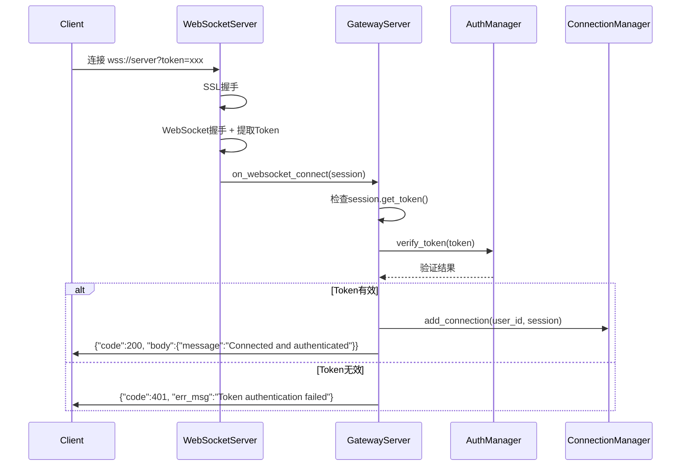
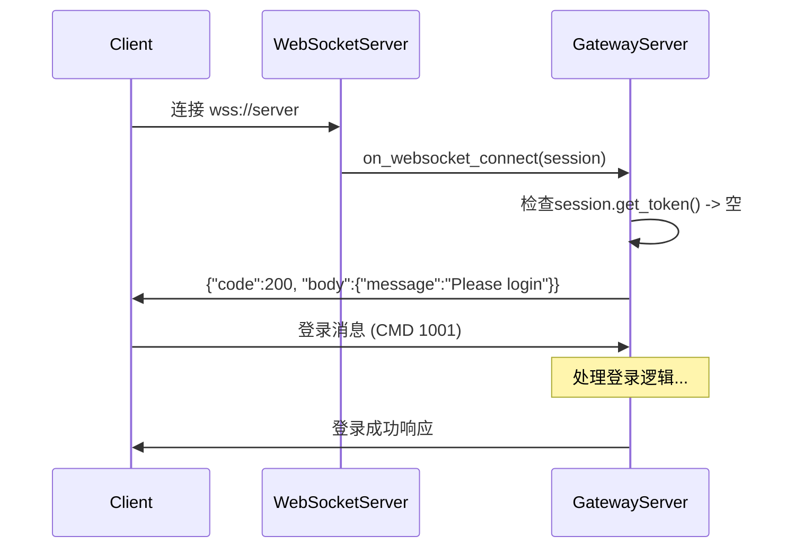

# WebSocket Token 认证完整指南

## 🎯 **Token获取方式**

现在你的WebSocket服务器支持在连接建立时自动获取和验证Token，有以下几种方式：

### 方式1：URL查询参数（推荐）

```javascript
// 客户端连接示例
const token = "eyJ0eXAiOiJKV1QiLCJhbGciOiJIUzI1NiJ9...";
const ws = new WebSocket(`wss://your-server.com:8080?token=${token}`);

// 或者带其他参数
const ws = new WebSocket(`wss://your-server.com:8080?token=${token}&device_id=web001&platform=web`);
```

### 方式2：Authorization头部

```javascript
// 浏览器环境（需要支持WebSocket头部的浏览器）
const ws = new WebSocket('wss://your-server.com:8080', [], {
    headers: {
        'Authorization': `Bearer ${token}`
    }
});
```

### 方式3：无Token连接（传统方式）

```javascript
// 不带Token连接，后续通过消息登录
const ws = new WebSocket('wss://your-server.com:8080');
```

## 🚀 **连接流程详解**

### 场景1：带Token的自动认证流程



### 场景2：无Token的传统登录流程



## 📱 **客户端实现示例**

### JavaScript/Web客户端

```javascript
class ChatClient {
    constructor(serverUrl, token = null) {
        this.serverUrl = serverUrl;
        this.token = token;
        this.ws = null;
    }

    // 方式1：Token直连
    connectWithToken(token) {
        const wsUrl = `${this.serverUrl}?token=${encodeURIComponent(token)}`;
        this.ws = new WebSocket(wsUrl);
        
        this.ws.onopen = () => {
            console.log('WebSocket connected');
        };
        
        this.ws.onmessage = (event) => {
            const response = JSON.parse(event.data);
            if (response.code === 200) {
                console.log('Authentication successful:', response.body.message);
            } else if (response.code === 401) {
                console.error('Authentication failed:', response.err_msg);
                // 可以尝试重新登录
                this.login('username', 'password');
            }
        };
    }

    // 方式2：无Token连接后登录
    connectAndLogin(username, password) {
        this.ws = new WebSocket(this.serverUrl);
        
        this.ws.onopen = () => {
            console.log('WebSocket connected, sending login...');
            this.login(username, password);
        };
        
        this.ws.onmessage = (event) => {
            const response = JSON.parse(event.data);
            console.log('Server response:', response);
        };
    }

    login(username, password) {
        const loginMessage = {
            cmd_id: 1001,
            from_uid: username,
            device_id: this.generateDeviceId(),
            platform: "web",
            body: {
                username: username,
                password: password
            }
        };
        
        this.ws.send(JSON.stringify(loginMessage));
    }

    generateDeviceId() {
        return 'web_' + Math.random().toString(36).substr(2, 9);
    }
}

// 使用示例
const client = new ChatClient('wss://localhost:8080');

// 方式1：直接用Token连接
const savedToken = localStorage.getItem('access_token');
if (savedToken) {
    client.connectWithToken(savedToken);
} else {
    // 方式2：无Token登录
    client.connectAndLogin('user123', 'password123');
}
```

### Python客户端示例

```python
import asyncio
import websockets
import json
import urllib.parse

class ChatClient:
    def __init__(self, server_url, token=None):
        self.server_url = server_url
        self.token = token
        self.websocket = None

    async def connect_with_token(self, token):
        """使用Token直连"""
        url = f"{self.server_url}?token={urllib.parse.quote(token)}"
        
        async with websockets.connect(url) as websocket:
            self.websocket = websocket
            print("Connected with token")
            
            # 监听消息
            async for message in websocket:
                response = json.loads(message)
                if response['code'] == 200:
                    print(f"Success: {response['body']['message']}")
                elif response['code'] == 401:
                    print(f"Auth failed: {response['err_msg']}")

    async def connect_and_login(self, username, password):
        """无Token连接后登录"""
        async with websockets.connect(self.server_url) as websocket:
            self.websocket = websocket
            print("Connected, sending login...")
            
            # 发送登录消息
            login_msg = {
                "cmd_id": 1001,
                "from_uid": username,
                "device_id": "python_client",
                "platform": "python",
                "body": {
                    "username": username,
                    "password": password
                }
            }
            
            await websocket.send(json.dumps(login_msg))
            
            # 监听响应
            async for message in websocket:
                response = json.loads(message)
                print(f"Server response: {response}")

# 使用示例
async def main():
    client = ChatClient('ws://localhost:8080')
    
    # 方式1：Token直连
    token = "your_saved_token_here"
    if token:
        await client.connect_with_token(token)
    else:
        # 方式2：登录
        await client.connect_and_login('user123', 'password123')

# 运行
asyncio.run(main())
```

## 🔧 **服务器端响应格式**

### 连接成功（有Token）
```json
{
    "code": 200,
    "body": {
        "message": "Connected and authenticated successfully",
        "session_id": "session_12345"
    },
    "err_msg": ""
}
```

### 连接成功（无Token）
```json
{
    "code": 200,
    "body": {
        "message": "Connected successfully. Please login or provide token.",
        "session_id": "session_12345"
    },
    "err_msg": ""
}
```

### Token认证失败
```json
{
    "code": 401,
    "body": null,
    "err_msg": "Token authentication failed. Please login."
}
```

## 🎯 **最佳实践建议**

1. **Token存储**: 将access_token存储在本地，连接时优先使用
2. **自动重连**: Token失效时自动降级到用户名密码登录
3. **安全考虑**: 使用WSS (WebSocket Secure) 加密传输
4. **错误处理**: 妥善处理各种连接和认证错误
5. **心跳机制**: 定期发送ping消息保持连接活跃

## 🔄 **Token刷新流程**

```javascript
// Token即将过期时的刷新逻辑
ws.onmessage = (event) => {
    const response = JSON.parse(event.data);
    
    if (response.code === 401 && response.err_msg.includes('token expired')) {
        // Token过期，使用refresh_token刷新
        refreshTokenAndReconnect();
    }
};

function refreshTokenAndReconnect() {
    const refreshToken = localStorage.getItem('refresh_token');
    
    // 调用刷新Token的HTTP API
    fetch('/api/refresh-token', {
        method: 'POST',
        headers: { 'Content-Type': 'application/json' },
        body: JSON.stringify({ refresh_token: refreshToken })
    })
    .then(response => response.json())
    .then(data => {
        if (data.code === 200) {
            localStorage.setItem('access_token', data.body.access_token);
            // 重新连接
            connectWithToken(data.body.access_token);
        }
    });
}
```

现在你的WebSocket服务器已经支持完整的Token认证流程了！🎉